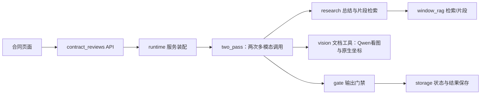

# 后端源码导航

**先读下面7个入口即可。** 后端还包含账号、租户、案件、语料、数据库与任务等保留功能，并非所有文件都是 Agent 组件。完整清单按目录折叠，查到需要修改的部分再展开。

## 合同 Agent 阅读顺序

| 顺序 | 文件 | 一句话职责 |
| --- | --- | --- |
| 1 | [runtime.py](src/lawyer_agent/infrastructure/contract_review/runtime.py) | 把真实服务装配起来，控制运行、取消和保存。 |
| 2 | [two_pass.py](src/lawyer_agent/infrastructure/contract_review/two_pass.py) | 当前两次多模态调用、第二次提示词与JSON、引用绑定、校验及结束；workflow.py保留旧循环。 |
| 3 | [research.py](src/lawyer_agent/application/contract_review/research.py) | 第一次看图总结的提示词与Schema；总结一次检索Top7、读取全部命中来源片段。 |
| 4 | [vision.py](src/lawyer_agent/infrastructure/contract_review/vision.py) | Qwen看页面图片；复用pdf.py原生字形坐标进行引用定位，不调用规则表格/OCR。 |
| 5 | [window_rag.py](src/lawyer_agent/infrastructure/contract_review/window_rag.py) | 当前第二版RRF/rerank与相关法律片段MCP，复用legal_documents.py受控客户端。 |
| 6 | [gate.py](src/lawyer_agent/application/contract_review/gate.py) | 输出前核对原文、覆盖、引用与意见内容。 |
| 7 | [contract_reviews.py](src/lawyer_agent/api/v1/contract_reviews.py) | 网页上传、阶段SSE、原件与结果接口。 |

模型和Key看 [dashscope.py](src/lawyer_agent/infrastructure/providers/dashscope.py)；网页标红和气泡看 [PdfContractReview.vue](../frontend/src/components/PdfContractReview.vue)。不需要改Agent时打开账号或迁移模块。



[运行说明与验证边界](../docs/contract-review-core.md)。真实接入代码存在不等于完整网页/生产环境验收；客户PDF已用于上传和多模态读取检查，当前23页两次调用与草稿保存已通过；意见准确性仍未通过，见运行说明。

## 按修改目标找入口

| 我想做什么 | 看哪里 |
| --- | --- |
| 改数据字段、锚点或预算 | application/contract_review/contracts.py |
| 改Agent提示词和循环 | infrastructure/contract_review/two_pass.py（当前两次调用）；workflow.py（旧循环） |
| 改研究摘要、选文和全文限制 | application/contract_review/research.py |
| 增加文档MCP工具 | infrastructure/contract_review/mcp_servers.py、tool_contracts.py、tools.py |
| 改法律全文MCP | infrastructure/contract_review/legal_documents.py、research.py |
| 改租户/owner授权、持久化 | infrastructure/contract_review/storage.py |
| 改不可变PDF存储 | infrastructure/contract_review/objects.py |
| 填写模型Key | [集中配置说明](../docs/superpowers/specs/2026-09-16-agent-api-key-design.md) |
| 调整既有法规问答 | application/legal_retrieval_qa.py（独立于普通聊天） |
| 改Milvus内网检索 | [tools/milvus_query](../tools/milvus_query/) |

## 目录分工

| 位置 | 职责 |
| --- | --- |
| main.py、config.py、api/dependencies.py | HTTP启动、环境配置和依赖装配 |
| api/ | HTTP/SSE契约、认证上下文、错误响应 |
| application/ | 用例编排、接口约定、输出门禁 |
| domain/ | 不依赖数据库和SDK的状态/业务规则 |
| infrastructure/ | 数据库、文件、模型、搜索、消息的实际访问 |
| cli/ | 手动管理、导入、发布及验证入口 |
| workers/、runtime/ | 原有持久队列工作进程及配置 |

`corpus` 是语料；`gate` 是输出前校验；`ports` 是接口；`providers` 是供应商适配；`repositories` 是数据库读写；persistence中的`models`是数据库表；`__init__.py`通常只是包声明。

## 按文件查职责

以下按模块列出 Python 文件职责。展开相关目录或搜索文件名，不需要依次通读。新增/改名文件时更新对应行；职责说明不代表生产链路已验收。

<details>
<summary>包根目录（3 个文件）</summary>

| 文件 | 职责 |
| --- | --- |
| [__init__.py](src/lawyer_agent/__init__.py) | 后端 Python 包声明。 |
| [config.py](src/lawyer_agent/config.py) | 统一后端配置与环境变量校验，加载现有秘密文件；不是业务逻辑。 |
| [main.py](src/lawyer_agent/main.py) | 创建 FastAPI 应用，挂载路由、启动资源、请求追踪和错误处理。 |

</details>

<details>
<summary>api/（4 个文件）</summary>

| 文件 | 职责 |
| --- | --- |
| [__init__.py](src/lawyer_agent/api/__init__.py) | HTTP 接口包声明。 |
| [dependencies.py](src/lawyer_agent/api/dependencies.py) | 把数据库、模型、权限和应用服务组装起来，供 HTTP 接口使用。 |
| [errors.py](src/lawyer_agent/api/errors.py) | 将业务异常统一转换为 HTTP Problem Details 错误响应。 |
| [router.py](src/lawyer_agent/api/router.py) | 存活和就绪探针；检查服务是否可接受请求。 |

</details>

<details>
<summary>api/v1/（18 个文件）</summary>

| 文件 | 职责 |
| --- | --- |
| [__init__.py](src/lawyer_agent/api/v1/__init__.py) | 第一版 HTTP 接口包声明。 |
| [accounts.py](src/lawyer_agent/api/v1/accounts.py) | 查询当前账号及其可访问的租户。 |
| [agent_gateway.py](src/lawyer_agent/api/v1/agent_gateway.py) | 已有工具网关的工具列表和调用 HTTP 接口；不是合同 MCP Server。 |
| [ai_jobs.py](src/lawyer_agent/api/v1/ai_jobs.py) | AI 后台任务的 HTTP 受理与访问控制。 |
| [audit.py](src/lawyer_agent/api/v1/audit.py) | 租户审计记录查询接口。 |
| [auth.py](src/lawyer_agent/api/v1/auth.py) | 注册、登录、切换租户、重新认证与令牌相关接口。 |
| [contract_reviews.py](src/lawyer_agent/api/v1/contract_reviews.py) | 合同上传、原件读取、结果查询与阶段 SSE；校验租户路径和会话。 |
| [invitations.py](src/lawyer_agent/api/v1/invitations.py) | 接受租户邀请的接口。 |
| [legal_chat.py](src/lawyer_agent/api/v1/legal_chat.py) | 普通模型聊天及流式聊天接口；与有据问答分开。 |
| [legal_corpus.py](src/lawyer_agent/api/v1/legal_corpus.py) | 查询法规文书、版本、条文、批次、快照和差异的接口。 |
| [legal_retrieval_qa.py](src/lawyer_agent/api/v1/legal_retrieval_qa.py) | 检索后生成有引用回答的问答及 SSE 接口。 |
| [matter_documents.py](src/lawyer_agent/api/v1/matter_documents.py) | 案件、参与方、文档登记及相关管理接口。 |
| [platform.py](src/lawyer_agent/api/v1/platform.py) | 平台层租户申请审批接口。 |
| [reviews.py](src/lawyer_agent/api/v1/reviews.py) | 文档版本的人工审核接口；不是新 ReAct Agent 主循环。 |
| [router.py](src/lawyer_agent/api/v1/router.py) | 汇总上述路由并挂到 /api/v1。 |
| [rule_checks.py](src/lawyer_agent/api/v1/rule_checks.py) | 运行确定性规则检查、处置风险及获取报告的接口。 |
| [rule_packs.py](src/lawyer_agent/api/v1/rule_packs.py) | 规则包和规则的管理接口。 |
| [tenants.py](src/lawyer_agent/api/v1/tenants.py) | 租户、成员、角色和邀请管理接口。 |

</details>

<details>
<summary>application/（60 个文件）</summary>

| 文件 | 职责 |
| --- | --- |
| [accounts.py](src/lawyer_agent/application/accounts.py) | 组织账号与租户列表查询。 |
| [ai_job_runtime.py](src/lawyer_agent/application/ai_job_runtime.py) | 后台任务投递、领取、执行等运行协议与服务逻辑。 |
| [ai_job_service.py](src/lawyer_agent/application/ai_job_service.py) | 把创建和访问 AI 任务的应用操作提供给上层入口。 |
| [ai_jobs.py](src/lawyer_agent/application/ai_jobs.py) | AI 任务授权、执行授权范围及权威上下文检查。 |
| [audit.py](src/lawyer_agent/application/audit.py) | 结构化审计事件的类型、允许字段和写入规则。 |
| [audit_query_api.py](src/lawyer_agent/application/audit_query_api.py) | 组织面向 HTTP 的租户审计查询。 |
| [conversion_provenance.py](src/lawyer_agent/application/conversion_provenance.py) | 描述文档转换的来源证明，不执行转换。 |
| [document_review_api.py](src/lawyer_agent/application/document_review_api.py) | 组织人工文档审核、版本检查与审核状态更新。 |
| [documents.py](src/lawyer_agent/application/documents.py) | 文档上传会话与完成登记的应用逻辑；当前以元数据为主。 |
| [evidence.py](src/lawyer_agent/application/evidence.py) | 证据包与引用校验；核对引用身份和允许的证据范围。 |
| [idempotency.py](src/lawyer_agent/application/idempotency.py) | 处理幂等键和重复请求，避免同一操作重复生效。 |
| [identity.py](src/lawyer_agent/application/identity.py) | 账号身份建立、冲突检查、敏感身份索引与相关流程。 |
| [invitations.py](src/lawyer_agent/application/invitations.py) | 邀请创建、接受、目标校验及投递接口。 |
| [legal_chat.py](src/lawyer_agent/application/legal_chat.py) | 普通聊天的业务接线，调用模型网关并映射错误。 |
| [legal_chunk_structure.py](src/lawyer_agent/application/legal_chunk_structure.py) | 按法律条文结构生成父子文本块及原文位置。 |
| [legal_claim_gate.py](src/lawyer_agent/application/legal_claim_gate.py) | 对模型生成的结构化法律结论执行引用门禁。 |
| [legal_claim_parse.py](src/lawyer_agent/application/legal_claim_parse.py) | 把模型输出解析成法律结论和引用的数据结构。 |
| [legal_corpus.py](src/lawyer_agent/application/legal_corpus.py) | 法规原件指纹、文件清单、批次和数据集登记。 |
| [legal_corpus_chunks.py](src/lawyer_agent/application/legal_corpus_chunks.py) | 从条文生成基础检索块。 |
| [legal_corpus_diff.py](src/lawyer_agent/application/legal_corpus_diff.py) | 比较同一法规两个版本的条文差异。 |
| [legal_corpus_export.py](src/lawyer_agent/application/legal_corpus_export.py) | 将语料文件导出为可恢复的离线正文和切块产物。 |
| [legal_corpus_import.py](src/lawyer_agent/application/legal_corpus_import.py) | 受控导入法规身份、版本和条文。 |
| [legal_corpus_import_mapping.py](src/lawyer_agent/application/legal_corpus_import_mapping.py) | 把解析器输出及审核元数据转换为入库命令。 |
| [legal_corpus_manifest.py](src/lawyer_agent/application/legal_corpus_manifest.py) | 从导出清单准备待确认的元数据候选。 |
| [legal_corpus_onboarding.py](src/lawyer_agent/application/legal_corpus_onboarding.py) | 串接版本导入和基础检索块生成、持久化。 |
| [legal_corpus_publish.py](src/lawyer_agent/application/legal_corpus_publish.py) | 法规版本质量检查与不可变数据集发布逻辑。 |
| [legal_corpus_read.py](src/lawyer_agent/application/legal_corpus_read.py) | 组织 HTTP 所需的法规查询与分页。 |
| [legal_corpus_replay.py](src/lawyer_agent/application/legal_corpus_replay.py) | 重跑导入时核对原事实和父子关系，避免覆盖已有身份。 |
| [legal_dataset_evidence.py](src/lawyer_agent/application/legal_dataset_evidence.py) | 串接数据集检索和证据组装。 |
| [legal_dataset_gated_publish.py](src/lawyer_agent/application/legal_dataset_gated_publish.py) | 在索引发布前串接法规质量门禁。 |
| [legal_dataset_publication.py](src/lawyer_agent/application/legal_dataset_publication.py) | 协调数据库发布记录与搜索别名，并提供保守恢复流程。 |
| [legal_dataset_quality.py](src/lawyer_agent/application/legal_dataset_quality.py) | 基于权威数据库事实检查发布集合，早于模型和索引操作。 |
| [legal_dataset_search.py](src/lawyer_agent/application/legal_dataset_search.py) | 找到数据集对应索引，再执行混合检索。 |
| [legal_dataset_set_publish.py](src/lawyer_agent/application/legal_dataset_set_publish.py) | 组织多版本法规集合的有界向量构建和发布。 |
| [legal_evidence_assembly.py](src/lawyer_agent/application/legal_evidence_assembly.py) | 从检索命中恢复数据库中的权威完整条文并组装证据。 |
| [legal_export_verification.py](src/lawyer_agent/application/legal_export_verification.py) | 只读核对离线切块产物与原始文件的一致性。 |
| [legal_hybrid_search.py](src/lawyer_agent/application/legal_hybrid_search.py) | 组织 BM25 和向量检索，并融合结果。 |
| [legal_index_alias.py](src/lawyer_agent/application/legal_index_alias.py) | 管理数据集搜索索引别名。 |
| [legal_index_chunks.py](src/lawyer_agent/application/legal_index_chunks.py) | 校验文本块父子图，挑选用于检索的叶子块。 |
| [legal_index_publish.py](src/lawyer_agent/application/legal_index_publish.py) | 组织索引构建、发布快照和别名切换。 |
| [legal_navigation_index.py](src/lawyer_agent/application/legal_navigation_index.py) | 用权威法规数据构建标题和结构导航索引。 |
| [legal_navigation_search.py](src/lawyer_agent/application/legal_navigation_search.py) | 按来源标题和结构位置缩小法规检索范围。 |
| [legal_non_article_import.py](src/lawyer_agent/application/legal_non_article_import.py) | 映射没有条号结构的正文，不虚构法律条号。 |
| [legal_retrieval_qa.py](src/lawyer_agent/application/legal_retrieval_qa.py) | 组织检索、模型生成、结论解析和引用门禁的完整问答流程。 |
| [legal_source_diff.py](src/lawyer_agent/application/legal_source_diff.py) | 对两个解析后的法律来源文件做正文差异比较。 |
| [legal_source_proof.py](src/lawyer_agent/application/legal_source_proof.py) | 保存不可变来源证明，并在重跑时检查身份一致。 |
| [legal_vector_indexing.py](src/lawyer_agent/application/legal_vector_indexing.py) | 通过模型网关生成法规向量并写入检索索引。 |
| [matter_document_api.py](src/lawyer_agent/application/matter_document_api.py) | 组织案件、参与方和文档的应用服务。 |
| [mcp_gateway.py](src/lawyer_agent/application/mcp_gateway.py) | 已有受控工具登记和分派服务；与合同 SDK 工具集并存。 |
| [model_gateway.py](src/lawyer_agent/application/model_gateway.py) | 统一调用模型 Provider，校验结果并记录耗时、用量和失败。 |
| [permission_rollout.py](src/lawyer_agent/application/permission_rollout.py) | 权限功能分阶段启用、回退和租户状态协调。 |
| [platform.py](src/lawyer_agent/application/platform.py) | 平台管理、租户申请审核及初始管理员建立流程。 |
| [report_export.py](src/lawyer_agent/application/report_export.py) | 把规则风险项组装成租户范围内的 DOCX 工作报告。 |
| [retrieval_fusion.py](src/lawyer_agent/application/retrieval_fusion.py) | RRF 排序融合算法，不调用模型。 |
| [rule_check_api.py](src/lawyer_agent/application/rule_check_api.py) | 组织规则检查、风险处置和报告相关应用操作。 |
| [rule_pack_admin_api.py](src/lawyer_agent/application/rule_pack_admin_api.py) | 组织规则包与规则的管理操作。 |
| [rules.py](src/lawyer_agent/application/rules.py) | 确定性规则引擎，按规则产生风险项；不是 LLM 审查。 |
| [security_locks.py](src/lawyer_agent/application/security_locks.py) | 安全相关写锁和权限功能快照的接口约定。 |
| [sessions.py](src/lawyer_agent/application/sessions.py) | 登录会话校验、令牌轮换、撤销和重放防护流程。 |
| [tenancy.py](src/lawyer_agent/application/tenancy.py) | 租户、成员、角色等管理流程及版本并发检查。 |

</details>

<details>
<summary>application/contract_review/（6 个文件）</summary>

| 文件 | 职责 |
| --- | --- |
| [__init__.py](src/lawyer_agent/application/contract_review/__init__.py) | 合同审查业务契约包声明。 |
| [contracts.py](src/lawyer_agent/application/contract_review/contracts.py) | 定义文档块、锚点、风险意见、证据、审查结果和运行预算。 |
| [gate.py](src/lawyer_agent/application/contract_review/gate.py) | 重新核对原文、锚点及覆盖范围，并要求内容策略检查每条意见。 |
| [ports.py](src/lawyer_agent/application/contract_review/ports.py) | 定义解析、检索、授权、模型、门禁、保存的 Python 接口；不实现外部服务。 |
| [research.py](src/lawyer_agent/application/contract_review/research.py) | 合同摘要、检索Top7、选择最多3份并分页读全文的业务流程与数据契约。 |
| [web.py](src/lawyer_agent/application/contract_review/web.py) | 合同网页请求/响应字段、最终白名单结果和服务接口。 |

</details>

<details>
<summary>cli/（14 个文件）</summary>

| 文件 | 职责 |
| --- | --- |
| [__init__.py](src/lawyer_agent/cli/__init__.py) | 管理命令包声明。 |
| [bootstrap_platform_admin.py](src/lawyer_agent/cli/bootstrap_platform_admin.py) | 受控建立初始平台管理员的命令入口。 |
| [contract_review_check.py](src/lawyer_agent/cli/contract_review_check.py) | 显式 --live 的 PDF 解析/研究联通检查，不生成完整审查结果。 |
| [contract_review_smoke.py](src/lawyer_agent/cli/contract_review_smoke.py) | 组装合成模型和服务，跑通真实 ReAct Workflow 与 MCP SDK。 |
| [corpus_convert.py](src/lawyer_agent/cli/corpus_convert.py) | 受控调用旧 Word 转换并验证派生文件。 |
| [corpus_export.py](src/lawyer_agent/cli/corpus_export.py) | 离线语料导出命令。 |
| [corpus_import_batch.py](src/lawyer_agent/cli/corpus_import_batch.py) | 逐来源事务导入经过明确审核的语料清单。 |
| [corpus_manifest.py](src/lawyer_agent/cli/corpus_manifest.py) | 生成本地待确认元数据清单，不直接入库。 |
| [corpus_publication.py](src/lawyer_agent/cli/corpus_publication.py) | 查看或恢复持久化发布任务，不重新构建索引。 |
| [corpus_publish.py](src/lawyer_agent/cli/corpus_publish.py) | 单来源法规导入与发布命令，支持预检等流程。 |
| [corpus_publish_set.py](src/lawyer_agent/cli/corpus_publish_set.py) | 对审核过的法规集合进行质量检查、构建和发布。 |
| [corpus_static_extract.py](src/lawyer_agent/cli/corpus_static_extract.py) | 对明确指定且普通转换失败的旧 DOC 做受限静态恢复。 |
| [corpus_verify.py](src/lawyer_agent/cli/corpus_verify.py) | 核对已导出的语料文件并生成交付报告。 |
| [embedding_smoke.py](src/lawyer_agent/cli/embedding_smoke.py) | 实际调用本地 Embedding 验证安装与模型；不同于合同合成演示。 |

</details>

<details>
<summary>domain/（22 个文件）</summary>

| 文件 | 职责 |
| --- | --- |
| [ai_jobs.py](src/lawyer_agent/domain/ai_jobs.py) | AI 任务状态、权限、风险类别及状态约束。 |
| [authorization.py](src/lawyer_agent/domain/authorization.py) | 权限动作、访问主体、资源状态与授权判断规则。 |
| [common.py](src/lawyer_agent/domain/common.py) | UUIDv7 等通用身份标识工具。 |
| [document_review.py](src/lawyer_agent/domain/document_review.py) | 人工文档审核的状态机与审核理由规则。 |
| [identity.py](src/lawyer_agent/domain/identity.py) | 账号身份标准化及敏感身份相关值类型。 |
| [legal_article_heading.py](src/lawyer_agent/domain/legal_article_heading.py) | 法律条号识别使用的公共标记规则。 |
| [legal_corpus.py](src/lawyer_agent/domain/legal_corpus.py) | 法规身份、版本、条文、文本块和数据集等领域对象。 |
| [legal_dataset_publication.py](src/lawyer_agent/domain/legal_dataset_publication.py) | 持久发布意图、发布状态及候选校验规则。 |
| [legal_dataset_quality.py](src/lawyer_agent/domain/legal_dataset_quality.py) | 发布选择、配置和质量报告的数据类型与校验。 |
| [legal_mixed_release_review.py](src/lawyer_agent/domain/legal_mixed_release_review.py) | 核对从 JSON 恢复的混合版本发布审核证据。 |
| [legal_navigation.py](src/lawyer_agent/domain/legal_navigation.py) | 法规标题与结构导航的数据类型。 |
| [legal_parser_profiles.py](src/lawyer_agent/domain/legal_parser_profiles.py) | 明确解析器版本身份和原文保留约定。 |
| [legal_release_provenance.py](src/lawyer_agent/domain/legal_release_provenance.py) | 混合解析版本发布的来源与选择证明。 |
| [legal_search.py](src/lawyer_agent/domain/legal_search.py) | 检索命中与版本范围的数据类型。 |
| [legal_source_proof.py](src/lawyer_agent/domain/legal_source_proof.py) | 法规来源哈希、结构证明和静态恢复审核的值对象。 |
| [matter_documents.py](src/lawyer_agent/domain/matter_documents.py) | 案件、文档类型、归属条件和状态迁移规则。 |
| [model_gateway.py](src/lawyer_agent/domain/model_gateway.py) | 模型消息、向量、排序、用量和调用限制等中立类型。 |
| [origins.py](src/lawyer_agent/domain/origins.py) | HTTP Origin 的解析、标准化和值类型。 |
| [rule_pack.py](src/lawyer_agent/domain/rule_pack.py) | 规则包、规则、风险项及风险状态的数据模型。 |
| [rule_pack_management.py](src/lawyer_agent/domain/rule_pack_management.py) | 规则版本递增与规则构造等纯业务规则。 |
| [sessions.py](src/lawyer_agent/domain/sessions.py) | 令牌声明、会话受众、撤销原因和二次认证类型。 |
| [tenancy.py](src/lawyer_agent/domain/tenancy.py) | 租户、部门、成员状态与租户上下文类型。 |

</details>

<details>
<summary>infrastructure/contract_review/（12 个文件）</summary>

| 文件 | 职责 |
| --- | --- |
| [__init__.py](src/lawyer_agent/infrastructure/contract_review/__init__.py) | 可选 LlamaIndex/MCP 集成包声明，需要 contract-review Extra。 |
| [legal_documents.py](src/lawyer_agent/infrastructure/contract_review/legal_documents.py) | 连接已有RAG并提供全文MCP；校验派生段落身份、哈希和签名分页。 |
| [llm.py](src/lawyer_agent/infrastructure/contract_review/llm.py) | 把既有 ModelGateway 适配为 Workflow 的模型接口。 |
| [mcp_servers.py](src/lawyer_agent/infrastructure/contract_review/mcp_servers.py) | 用 SDK 定义文档、法律两个 MCP Server 及七个工具。 |
| [objects.py](src/lawyer_agent/infrastructure/contract_review/objects.py) | 租户范围内不可变PDF的S3签名上传、读取和摘要校验。 |
| [pdf.py](src/lawyer_agent/infrastructure/contract_review/pdf.py) | PDF原生文字/表格/图片OCR、可靠坐标、分页块及识别质量。 |
| [vision.py](src/lawyer_agent/infrastructure/contract_review/vision.py) | 当前合同入口：Qwen分批看图，原生字形核对定位；不调用旧表格/OCR路径。 |
| [research.py](src/lawyer_agent/infrastructure/contract_review/research.py) | Agent调用研究MCP的受控客户端；身份、Schema和响应预算。 |
| [runtime.py](src/lawyer_agent/infrastructure/contract_review/runtime.py) | 真实合同服务装配；连接模型、PDF、MCP、门禁、MySQL/S3和取消生命周期。 |
| [storage.py](src/lawyer_agent/infrastructure/contract_review/storage.py) | 合同运行仓储、可信租户/owner/session授权、状态CAS与失败租约。 |
| [tool_contracts.py](src/lawyer_agent/infrastructure/contract_review/tool_contracts.py) | 固定工具名称、输入输出模型和 Agent 可见白名单。 |
| [tools.py](src/lawyer_agent/infrastructure/contract_review/tools.py) | MCP 客户端发现、Schema 核对、授权、读取缓存和调用预算。 |
| [workflow.py](src/lawyer_agent/infrastructure/contract_review/workflow.py) | Agent 主循环：准备原文、调用模型/工具、校验结果、保存草稿。 |

</details>

<details>
<summary>infrastructure/documents/（21 个文件）</summary>

| 文件 | 职责 |
| --- | --- |
| [binary_word_text.py](src/lawyer_agent/infrastructure/documents/binary_word_text.py) | 不执行 Word 的受限旧 DOC 静态正文恢复。 |
| [conversion_paths.py](src/lawyer_agent/infrastructure/documents/conversion_paths.py) | 检查转换路径，拒绝重定向到不允许的位置。 |
| [corpus_source.py](src/lawyer_agent/infrastructure/documents/corpus_source.py) | 只读准备来源文件，并核验原件和转换产物。 |
| [docx_loader.py](src/lawyer_agent/infrastructure/documents/docx_loader.py) | 使用 ZIP/XML 读取 DOCX，并执行格式安全校验。 |
| [docx_writer.py](src/lawyer_agent/infrastructure/documents/docx_writer.py) | 使用 ZIP/XML 生成 DOCX 报告。 |
| [embedded_article.py](src/lawyer_agent/infrastructure/documents/embedded_article.py) | 识别一个来源段内嵌入的多个法律条头。 |
| [export_reader.py](src/lawyer_agent/infrastructure/documents/export_reader.py) | 离线导出专用 DOCX 读取，保留正文及辅助内容来源。 |
| [import_manifest.py](src/lawyer_agent/infrastructure/documents/import_manifest.py) | 有界读取经过审核的导入清单。 |
| [leading_title.py](src/lawyer_agent/infrastructure/documents/leading_title.py) | 识别法规正文之前的标题和历史沿革段落。 |
| [loader.py](src/lawyer_agent/infrastructure/documents/loader.py) | 法规导入使用的统一只读文档加载接口。 |
| [parsers.py](src/lawyer_agent/infrastructure/documents/parsers.py) | 从已读取文本中识别法规标题、章节和条文。 |
| [prefixed_article.py](src/lawyer_agent/infrastructure/documents/prefixed_article.py) | 识别带前缀、增补等特殊形式的法律条头。 |
| [release_manifest.py](src/lawyer_agent/infrastructure/documents/release_manifest.py) | 核对单批次导入结果快照。 |
| [release_set_manifest.py](src/lawyer_agent/infrastructure/documents/release_set_manifest.py) | 读取由多个完整导入报告组成的发布清单。 |
| [release_set_v3.py](src/lawyer_agent/infrastructure/documents/release_set_v3.py) | 读取混合解析版本和显式替换关系的发布清单。 |
| [source_format.py](src/lawyer_agent/infrastructure/documents/source_format.py) | 从文件特征判断是否为旧 Word 格式。 |
| [spaced_article.py](src/lawyer_agent/infrastructure/documents/spaced_article.py) | 保守识别数字内部带空格的法律条号。 |
| [static_recovery_review.py](src/lawyer_agent/infrastructure/documents/static_recovery_review.py) | 读取并核验明确指定的静态恢复审核材料。 |
| [word_article_numbering.py](src/lawyer_agent/infrastructure/documents/word_article_numbering.py) | 恢复明确的 Word 自动条号及编号来源信息。 |
| [word_conversion.py](src/lawyer_agent/infrastructure/documents/word_conversion.py) | 验证、记录和恢复 Word 转换产物。 |
| [word_driver.py](src/lawyer_agent/infrastructure/documents/word_driver.py) | 管理有界的 Windows Word 子进程及退出/恢复记录。 |

</details>

<details>
<summary>infrastructure/messaging/（6 个文件）</summary>

| 文件 | 职责 |
| --- | --- |
| [__init__.py](src/lawyer_agent/infrastructure/messaging/__init__.py) | 消息队列适配包声明。 |
| [delivery.py](src/lawyer_agent/infrastructure/messaging/delivery.py) | 有界解析收到的消息，校验内容类型和信封结构。 |
| [envelope.py](src/lawyer_agent/infrastructure/messaging/envelope.py) | 定义 AI 任务消息信封及标准 JSON 序列化。 |
| [rabbitmq.py](src/lawyer_agent/infrastructure/messaging/rabbitmq.py) | 基于 aio-pika 的 RabbitMQ 发布、消费和拓扑适配。 |
| [signing.py](src/lawyer_agent/infrastructure/messaging/signing.py) | 消息信封签名、验签及密钥环解析。 |
| [topology.py](src/lawyer_agent/infrastructure/messaging/topology.py) | 定义并核对交换机、队列等消息拓扑。 |

</details>

<details>
<summary>infrastructure/objects/（1 个文件）</summary>

| 文件 | 职责 |
| --- | --- |
| [object_store.py](src/lawyer_agent/infrastructure/objects/object_store.py) | 对象存储接口及租户 Object Key 校验；当前本地实现仍是占位。 |

</details>

<details>
<summary>infrastructure/persistence/（17 个文件）</summary>

| 文件 | 职责 |
| --- | --- |
| [account_queries.py](src/lawyer_agent/infrastructure/persistence/account_queries.py) | SQLAlchemy 实现账号、成员租户查询和事务。 |
| [ai_jobs_uow.py](src/lawyer_agent/infrastructure/persistence/ai_jobs_uow.py) | 组装 AI 任务数据库事务及仓储。 |
| [base.py](src/lawyer_agent/infrastructure/persistence/base.py) | SQLAlchemy 声明式数据库模型基类。 |
| [engine.py](src/lawyer_agent/infrastructure/persistence/engine.py) | 创建异步数据库引擎和 Session 工厂。 |
| [invitations_uow.py](src/lawyer_agent/infrastructure/persistence/invitations_uow.py) | 组装邀请流程所需仓储和事务。 |
| [json_documents.py](src/lawyer_agent/infrastructure/persistence/json_documents.py) | 有界分段读回大 MySQL JSON，避免大字段传输问题。 |
| [legal_corpus_read_uow.py](src/lawyer_agent/infrastructure/persistence/legal_corpus_read_uow.py) | 组装法规查询和大快照读取所需仓储。 |
| [matter_document_uow.py](src/lawyer_agent/infrastructure/persistence/matter_document_uow.py) | 组装案件、参与方和文档操作的事务。 |
| [outbox_claim.py](src/lawyer_agent/infrastructure/persistence/outbox_claim.py) | 实现待投递消息的数据库领取协议。 |
| [permission_rollout_uow.py](src/lawyer_agent/infrastructure/persistence/permission_rollout_uow.py) | 组装权限功能分阶段变更的事务。 |
| [platform_uow.py](src/lawyer_agent/infrastructure/persistence/platform_uow.py) | 组装平台审批管理事务。 |
| [rule_check_uow.py](src/lawyer_agent/infrastructure/persistence/rule_check_uow.py) | 组装规则检查、风险项和审计事务。 |
| [rule_pack_admin_uow.py](src/lawyer_agent/infrastructure/persistence/rule_pack_admin_uow.py) | 组装规则包管理事务。 |
| [seed_authz.py](src/lawyer_agent/infrastructure/persistence/seed_authz.py) | 初始化权限/角色目录，并检查已有种子数据漂移。 |
| [tenancy_uow.py](src/lawyer_agent/infrastructure/persistence/tenancy_uow.py) | 组装租户和成员变更事务。 |
| [types.py](src/lawyer_agent/infrastructure/persistence/types.py) | UUID 与数据库二进制字段的类型转换。 |
| [uow.py](src/lawyer_agent/infrastructure/persistence/uow.py) | 通用事务上下文：成功提交、异常回滚、关闭 Session。 |

</details>

<details>
<summary>infrastructure/persistence/models/（15 个文件）</summary>

| 文件 | 职责 |
| --- | --- |
| [__init__.py](src/lawyer_agent/infrastructure/persistence/models/__init__.py) | 集中导入 ORM 模型，使数据库元数据包含相应表。 |
| [_mixins.py](src/lawyer_agent/infrastructure/persistence/models/_mixins.py) | 数据库模型共用的时间戳和版本字段。 |
| [ai_jobs.py](src/lawyer_agent/infrastructure/persistence/models/ai_jobs.py) | AI 任务、执行授权、尝试、消息及权限发布相关数据库模型。 |
| [audit.py](src/lawyer_agent/infrastructure/persistence/models/audit.py) | 审计事件和幂等记录的数据表模型。 |
| [authorization.py](src/lawyer_agent/infrastructure/persistence/models/authorization.py) | 权限、角色模板、租户角色及角色授权的数据表模型。 |
| [contract_review.py](src/lawyer_agent/infrastructure/persistence/models/contract_review.py) | 合同运行数据库表：原件引用、解析、结果、证据、状态和租约。 |
| [identity.py](src/lawyer_agent/infrastructure/persistence/models/identity.py) | 用户、身份、密码凭据和验证挑战的数据表模型。 |
| [legal_corpus.py](src/lawyer_agent/infrastructure/persistence/models/legal_corpus.py) | 法规、版本、条文、文本块、数据集、批次和质量问题的数据表模型。 |
| [legal_dataset_publication.py](src/lawyer_agent/infrastructure/persistence/models/legal_dataset_publication.py) | 跨系统发布进度和状态记录的数据表模型。 |
| [legal_source_proof.py](src/lawyer_agent/infrastructure/persistence/models/legal_source_proof.py) | 不可变法规来源证明的数据表模型。 |
| [matter_documents.py](src/lawyer_agent/infrastructure/persistence/models/matter_documents.py) | 租户案件、参与方、文档及文档版本的数据表模型。 |
| [outbox.py](src/lawyer_agent/infrastructure/persistence/models/outbox.py) | 授权缓存失效待投递记录的数据表模型。 |
| [rule_pack.py](src/lawyer_agent/infrastructure/persistence/models/rule_pack.py) | 规则包、规则和合同风险项的数据表模型。 |
| [sessions.py](src/lawyer_agent/infrastructure/persistence/models/sessions.py) | 登录会话和 Refresh Token 记录的数据表模型。 |
| [tenancy.py](src/lawyer_agent/infrastructure/persistence/models/tenancy.py) | 租户、部门、成员和邀请的数据表模型。 |

</details>

<details>
<summary>infrastructure/persistence/repositories/（22 个文件）</summary>

| 文件 | 职责 |
| --- | --- |
| [ai_jobs.py](src/lawyer_agent/infrastructure/persistence/repositories/ai_jobs.py) | 读写任务、尝试、授权和消息执行记录。 |
| [audit.py](src/lawyer_agent/infrastructure/persistence/repositories/audit.py) | 写入和分页查询租户审计记录。 |
| [authorization.py](src/lawyer_agent/infrastructure/persistence/repositories/authorization.py) | 从数据库恢复有效成员、权限和资源授权事实。 |
| [authorization_cache_outbox.py](src/lawyer_agent/infrastructure/persistence/repositories/authorization_cache_outbox.py) | 保存和处理授权缓存失效消息。 |
| [documents.py](src/lawyer_agent/infrastructure/persistence/repositories/documents.py) | 读写文档/版本以及人工审核状态。 |
| [idempotency.py](src/lawyer_agent/infrastructure/persistence/repositories/idempotency.py) | 保存幂等操作状态、响应和冲突信息。 |
| [identity.py](src/lawyer_agent/infrastructure/persistence/repositories/identity.py) | 用户身份、凭据、唯一性和身份流程事务的数据库实现。 |
| [invitations.py](src/lawyer_agent/infrastructure/persistence/repositories/invitations.py) | 读写邀请、目标及接受后的成员关系。 |
| [legal_corpus.py](src/lawyer_agent/infrastructure/persistence/repositories/legal_corpus.py) | 读写法规、版本、条文、块图、快照和相关查询。 |
| [legal_corpus_inventory.py](src/lawyer_agent/infrastructure/persistence/repositories/legal_corpus_inventory.py) | 语料文件盘点、导入批次与数据集登记仓储。 |
| [legal_corpus_read.py](src/lawyer_agent/infrastructure/persistence/repositories/legal_corpus_read.py) | 法规查询组合及有界大 JSON 快照读回。 |
| [legal_dataset_publication.py](src/lawyer_agent/infrastructure/persistence/repositories/legal_dataset_publication.py) | 持久保存发布日志与状态，供跨系统恢复使用。 |
| [legal_source_proof.py](src/lawyer_agent/infrastructure/persistence/repositories/legal_source_proof.py) | 只插入、不覆盖的来源证明仓储。 |
| [matters.py](src/lawyer_agent/infrastructure/persistence/repositories/matters.py) | 案件与参与方的数据库查询和变更。 |
| [message_security.py](src/lawyer_agent/infrastructure/persistence/repositories/message_security.py) | 记录脱敏的消息安全拒绝事件。 |
| [permission_rollout.py](src/lawyer_agent/infrastructure/persistence/repositories/permission_rollout.py) | 保存全局及租户的权限功能启用阶段。 |
| [platform.py](src/lawyer_agent/infrastructure/persistence/repositories/platform.py) | 平台审批及管理查询的数据库实现。 |
| [rule_pack.py](src/lawyer_agent/infrastructure/persistence/repositories/rule_pack.py) | 读写租户规则包、规则与风险项。 |
| [security_locks.py](src/lawyer_agent/infrastructure/persistence/repositories/security_locks.py) | 数据库中的安全写锁实现。 |
| [sessions.py](src/lawyer_agent/infrastructure/persistence/repositories/sessions.py) | 保存会话、令牌状态及会话审计。 |
| [tenancy.py](src/lawyer_agent/infrastructure/persistence/repositories/tenancy.py) | 租户、部门和成员的基础数据库读写。 |
| [tenant_workflows.py](src/lawyer_agent/infrastructure/persistence/repositories/tenant_workflows.py) | 租户申请、角色变更和会话撤销等流程的数据库操作。 |

</details>

<details>
<summary>infrastructure/providers/（10 个文件）</summary>

| 文件 | 职责 |
| --- | --- |
| [__init__.py](src/lawyer_agent/infrastructure/providers/__init__.py) | 外部服务和模型适配器包声明。 |
| [dashscope.py](src/lawyer_agent/infrastructure/providers/dashscope.py) | 集中读取阿里云Key/地址/模型，通过受限HTTP调用Qwen chat。 |
| [deepseek.py](src/lawyer_agent/infrastructure/providers/deepseek.py) | 实际向 DeepSeek 发送聊天请求、解析响应和流式内容。 |
| [development.py](src/lawyer_agent/infrastructure/providers/development.py) | 开发/测试用邀请投递适配器，不代表真实邮件/短信服务。 |
| [embedding.py](src/lawyer_agent/infrastructure/providers/embedding.py) | 从本地模型权重生成文本向量。 |
| [embedding_cache.py](src/lawyer_agent/infrastructure/providers/embedding_cache.py) | 固定模型身份的磁盘向量缓存和路径检查。 |
| [embedding_execution.py](src/lawyer_agent/infrastructure/providers/embedding_execution.py) | 让同步向量计算在后台有界执行，避免阻塞事件循环。 |
| [embedding_windows.py](src/lawyer_agent/infrastructure/providers/embedding_windows.py) | 生成无损文本 token 窗口并管理窗口模型身份。 |
| [lifecycle.py](src/lawyer_agent/infrastructure/providers/lifecycle.py) | 等待并有界关闭模型资源，正确处理仍在运行的工作。 |
| [recorder.py](src/lawyer_agent/infrastructure/providers/recorder.py) | 只记录模型调用元数据与用量，不记录提示词、正文或 Key。 |

</details>

<details>
<summary>infrastructure/redis/（4 个文件）</summary>

| 文件 | 职责 |
| --- | --- |
| [authz_cache.py](src/lawyer_agent/infrastructure/redis/authz_cache.py) | 租户授权快照缓存及其编码。 |
| [client.py](src/lawyer_agent/infrastructure/redis/client.py) | Redis 客户端、拓扑约束和稳定错误适配。 |
| [rate_limit.py](src/lawyer_agent/infrastructure/redis/rate_limit.py) | 基于 Redis 的请求限流与桶策略。 |
| [step_up.py](src/lawyer_agent/infrastructure/redis/step_up.py) | 保存和使用短期二次认证授权。 |

</details>

<details>
<summary>infrastructure/search/（3 个文件）</summary>

| 文件 | 职责 |
| --- | --- |
| [bounded_bulk.py](src/lawyer_agent/infrastructure/search/bounded_bulk.py) | 把索引写入拆为大小受控的 Bulk 请求。 |
| [legal_navigation.py](src/lawyer_agent/infrastructure/search/legal_navigation.py) | 法规标题/结构导航索引的 OpenSearch HTTP 适配。 |
| [opensearch.py](src/lawyer_agent/infrastructure/search/opensearch.py) | OpenSearch 建索引、查询、别名及响应校验的 HTTP 适配。 |

</details>

<details>
<summary>infrastructure/security/（5 个文件）</summary>

| 文件 | 职责 |
| --- | --- |
| [blind_index.py](src/lawyer_agent/infrastructure/security/blind_index.py) | 为加密身份字段生成可精确匹配的用途隔离索引。 |
| [cipher.py](src/lawyer_agent/infrastructure/security/cipher.py) | 敏感字段的加密与解密。 |
| [csrf.py](src/lawyer_agent/infrastructure/security/csrf.py) | 可信 Origin、Cookie 选项和 CSRF Token 校验。 |
| [jwt_tokens.py](src/lawyer_agent/infrastructure/security/jwt_tokens.py) | 签发和验证 JWT Access Token 及相关声明。 |
| [passwords.py](src/lawyer_agent/infrastructure/security/passwords.py) | 使用 Argon2 对密码进行哈希和验证。 |

</details>

<details>
<summary>runtime/（2 个文件）</summary>

| 文件 | 职责 |
| --- | --- |
| [__init__.py](src/lawyer_agent/runtime/__init__.py) | 独立后台进程配置包声明。 |
| [settings.py](src/lawyer_agent/runtime/settings.py) | Publisher、Worker 等进程配置及秘密文件加载。 |

</details>

<details>
<summary>workers/（3 个文件）</summary>

| 文件 | 职责 |
| --- | --- |
| [__init__.py](src/lawyer_agent/workers/__init__.py) | 后台进程包声明。 |
| [ai_job_publisher.py](src/lawyer_agent/workers/ai_job_publisher.py) | 将事务 Outbox 消息发布到队列的独立进程。 |
| [ai_job_worker.py](src/lawyer_agent/workers/ai_job_worker.py) | 领取和处理 AI 任务消息的独立进程；存在入口不代表全部执行阶段已完成。 |

</details>

## 验证命令

在 backend 目录执行，先确认需要的 Extra；测试外部服务需另行准备环境：

```powershell
uv sync --frozen
uv run python -X utf8 -m pytest tests/unit tests/api tests/contract -q
uv run ruff check .
uv run mypy src
```

合同 SDK 测试需要 `contract-review` Extra；合成运行及独立环境安装见[框架说明](../docs/contract-review-core.md)。只改这份导航无需运行付费模型或重建索引。
