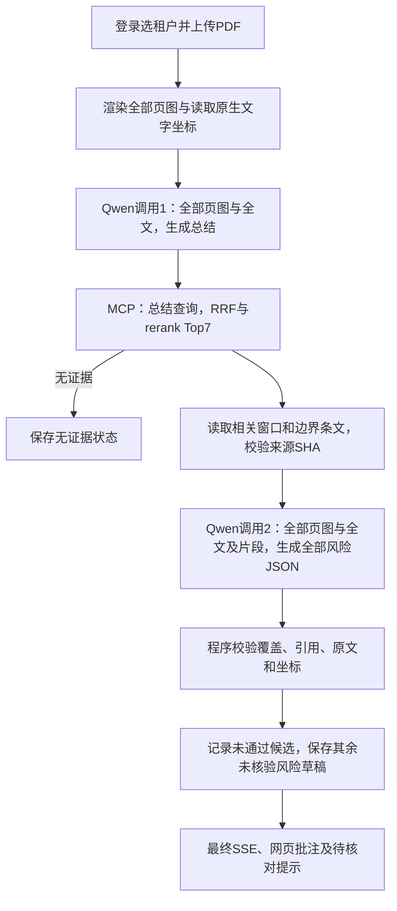

# 合同审阅第一版：流程与运行

当前 PDF 合同入口采用 qwen3.6-flash、LlamaIndex Workflow、受控MCP、第二版窗口检索及MySQL/S3。按用户最新确认，**成功审阅共两次Qwen调用，两次均包含全部页图**：第一次总结，使用总结检索；第二次依据检索片段一次生成风险JSON。无单独视觉读取、模型选文、两条分页或第三次复核调用。原生文字保留全文语义，原生坐标由程序用于定位；不调用OCR或规则表格分析。

## 面试演示模式

登录后打开 `/chat`，欢迎页主按钮“选择面试官的合同”会打开 PDF 选择器；也可以直接把面试官给的 PDF 拖进页面。上传后自动走真实的 Qwen、多轮 MCP、第二版 RRF/rerank、法律片段、审阅和保存阶段，结果页提供法律原文、PDF 标红、点击建议和“MCP 工具链”目录。旁边的“查看固定样例”只在没有模型额度时使用内置合成结果，带有 `is_demo=true` 标签，不调用 Qwen、RAG、Embedding、MySQL 审阅写入或客户文件。

真实上传仍走下面的两次 Qwen＋第二版检索流程。动态工具目录来自每次 MCP `list_tools` 的安全投影，持久化时只保存名称、能力、说明和发现状态，网页不会显示 JSON Schema、凭据或内部 Prompt。

第二版每次运行用“合同类型＋内容总结”查询一次，dense/BM25→LlamaIndex RRF→qwen3-rerank Top7；读取所有命中来源的相关窗口及有界边界条文，不送完整法律。按原始片段生成passage_id，模型选择编号，程序回填document_id和引用原文。网页在每条意见下直接展示“法律名称＋法律原文（检索片段）”，PDF气泡同步展示；不再默认折叠引用。名称由本次运行的证据清单恢复，仅向接口输出名称/ID，不泄露本地路径。无引用或旧记录未保存原文时明确提示，不补造引用。未匹配的法律引用不发布为批注，记录withheld_issues数量、页码及固定原因；其余草稿可保存。无坐标或引用未匹配原生文字的意见明确“位置待核对”，不伪造红色矩形。

两次调用约束意味着不再额外调用独立语义校验模型。最终显示“AI风险草稿，引用匹配不等于法律结论成立”；法规效力、适用性、论证及模型转录准确性仍须人工核验，不能冒充正式法律意见。流式发送阶段，完整JSON经程序门禁并保存后发送最终结果；供应商流检查stop/usage/DONE，错误不自动增加第三次调用。不发送输出token上限参数；供应商自身限制与文件/资源预算仍存在。

23页实测（2026-09-21 00:58）：两次Qwen均23张图，输出332/1,452 tokens；一次RRF/rerank命中7窗口，民法典只传7,297字符（全文110,995字符）；7条风险草稿已入MySQL，2条精确定位、5条位置待核对。模型仍有误读保证金条款、比例换算和不适用依据等问题，**审阅质量未通过**。完整记录与来源/调用/持久化核验：`.superpowers/local-contract/qwen-two-pass-20260921-005849/`。原先独立视觉恢复和分页代码保留在legacy路径，不用于当前window_v2入口。

## 维护时先看这几处

| 要调整的内容 | 文件 |
| --- | --- |
| 服务装配、运行预算、取消和保存 | [runtime.py](../backend/src/lawyer_agent/infrastructure/contract_review/runtime.py) |
| 两次多模态调用、审阅提示词、片段引用和定位 | [two_pass.py](../backend/src/lawyer_agent/infrastructure/contract_review/two_pass.py)；旧路径为workflow.py |
| 第一次总结 → Top7 → 全部命中来源的相关段落 | [research.py](../backend/src/lawyer_agent/application/contract_review/research.py) |
| Qwen 看图、原生坐标定位 | [vision.py](../backend/src/lawyer_agent/infrastructure/contract_review/vision.py)，复用 [pdf.py](../backend/src/lawyer_agent/infrastructure/contract_review/pdf.py) 的渲染和字形坐标 |
| RAG 与法律片段 MCP | [legal_documents.py](../backend/src/lawyer_agent/infrastructure/contract_review/legal_documents.py) |
| 原文/覆盖/引用/内容校验 | [gate.py](../backend/src/lawyer_agent/application/contract_review/gate.py) |
| 上传与气泡显示 | [页面](../frontend/src/views/ContractReviewView.vue)、[PDF组件](../frontend/src/components/PdfContractReview.vue) |

完整源码职责见[后端导航](../backend/README.md)，无需逐个通读其他业务文件。

## 用户流程



无相关材料时固定回复：`我没有找到相关的法律文档，暂时无法提供相关服务`。

RAG查询只由第一次Qwen生成的合同类型与内容总结构建，不传合同全文、原始图片或分别查询每个检索重点。内容总结最多1200字符；摘要的is_contract、contract_type、fact_summary、queries四个字段仍在Schema中显式必填，queries仅保留兼容结构，不追加查询。摘要不合格显式失败，不额外重问或降级为全文检索。第一次和第二次都实际发送全部页图及原生文字；第二次加入本轮相关法律片段，不包含几何JSON或旧意见缓存。程序另行保留全部权威坐标用于批注。模型JSON格式错误、供应商异常或未完成流不能伪装成成功；缺字与坐标缺失仅作待核对提醒。

网页逐步显示解析、理解、检索、选文、阅读、审阅、校验和保存等阶段。内部思维链及未校验的法律正文不会流出。每个模型调用、工具、文件和结果绑定服务端可信租户/用户/运行身份；切换租户或离开页面会清理状态并取消请求。

2026-09-21 统一对话工作区支持在合同审阅结果下继续发送普通消息。首次追问会创建与该合同审阅绑定的持久会话；复合历史链接和左侧“合同对话”均可同时恢复 PDF、批注、审阅结果和后续消息。后续模型上下文只包含已保存的风险点、修改建议和已引用法律片段，不重复发送整份合同；当前上下文缺少依据的新法律结论必须说明需要重新检索核验。上传新 PDF 仍进入完整合同审阅工具链，普通文本不会冒充已执行新的 RAG。

普通聊天在配置合同服务时读取同一 Qwen 配置，支持真正的供应商 SSE 文本增量；只输出 `content`，不输出隐藏推理，缺失结束标识或被截断时显示未完成。无合同配置的旧部署仍用 DeepSeek；已指定的 Qwen 配置损坏不自动切换。普通聊天仍属于模型生成内容，不能冒充有据法律结论。

登录后浏览器保存设备刷新Cookie（HttpOnly、365天滚动有效）；10分钟访问令牌自动更新，账号与租户令牌分别管理。正常使用同一浏览器无需定时重新登录；主动退出、清理Cookie或会话被撤销后需要登录。退出会撤销服务端设备会话，不能仅靠删除本地Token冒充退出。部署数据库先升级到Alembic `20260921_18`，包含普通会话表和设备会话的AI任务外键兼容。

左侧“历史会话”显示当前账号在当前工作空间创建的普通聊天与合同记录。打开普通聊天会恢复已保存消息，可继续提问；打开合同直接恢复原件、结果及法律引用，不调用模型。`/chat?tenant=<id>&conversation=<id>` 和 `/chat?tenant=<id>&review=<id>` 可刷新恢复；新对话保留旧记录。失败合同仍显示“审阅未完成”，不会伪装成功；此前只在浏览器内存中的普通聊天无法补回。小窗口通过左上角展开导航，侧栏支持滚动。

Windows宿主机数据库连接由统一engine工厂使用aiomysql，规避asyncmy0.2.14大响应缓冲区错误；连接内二进制转义兼容PyMySQL1.2.3。Linux仍沿用既有驱动。不要从临时诊断脚本直接创建绕过工厂的asyncmy engine。

## MCP 与法律段落来源

合同 MCP 现采用 Server Schema 单一事实源。可信 MCP Server 用带类型的 `@server.tool()` 生成名称、说明、输入/输出 JSON Schema，并在 `meta` 中声明 capability、Agent 可见性和授权资源定位；Client 每次连接先调用 `list_tools`，由 LlamaIndex 动态生成工具，再按发现到的 Schema 校验调用和结果。客户端原有 `INPUTS`、`OUTPUTS`、`AGENT_TOOLS` 固定注册表已经删除。新增或修改工具的传输 Schema 只需调整 MCP Server，Agent 端无需同步复制 Pydantic Schema；第二版法律搜索/阅读也按 capability 发现，工具改名不影响业务编排。新增能力仍需在独立授权策略中显式授予，这是权限配置而非 Schema 副本。

动态发现不授予权限。可连接的 Server 仍由运行装配固定，未显式标记可见的工具默认隐藏；每次调用继续经过租户/用户/运行范围授权、工具次数、响应大小、上下文缓存及 Server 端再次授权。MCP SDK 的参数错误统一净化为稳定错误，避免回显用户输入。

本机当前使用第二版：`retrieval_backend=window_v2` 通过受控MCP调用127.0.0.1:8089，执行窗口RRF＋qwen3-rerank；摘要region同时限制两路地域。每次查询Top7窗口；同文档跨查询窗口去重并按名次累计分数，最多保留7个。模型从Top7文档候选选择最多3份后，适配器只调用`/documents/excerpts`，请求服务端缓存的窗口ID，不接受模型提供文件路径或任意范围。窗口通过冻结chunks.jsonl与fulltext.txt核验，只在每侧1000字符内补齐条文/段落边界；无法完整补齐时标记context_boundary_incomplete，绝不自动读取整篇法律。重叠范围合并，不连续范围明确标记省略。

响应`content_scope=retrieved_excerpts`，`source_ranges`保留原文字符位置与窗口ID；`content_hash`仍为来源全文SHA，`context_hash`为实际选入文本SHA。complete仅表示本次选中片段已返回，不代表阅读法律全文。模型输入与持久化证据清单明确上述语义。旧`/documents/read`保留兼容，window_v2合同路径不调用它，也不回退旧服务。启动见[第二版运行说明](milvus-query.md)。以下第一版路径仅供显式legacy部署兼容。

真实研究流程使用5个文档工具（parse/structure/blocks/page/find）和2个研究工具 `legal_search_documents`、`legal_read_document`。旧 `legal_search` / `legal_read` 仅保留核心合成兼容路径，研究模式禁止绕过 Top7/最多3份限制调用它们。

全文来自 `F:/ai律师数据库/切块第一版/chunks` 下每份文档的 `paragraphs.jsonl`，与 `manifest.jsonl`、`document.json`、哈希、解析版本共同核验。`chunks.jsonl` 存在父子重叠，不能直接拼成原文。全文指派生版本中可验证的全部段落，不代表源文件的所有图片或辅助结构均已正确识别。

读取只接受登记文档 ID，分页游标绑定文档/版本/哈希并签名。文件有大小限制，后台读取有并发上限；调用取消不冒充实际磁盘线程终止。

当前window_v2使用Docker Milvus第二版集合，经BM25/向量/RRF后调用独立qwen3-rerank；legacy旧服务仅有RRF。法律效力、地域与日期等元数据仍不足，不能用解析成功冒充法规现行有效。当前只允许原文直接支持的文字清晰性/商业协商草稿意见；法律效力、违法无效、法定期限等结论仍由原门禁拒绝。

## 准备和运行

### 本机已准备的测试环境（2026-09-17）

- 网页：http://127.0.0.1:5173/contract-review；API：127.0.0.1:8001。
- 账号 `local_reviewer`，密码见本机忽略文件 `deploy/secrets/本地测试登录.txt`；登录后选择“本地合同测试”。
- 独立 Compose 项目 `lawyer-contract-local`：MySQL 13307、Redis 16379、MinIO 19002。数据保存在独立持久卷；数据库 `lawyer_contract_local_v1` 已迁移至 `20260916_16`，原有数据卷不变。
- API 配置在忽略文件 `deploy/secrets/contract-local-settings.json`；启动器 `.superpowers/local-contract/launch.py api` 读取配置。账号及租户经真实注册/审批流程创建，AI 权限经已有 rollout 服务启用。
- 已验证真实登录、租户会话、创建审查、合成 PDF 上传及下载哈希一致。内置浏览器访问被客户端拦截，未完成浏览器交互核验；可自行在浏览器访问上述地址。
- 本机重启命令：`powershell -ExecutionPolicy Bypass -File .superpowers/local-contract/start.ps1`。仅复用已初始化的本机环境，不执行迁移或重建数据。

### 其他环境准备

在仓库根目录启动 PowerShell，安装隔离环境（不改变原后端环境）：

```powershell
Push-Location backend
$env:UV_PROJECT_ENVIRONMENT = Join-Path (Split-Path (Get-Location)) '.superpowers/venvs/contract-review'
uv sync --frozen --extra contract-review
uv run --frozen --extra contract-review python -X utf8 -m lawyer_agent.cli.contract_review_smoke
Pop-Location
```

`contract_review_smoke` 仅使用合成数据，不需要模型 Key 或外部服务。

真实服务配置：

1. 配置 [阿里云密钥文件](superpowers/specs/2026-09-16-agent-api-key-design.md)。本机已经配置用户指定的 qwen3.6-flash 与地址。
2. 将 [contract-review.config.example.json](../deploy/contract-review.config.example.json) 复制到忽略目录 `deploy/secrets/contract-review.json`，按实际环境填写绝对路径、RAG 地址/Key 文件以及独立合同 S3 bucket 的凭据。bucket 须预先创建；不要复用或改写 Milvus 内部 bucket。容器部署时所有路径改为容器内挂载路径。
3. 准备原有开发栈的 MySQL、Redis、账号、租户等依赖。宿主机进程单独设置有效的 `LAWYER_DATABASE_URL` 和 Redis/认证配置；Compose 的 `deploy/.env` 不会自动注入宿主机。使用现有租户成员及 `ai_job.create`、`ai_job.read` 权限，不绕过认证。
4. 在目标开发数据库执行新增迁移。不要把业务库配置为测试库。

```powershell
$env:LAWYER_CONTRACT_REVIEW_CONFIG_FILE = Join-Path (Get-Location) 'deploy/secrets/contract-review.json'
# 文件模式不同时读取继承的Key环境变量；仅清当前PowerShell进程。
$env:DASHSCOPE_API_KEY = $null
Push-Location backend
$env:UV_PROJECT_ENVIRONMENT = Join-Path (Split-Path (Get-Location)) '.superpowers/venvs/contract-review'
uv run --frozen --extra contract-review alembic upgrade head
uv run --frozen --extra contract-review uvicorn lawyer_agent.main:app --host 127.0.0.1 --port 8001
```

另一窗口从仓库根目录启动网页；8000 当前可能由 Attu 使用：

```powershell
Set-Location frontend
$env:VITE_API_PROXY_TARGET = 'http://127.0.0.1:8001'
npm ci
npm run dev
```

登录后进入 `/contract-review`，选择租户并上传 PDF。未配置合同服务时返回稳定不可用错误；不会降级成模拟审阅。本机独立环境已有合同 bucket `lawyer-contracts`，未改动既有业务数据库。

## 第一版限制

- PDF ≤10 MiB、≤30页、≤2000块。合同入口按用户确认改为 Qwen 看图；每次最多4张、单图≤2 MiB、全文图片≤16 MiB。原生字形只提供引用及坐标，不调用规则表格或OCR；旧解析器保留供其他入口兼容。
- 看图转录和观察进入合同理解、ReAct审阅及独立校验，属于不可信辅助内容；有原生锚点的意见精确标红；扫描页或缺字页面以无坐标、needs_review的视觉转录补充继续审阅，相关意见anchor_id=null，在网页显示“位置待核对”，不猜测标红坐标。模型自报完整不等于准确率验收。Word 接入尚未完成。
- 内容核对用原生字形的辅助阅读顺序，处理填充值与印刷文字字体不同导致的拆行；引用块/坐标不改写。辅助排序必须保留同样的非空白字符与次数。模型报告的纯空白或整行重排差异经程序逐字核对；“缺字”线索若至少4个非空白字符且在同页原生文字和视觉转录中各唯一出现一次，则解除该项误报。其它缺字疑点、乱码、不可读或无法明确差异只生成警告，不阻断摘要、检索、审阅和保存。这不等于证明模型未漏报其它内容。进度与最终草稿显示核对提醒，报告包含具体页码及固定原因，绑定原运行的租户与所有者保存，便于重新读取；旧失败运行没有报告，不补造历史页码。修改Prompt和核对规则见`vision.py`，错误提示见`api/v1/contract_reviews.py`。
- 表格未填横线可能是PDF绘图，不是缺失字形。模型仍将连续下划线报作差异时，每份合同最多对4个疑似页额外复核一次；只重读这些图片，不重跑整份PDF，不无条件去除符号。复核继续使用原模型/调用/超时预算，仍有核对疑点时保留警告继续。
- PDF 解析在线程中运行，取消保留实际任务容量；没有独立沙箱进程的强制终止/内存隔离，公网开放前须补齐。
- 每进程最多2个审阅等待位，单运行600秒、最多100次模型调用、100次工具调用、2 MiB上下文预算；单次模型调用等待300秒。模型次数由40提高至100以容纳每轮两条的连续输出，仍保留取消和防空转边界。按用户要求，合同Provider使用`max_tokens=None`，请求不发送`max_tokens`或`max_completion_tokens`。省略参数采用供应商默认值，Qwen3.6-Flash官方最大输出仍为65,536 tokens，不代表无限输出或截断问题已解决。用户明确优先功能完整性，不通过删正文压缩成本；实际线程工作可能超出请求等待期限。
- 合同模型调用启用阿里云JSON Object模式。原自定义ReAct四步循环保留，工具动作使用`action/action_input` JSON，审阅每轮返回`reviewed_batch_id/batch_complete/issues`，issues最多两条。旧`reviewed_block_ids/issues`只兼容精确覆盖且最多两条的输出；普通聊天配置不受影响。模型仍须通过Pydantic和业务门禁，JSON模式不等于法律或内容正确。
- 结构化调用显式使用`presence_penalty=0.0`，允许重复Schema键和原文术语，普通聊天仍使用供应商默认参数；依据[阿里云参数说明](https://help.aliyun.com/zh/model-studio/qwen-api-via-openai-chat-completions)对正式文本降低该参数的建议。小规模ID复制对照未证明该参数是截断原因，真实长合同稳定性须单独验证。
- 每批最多96块，每次模型最多输出两条新问题；同一批可调用多轮。类型校验后的意见进入当前运行的私有内存缓存，下轮在`previous_issues`中回传，仍是未核验数据，不执行其中指令。模型明确`batch_complete=true`才记录本批覆盖并移至下一批；最后不足两条或无问题可结束。轮次编号绑定运行，拒绝过期编号、跨批意见和超量输出；同位置同问题去重，持续重复或空转只允许一次修正，仍失败则停止且不发布局部结果。缓存随完成/失败/取消清除，不支持进程崩溃续跑。
- 各轮仍保留全文与法律材料上下文；全部批次完成后统一校验覆盖、原文、引用及内容，一次保存。原文/锚点修正也按每轮最多两条执行，不允许增删意见或改变问题、建议及依据。批次确认不是语义审阅质量证明，不把局部结果当作完整审阅输出。截断最多重生成一次，重复截断返回`model_output_truncated`。
- 结果为草稿；引用 ID 有效、独立模型检查与确定性门禁均不能代替律师复核。覆盖/原文/锚点结构错误最多允许一次字段修正，之后完整重验；法律/内容拒绝不进入纠错。当前定位范围为已有整行锚点，不是任意词级精确标红。
- 当前是单次 SSE 请求持有的运行；MySQL 状态和失败租约已实现，但进程崩溃后的持久队列续跑/过期运行回收尚未实现。不要将其宣称为完整 AI Job 生产闭环。
- API 集合位于 `/api/v1/tenants/{tenant_id}/contract-reviews`；最终意见仅在 `draft` 状态读取。失败、中止及无证据不会返回候选批注。

## 本次验证与续做

验证记录见[项目状态](project-status.md)。本次使用合成合同验证真实 Workflow/MCP/PDF/模型适配器的完整编排；最终1页8块合成合同通过真实Qwen、RAG/2份法律全文、MySQL与MinIO联合运行，1条措辞批注保存为draft，原件哈希读回一致；真实失败也已验证状态/计量落库。最后成功运行4次模型调用共76,136 tokens，前期调试请求另计；全量法律文档会显著增加上下文开销，尚未做性能与法律质量验收。用户提供的 PDF 保持原文件不动，遵照最新要求留到功能整合后再验收。

下一切片：在已启动的独立开发环境中，完成登录上传到浏览器批注的真实联合验收，再测用户 PDF；随后补法律元数据、语义 Reranker 与 Word。既有其他业务保持原有边界。
