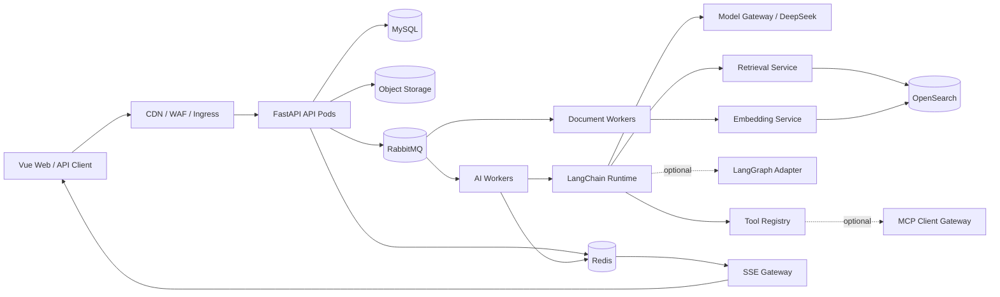
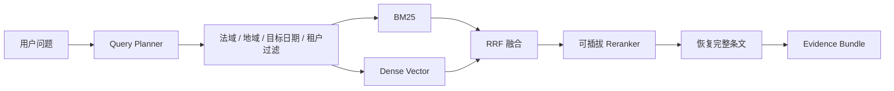

# 中国大陆企业级律师 Agent 总体设计规格

- 状态：已确认设计方向，进入实施计划前审阅
- 日期：2026-08-31
- 适用法域：中国大陆
- 产品形态：公网多租户 SaaS、响应式 Web、标准 API
- 目标用户：企业法务、律师事务所及其客户、法学院校教师与学生

## 1. 背景与目标

本项目建设一个面向中国大陆法律场景的企业级律师 Agent。平台同时覆盖三类业务：

1. 企业法务与律所内部工作；
2. 律所面向客户提供法律服务；
3. 法学教育与训练。

首期商业与责任边界为：律所租户自行提供承办律师，平台提供软件、AI 能力、证据检索、任务流转和人工复核工作流，不以平台名义自行提供承办律师。

系统必须从开发期即采用 Docker；本地通过 Docker Compose 一键启动，生产架构按 Kubernetes 设计。平台以万级注册用户、万级日活、10,000 RPS 轻量接口/任务受理能力为容量目标。AI 推理吞吐由模型供应商额度、Worker 数量、GPU 资源和队列容量决定，不将 10,000 RPS 等同于每秒完成 10,000 次模型推理。

### 1.1 核心目标

- 法律结论以证据为中心，每项结论可回溯到法规名称、版本、效力状态、条号、原文和来源。
- 同一平台安全服务多个律所、企业、院校及其外部客户，防止任何形式的跨租户数据访问。
- 支持合同审查、文书起草、企业知识库、专题合规、Matter 管理、报告生成、客户咨询和法学教育。
- LangChain 作为首期 AI 核心运行时；LangGraph 与 MCP 均按需接入，不成为首期核心功能的强依赖。
- 从第一阶段建立权限、审计、评测、可观测性和数据版本，而不是在原型完成后补建。
- 主要基础设施采用可自建的开源组件，并为等保三级整改和个人信息保护要求预留架构能力。

### 1.2 非目标与延期项

- 首期不自行组建平台律师团队，不替代律所的执业责任与专业复核。
- 首期不把 LangGraph 用于所有 AI 请求；仅在出现复杂分支、长期暂停恢复或多角色编排后按需使用。
- 首期不依赖任何具体 MCP Server，只建设 Tool Registry 和 MCP Client Gateway 的扩展边界。
- 企业 SSO、支付、电子签章、具体 MCP 服务、半自动法规增量抓取可以后续交付，但接口与数据边界需预留。
- 案例库和裁判文书库当前为空，不纳入首批数据导入完成标准。

## 2. 已有数据与数据原则

已有法律数据位于 `F:\ai律师数据库`，来源为国家法律法规数据库 `https://flk.npc.gov.cn/index` 的下载文件。只进行了目录盘点和少量抽样，没有全量读取正文。

当前盘点约为：

- 16,187 个文件，约 1 GB；
- 12,826 个 `.docx`；
- 3,179 个 `.doc`；
- 181 个 `.zip`；
- 1 个 `.docm`；
- 主要内容位于“法律法规数据库”，并按法律、行政法规、司法解释、监察法规、宪法及各省地方法规组织；
- ZIP 解压后的 Word 已存在，因此首期跳过 ZIP，避免重复入库。

### 2.1 原始数据原则

- 原始文件只读保存，计算 SHA-256 并形成导入清单。
- `.docm` 不执行宏；所有文档转换在受限环境中进行。
- `.doc` 可由加载适配器经 LibreOffice 转换后进入统一解析流程；`.docx` 使用 LangChain/Unstructured 对应加载能力。
- 原始文件、规范化文本、结构树、Chunk、Embedding 和 OpenSearch 索引分层保存。
- 原始文件是事实来源；解析文本、Chunk、向量与索引是可重建派生数据。
- 如果下载文件中没有原始页面 URL，只记录来源系统、文件路径和文件哈希，不猜测或拼造官方链接。
- 首批发布为不可变数据集快照 `dataset_v1`，记录清单、解析器版本、失败项和质量指标。
- 不能从本地文件确认法规时效状态时，系统必须标记为“状态未确认”，不得宣称其现行有效。

## 3. 技术选型

| 层次 | 首期选择 | 说明 |
|---|---|---|
| Web | Vue 3 响应式网站 | 同时服务桌面与移动浏览器 |
| API | Python + FastAPI | REST/OpenAPI、SSE、无状态部署 |
| AI 编排 | LangChain | 模型、Prompt、Runnable/Chain、结构化输出、Retriever、Tool Calling |
| 可选工作流 | LangGraph Adapter | 仅供复杂长流程、暂停恢复和多角色审批 |
| 生成模型 | DeepSeek V4 Flash 官方 API | 通过 Model Gateway 访问；当前可仅配置一个 Provider |
| 关系数据库 | MySQL | 业务与审计事实源 |
| 缓存/流 | Redis | 缓存、配额、锁、短状态、SSE 事件流 |
| 消息队列 | RabbitMQ | 异步 AI、文档、索引和批处理任务 |
| 搜索/向量 | OpenSearch | 必选；BM25 + Dense Vector 混合检索 |
| 对象存储 | MinIO/S3 兼容存储 | 原件、派生文件、报告、备份 |
| 密钥 | Vault/KMS 抽象 | 密钥与凭证轮换，不进入镜像或 Git |
| 部署 | Docker Compose / Kubernetes | 本地一键启动，生产水平扩容 |
| 可观测性 | OpenTelemetry + Prometheus/Grafana + Loki/Tempo | 指标、日志、链路与 AI 运营指标 |

### 3.1 Embedding 暂定方案

- 默认候选：`IEITYuan/Yuan-embedding-2.0-zh`，约 0.3B、1792 维，适合 12 GB 显存。
- A/B 候选：`richinfoai/ritrieve_zh_v1`，约 0.3B、1792 维。
- 长文本候选：`BAAI/bge-m3`，约 0.5B、1024 维、长上下文。
- 最终模型以本项目法律评测集的检索效果、延迟、显存和批吞吐为准，排行榜只用于候选筛选。
- Reranker 通过统一接口接入，具体模型在法律数据基准测试后确定。

## 4. 总体架构

采用“模块化单体业务核心 + 独立工作进程”的方案。首期保持一个代码仓库和清晰的模块边界，API、SSE、AI Worker、Document Worker、Embedding Service 可独立部署和扩容。

### 4.1 三条主链路

1. **同步业务链路**：鉴权、租户切换、Matter CRUD、成员管理等轻量请求由 FastAPI 在单个数据库事务中完成。
2. **AI 异步链路**：API 完成鉴权、配额和任务受理，返回 `202 + job_id`；AI Worker 消费任务，通过 SSE 回传可展示进度，最终结果落 MySQL。
3. **文档入库链路**：浏览器直传对象存储，经过校验、病毒扫描和安全转换后，由 Document Worker 解析、分块、向量化并发布到 OpenSearch。

### 4.2 模块化单体规则

- 每个业务模块拥有独立 Python 包、领域模型、表模型、Repository 与应用服务。
- 模块不能直接写入其他模块的数据表；跨模块命令通过应用服务调用。
- 可靠异步事件采用 Transactional Outbox：业务变更和 Outbox 记录在同一 MySQL 事务提交，再由发布器投递 RabbitMQ。
- 真实负载证明某个模块需要独立部署后，沿既有应用服务与事件边界拆出微服务。

## 5. 多租户、身份与权限

### 5.1 租户与身份模型

- 一个自然人对应一个全局 `User`，可绑定手机号、密码、邮箱和微信身份。
- `TenantMembership` 表示用户在某个律所、企业或院校中的成员身份、部门、角色、状态与有效期。
- 用户可同时属于多个租户，每个租户请求必须携带明确的租户上下文。
- 客户和学生可作为外部参与者加入特定 Matter、咨询、班级或作业，不因此获得租户其他数据。
- 平台个人账户可在未加入组织租户时使用允许的客户/教育入口。

### 5.2 授权模型

使用 RBAC + ABAC：

- RBAC 决定角色能执行哪些动作；
- ABAC 使用租户、部门、Matter 团队、密级、创建人、委托关系、资源状态和审批状态限制具体资源；
- 最终授权条件为：成员有效、角色允许动作、资源范围匹配、数据状态允许。

角色至少包括：

- 平台层：超级管理员、安全审计员、运维支持、内容运营；
- 租户层：租户所有者、租户管理员、部门管理员；
- 业务层：律师/法务、助理、教师、学生、外部客户。

### 5.3 超级管理员访问租户内容

超级管理员被允许查看租户内容，但不拥有无条件的日常裸权限。敏感访问必须：

1. 选择具体租户和资源范围；
2. 填写事由、工单号与访问期限；
3. 完成二次认证；
4. 获取短时特权令牌；
5. 默认禁止批量导出；
6. 记录访问、查看、下载和修改的完整审计事件。

### 5.4 各存储层隔离

- **MySQL**：首期共享集群与 Schema；全部租户业务表强制 `tenant_id`，复合唯一键和复合外键包含 `tenant_id`。Repository 自动注入租户条件。预留 `TenantDataLocator`，以后可迁移大客户到专属库或分片。
- **OpenSearch**：国家法规使用全局只读索引；租户私有知识使用池化私有索引并强制 `tenant_id` 路由和过滤；高密级或大租户可迁移专属索引。
- **对象存储**：按租户前缀和策略隔离，只发放短时单对象预签名地址；原件不可覆盖。
- **Redis**：所有 Key、锁、配额和 Stream 都包含租户维度，禁止缓存无租户维度的私有查询结果。
- **RabbitMQ/Worker**：消息仅保存任务引用和签名上下文；Worker 从 MySQL 重新加载任务、租户与权限范围，不信任消息体直接给出的资源地址。

### 5.5 安全与加密

- 全链路 TLS；Vault/KMS 管理主密钥，敏感字段使用信封加密。
- 密码使用 Argon2id；验证码接口限制发送、校验和枚举频率。
- 手机号、邮箱以加密值保存，并使用不可逆盲索引进行精确查询。
- 管理员使用更短会话、高风险操作再认证和二次认证。
- 生产数据、备份与灾备副本限定在中国大陆。
- 架构为个人信息保护、数据导出/删除和等保三级整改预留能力；最终合规仍需制度、测评、合同与运营流程配合。

租户和个人的数据导出、删除与保留使用受审计流程。业务数据先进入软删除和待清理状态，再按租户保留策略执行物理清理；存在法定保存义务、诉讼保全、审计要求或租户设置的 Legal Hold 时不得直接删除，并必须向申请人返回可解释状态。备份中的数据按备份生命周期到期清除，不承诺即时从每份历史备份中单独改写。

## 6. 法律数据、版本与检索证据链

### 6.1 入库流水线

1. 盘点文件、计算哈希、识别重复与生成 Manifest；
2. 安全提取 DOC/DOCX/DOCM，跳过 ZIP；
3. 规范化文本和基础元数据；
4. 识别编、章、节、条、款、项、目；
5. 提取标题、类别、机关、文号、地域、公布日、施行日、失效日和时效状态；
6. 执行文本覆盖率、条号连续性、重复、必需字段和异常格式检查；
7. 生成成功、降级和失败清单；
8. 向量化并构建新 OpenSearch 索引；
9. 质量门禁通过后切换数据集与索引别名。

### 6.2 法规与版本模型

- `LegalInstrument`：同一法规的稳定身份、标题、制定机关和法域。
- `LegalVersion`：一次公布/修订对应的文本版本、文号、公布日、施行日、失效日、状态、来源文件和数据集版本。
- `Provision`：某个版本中的完整条文、结构路径、条号、内容哈希和字符位置。
- `Chunk`：检索单元，关联 Parent Provision、解析器版本和质量状态。

“一部法规”与“某次版本文本”必须分离，以支持历史时点问答、失效法规识别和版本差异。
标题相似、文号缺失或元数据冲突时，自动流程只能生成“可能属于同一法规”的候选关系；未通过规则或人工确认前不得合并为同一个 `LegalInstrument`，以免把不同法规或不同地区文件误判为版本关系。

### 6.3 分块规则

- Parent Chunk 是完整条文，包含章/节标题和该条全部款项。
- 长条文可按款、项、目建立 Child Chunk；检索命中 Child 后恢复完整 Parent。
- 禁止跨条拼接。
- 格式异常时降级为“标题 + 段落”，并标记质量状态。
- 表格和附件独立分块，但必须保留与正文及原始文件的关系。

### 6.4 混合检索

Query Planner 决定公共法规、租户私有知识或二者联合检索，并解析法域、地域和目标日期。检索使用 BM25 与 Dense Vector，经过 RRF 融合、可选重排、去重和 Parent 恢复后形成 Evidence Bundle。

### 6.5 Evidence Bundle 与证据门禁

每条证据至少包含：

- 不可变 `evidence_id`；
- 法规/制度名称；
- 版本、公布/施行日期与效力状态；
- 条号、结构路径和完整原文；
- 来源文件、文件哈希、数据集版本；
- 当前用户的访问授权结果。

模型输出使用结构化 `claims[]`。每项法律结论必须绑定一个或多个本次 Evidence Bundle 中的 `evidence_id`。后端验证：

- Evidence ID 存在且属于本次任务；
- 当前租户与用户有权访问；
- 版本与目标日期不冲突；
- 引用字段和条文原文可以被完整展示；
- 无证据、版本冲突、状态未知或引用不支持结论时，降级、要求人工复核或拒答。

模型不得将常识、用户材料、租户制度或未来 MCP 返回值冒充国家现行法律。

### 6.6 半自动更新

后续更新先生成候选数据集，计算文件与条文级差异；通过自动质量检查和人工发布后形成 `dataset_v2` 等新版本。新索引构建完成后原子切换别名，旧数据集继续用于历史问答和快速回滚。

## 7. LangChain Agent、模型与工具

### 7.1 场景化 Chain 优先

系统不构建一个拥有全部工具和权限的万能 Agent。显式业务 API 优先选择场景；自由聊天入口只作为意图路由兜底。每个场景拥有独立输入、Prompt、工具白名单、输出 Schema、风险策略和评测集。

首期场景包括：

- 法规问答 Chain；
- 合同审查 Chain；
- 文书起草 Chain；
- 企业知识问答 Chain；
- 合规检查 Chain；
- 法律咨询 Chain；
- 法律报告 Chain；
- 法学教育 Chain。

统一 AI 管线为：请求受理 → 场景路由 → 权限/风险策略 → 专用 Chain → 引用与 Schema 验证 → 风险处置 → 持久化与回传。

### 7.2 Model Gateway

Model Gateway 隐藏具体 Provider，暴露统一的聊天、结构化输出、工具调用、Embedding 和 Rerank 接口。模型配置描述能力、上下文、超时、速率、成本和数据策略。

首期生成模型可仅配置 DeepSeek V4 Flash。即使只有一个模型，也必须记录模型版本、延迟、Token、费用和错误，并实现限流、超时、熔断和有界重试。没有配置备用模型时，供应商故障应明确排队或失败，不得伪造 fallback。

### 7.3 Tool Registry 与 MCP

原生工具至少包括：法规搜索、获取完整条文、租户知识库检索、读取 Matter、读取合同/文件、获取模板/规则包、创建受控任务。

每个工具声明：

- Pydantic 输入/输出 Schema；
- 所需租户权限与资源范围；
- 只读或写入；
- 风险级别、超时、调用费用和审计策略；
- 是否需要用户确认、人工批准或幂等键。

未来 MCP 的主要方向是增强本 Agent：Agent 作为 MCP Client 调用外部 MCP Server。MCP Client Gateway 负责服务器白名单、租户授权、凭证隔离、超时、出站网络、调用审计和输出清洗。首期没有具体 MCP Server，核心能力不依赖 MCP。

### 7.4 LangGraph 边界

普通 AI Worker 直接执行应用服务和 LangChain，不依赖 LangGraph。人工审批首期由 MySQL 状态机实现。只有出现复杂分支、多角色编排、跨天暂停、Checkpoint 与失败恢复需求时，才把相应流程接入 LangGraph Adapter。

### 7.5 风险分级

- **低风险**：基础法规知识、教育讲解、普通条文定位，可直接输出，但仍需证据和版本。
- **中风险**：合同修改建议、一般合规检查、文书初稿，以草稿形式输出，标记待确认事项。
- **高风险**：诉讼策略、时效结论、正式法律意见书和对外提交材料，必须进入租户律师/法务人工复核。

首期审批状态：`DRAFT → PENDING_REVIEW → CHANGES_REQUESTED / APPROVED / REJECTED`。只有 `APPROVED` 版本可以作为正式交付物发布。

### 7.6 Prompt 与工具安全

- 用户上传文档、网页、租户知识和 MCP 输出均为不可信内容。
- 文档中的“忽略规则、调用工具、泄露信息”等文字不能成为系统指令。
- 模型无数据库、文件系统和任意互联网直接访问权，只能调用 Tool Registry 暴露的受控工具。
- 外部模型只接收完成任务所需的最小数据，敏感字段先脱敏或阻断。
- 结构化输出失败最多进行一次受控修复，仍失败则安全终止。
- 不保存或向用户展示模型内部推理过程、系统 Prompt 与其他租户上下文。

## 8. 业务领域设计

### 8.1 四个共享业务积木

- **Matter**：一次合同审查、诉讼案件、企业事项或客户咨询的业务项目文件夹，管理参与者、负责人、时间线、截止日和关联资源。
- **Document**：合同、证据、制度和报告的原件、版本、解析状态与访问控制。AI 不直接覆盖原件。
- **Knowledge**：国家法规与租户私有知识的空间、文档、ACL、版本与检索任务。
- **Review**：AI 草稿、风险项、批注、退回、修改、批准与正式发布。

辅助能力包括 Party、Task、Template、Rule Pack、AI Job、Notification 和 Audit。

### 8.2 企业法务与律所七项核心能力

1. **法规问答与条文溯源**：`LegalResearch` 保存问题、Evidence Bundle、结论和引用验证结果。
2. **合同上传、风险审查与修改建议**：`ContractReview` 保存合同版本、条款、审查运行、风险项、依据、建议和人工处置。
3. **合同或法律文书起草**：`Drafting` 保存事实槽位、模板版本、章节草稿、变量和一致性校验结果。
4. **企业制度与知识库问答**：`TenantKnowledge` 保存知识空间、文档 ACL、版本和索引任务，并区分企业制度依据与国家法律依据。
5. **劳动用工、公司治理等专题合规检查**：`Compliance` 保存规则包、检查计划、检查项、证据、缺口、整改任务和复查。
6. **案件/咨询事项管理**：`MatterManagement` 统一参与方、团队、文件、时间线、任务、期限、沟通和费用；诉讼案件是 Matter 子类型。
7. **法律意见书或审查报告生成**：`LegalReport` 只消费已确认事实、风险项和法律证据；正式发布需批准，发布后只能创建新版本，并可从固定版本快照导出 DOCX/PDF。

### 8.3 合同审查流程

上传并创建 Document Version → 安全解析 → 识别合同类型和条款 → 规则包 + 法规 RAG + 租户立场/范本 → 生成 Risk Issue → 律师接受/驳回/修改 → 导出审查报告、修改稿和版本差异。

Risk Issue 至少包含：风险级别、原条款位置、问题描述、法律/制度依据、建议文本、证据充分性、模型版本和人工处置。

### 8.4 客户法律服务

- Intake：问题、相关当事方、文件、紧急程度、个人信息处理同意。
- Consultation：问题分类、初步风险、可能路径、管辖/期限提示、证据材料清单。
- Conflict Check：在分派律师前由授权人员按当事方执行利益冲突检查；结果只回答是否存在冲突及处置状态，不向无权用户泄露其他保密 Matter。
- Assignment：律所租户分派自己的律师或法务人员。
- Service Catalog/Quote：服务项目、报价、预约和状态；支付后续独立接入。
- 客户只查看自己被授权的 Matter、文件、消息和对外发布版本。

模型计算或提示的诉讼时效、除斥期间、上诉期和其他程序期限均属于高风险建议值，必须记录计算依据、起算事实和不确定项，并由律师/法务确认后才能成为正式 Matter 截止日或对外结论。

### 8.5 法学教育

- 课程、班级、章节、作业、题目、量规、提交、评分和进度独立建模。
- 知识问答、案例分析、苏格拉底追问、模拟法庭、考试练习、主观题评分和文书训练共享法规证据库。
- 自动评分保留评分量规、命中点、模型反馈和教师覆盖结果。
- 教育对话不能自动转为正式法律意见；确需法律服务时显式创建咨询 Matter。
- 教师只访问所属班级，学生只访问自己的提交和获授权课程资源。

## 9. API、异步任务、文件与实时通信

### 9.1 REST API

- 基础路径 `/api/v1`。
- 租户资源使用显式路径，例如 `/api/v1/tenants/{tenant_id}/matters`，服务端仍需验证成员关系。
- FastAPI 生成 OpenAPI；Schema 进入版本控制并执行契约测试。
- 创建任务和重要写操作支持 `Idempotency-Key`。
- 大列表使用游标分页。
- 资源使用 `version`/ETag 与条件更新防止并发覆盖。
- 错误使用统一 Problem Details 风格，包含稳定 `code`、可读说明、字段错误和 `trace_id`，不暴露堆栈、SQL 或秘密。
- 配额或背压返回 429/503 和 `Retry-After`。

用户登录使用短时 Access Token 与轮换 Refresh Token。企业系统集成使用租户 Service Account/API Key，Key 只保存哈希，并配置 Scope、有效期、IP 策略和配额。异步外部集成以后可增加 HMAC 签名 Webhook。

### 9.2 AI Job

耗时请求返回 `202 Accepted`、`job_id`、状态地址和事件地址。任务状态包括：

`QUEUED → RUNNING → WAITING_REVIEW / SUCCEEDED / FAILED / CANCELLED`

RabbitMQ 按至少一次投递设计，Worker 步骤必须幂等。失败采用有界指数退避，超过重试上限进入死信队列并告警。用户可取消尚未进入不可中断阶段的任务。

### 9.3 SSE

- SSE Gateway 独立部署和扩容。
- 事件使用递增 Event ID，支持 `Last-Event-ID` 重连。
- 可用事件：`progress`、`citation`、`draft`、`review_required`、`completed`、`failed`。
- `draft` 只能用于明确标识为未完成的工作区内容；涉及法律结论时，只有已绑定并通过增量证据校验的 Claim 才能发送。无法增量校验的场景不流式发送答案正文，只发送阶段进度并在完整门禁通过后返回结果。
- SSE 只承载实时体验；最终任务和结果持久化到 MySQL。
- 事件不包含内部推理过程、系统 Prompt 或其他租户内容。

### 9.4 文件上传

1. API 创建上传会话并返回短时预签名地址；
2. 浏览器分片直传 MinIO/S3，不经过 FastAPI Pod；
3. 完成后校验大小、MIME、SHA-256 和租户配额；
4. 病毒扫描、宏禁用与沙箱转换；
5. 状态变为 `ACCEPTED` 后才投递解析任务；
6. 密码保护或无法安全解析的文件进入人工处理状态，不绕过安全检查。

## 10. 部署、容量与故障恢复

### 10.1 本地 Docker Compose

默认包含 Vue/Nginx、FastAPI、AI Worker、Document Worker、MySQL、Redis、RabbitMQ、OpenSearch 和 MinIO。短信、邮件等外部服务使用开发模拟器。GPU Profile 启动本地 Embedding Service，并通过 NVIDIA Container Runtime 使用 12 GB 显卡。

### 10.2 Kubernetes 生产拓扑

- API Deployment：按 CPU、RPS 和延迟扩容；
- SSE Gateway：按活动连接数和事件吞吐扩容；
- AI Worker：按队列深度、最老任务等待时间和 Provider 配额扩容；
- Document Worker：按文件积压和解析时长扩容；
- Embedding/Reranker：部署到 GPU 节点，在线和批处理队列隔离；
- 定时/运维 Job：索引、清理、对账、备份与评测。

Pod 使用非 root、只读根文件系统、资源 requests/limits、NetworkPolicy、独立 ServiceAccount、PodDisruptionBudget、反亲和和滚动发布。镜像固定摘要并执行漏洞扫描和 SBOM 生成。

### 10.3 有状态服务

- MySQL：三节点高可用、连接代理、只读副本、自动备份和时间点恢复；
- Redis：主从/集群与故障转移，缓存、配额和 SSE Streams 分命名空间；
- RabbitMQ：三节点 Quorum Queue，按在线、合同、文档和批处理分队列；
- OpenSearch：专用主节点和可扩展数据节点，副本、快照和索引生命周期；
- MinIO：分布式纠删码、对象版本和跨故障域副本；
- Vault：高可用、短时身份和凭证轮换。

具体 Operator、节点数和硬件规格在容量测试和生产预算明确后确定。

### 10.4 容量验收暂定值

压测前先冻结轻量读、轻量写、AI 任务受理和 SSE 的请求比例与响应大小。暂定首期目标：

- 总入口 10,000 RPS 持续 15 分钟，不发生级联故障；
- 轻量读 p95 ≤ 300 ms；
- 轻量写和 AI 任务受理 p95 ≤ 500 ms；
- 平台错误率 ≤ 0.1%，明确的配额/背压 429 单独统计；
- 至少 10,000 条并发 SSE 连接通过断线重连与滚动发布测试；
- 正式容量至少保留 30% 余量。

使用 k6/Locust 执行单接口、混合、突发、长稳和容量极限测试。以上数字在真实工作负载画像建立后可调整，但必须以可重复脚本和报告验收。

### 10.5 故障降级

- DeepSeek 不可用：熔断新调用、保留任务并有界重试；无备用模型时明确失败或延迟。
- OpenSearch 不可用：已有业务数据和报告可读；需要新法律证据的回答暂停或拒答。
- Redis 不可用：缓存降级并保护 MySQL；SSE 重连后从 Job 快照恢复。
- Worker 崩溃：未 ACK 消息重新投递，依靠幂等步骤、租约和检查点恢复。
- MySQL 主故障：代理切换新主，应用只进行有界重试。
- 对象存储不可用：暂停上传、解析和新导出，保留任务状态待恢复。

### 10.6 灾备暂定值

- MySQL：RPO ≤ 5 分钟，RTO ≤ 30 分钟；
- 对象存储：版本化、跨故障域复制、加密离线/异地备份；
- OpenSearch：定期快照，并可从 MySQL + 对象存储重建；
- 所有备份在中国大陆，定期执行恢复演练。

## 11. 测试、法律评估与发布门禁

### 11.1 测试层次

1. 单元测试：领域规则、权限、条文解析、版本判断、引用验证和状态机；
2. 集成测试：MySQL、Redis、RabbitMQ、OpenSearch、MinIO 和模型适配器；
3. API/E2E：OpenAPI、登录、上传、任务、SSE、审批和完整业务纵切；
4. AI 法律评估：检索、引用、结论、拒答、合同风险和人工复核路由；
5. 非功能测试：串租攻击、文件安全、容量、故障注入和备份恢复。

### 11.2 金标准评测集

系统可从真实业务场景和法规生成候选题，但只有经律师、法务或法学教师确认的题目才能成为发布门禁。首期目标 100–300 条，覆盖：

- 法规问答、条文定位、历史版本、地域与效力冲突；
- 证据不足和正确拒答；
- 合同关键风险、误报、严重性与修改建议；
- 文书完整性、一致性和引用；
- 合规检查与整改建议；
- 客户咨询风险分级；
- 教学讲解、主观评分和教师量规。

每条题包含输入、目标日期、事实边界、正确证据、允许结论、禁止错误、风险等级和专业审核人。未经审核的自动题只能用于探索。

### 11.3 指标

- 检索：Recall@K、MRR/nDCG、正确版本召回、Parent 恢复率；
- 引用：结论覆盖率、引用支持率、条号/版本/状态正确率、错误来源率；
- 答案：法律正确性、事实越界、正确拒答、风险等级与审批路由；
- 合同：关键风险召回、误报率、严重性、依据和建议可执行性；
- 文书：章节完整性、事实/金额一致性、引用和模板规则；
- 运营：延迟、Token/费用、失败率、人工修改率、采纳率和投诉。

模型评分器可以辅助筛选，但不能单独决定高风险法律质量是否发布。

### 11.4 硬发布门禁

出现以下任一情况即阻止发布：

- 跨租户读取、缓存串租、越权下载或跨租户工具调用；
- 法律结论没有引用，或伪造法规、条文和来源；
- 将状态未知、历史失效或错误地域文本宣称为当前适用；
- 高风险结果绕过人工复核向客户发布；
- 数据库迁移无法安全前向修复/回滚，或备份恢复演练失败。

### 11.5 CI/CD

提交依次经过：格式与类型检查 → 单元测试 → 依赖/Secret/镜像/SBOM 扫描 → 集成与租户隔离测试 → AI 回归与数据库迁移兼容检查 → Staging Smoke → 小流量 Canary → 发布与监控。

代码、Prompt、模型路由、规则包、评测集、解析器、数据集和搜索索引分别版本化，线上结果必须可追溯到完整版本组合。

## 12. 分阶段实施顺序

### 阶段 0：工程与安全底座

项目结构、Docker Compose、FastAPI、MySQL 迁移、身份/租户/权限、审计、AI Job、RabbitMQ、对象存储、CI、测试骨架和可观测性最小闭环。

### 阶段 1：法规数据与有据问答

导入 `dataset_v1`、结构解析、版本模型、OpenSearch 混合检索、Embedding 基准、Evidence Bundle、Citation Gate、DeepSeek 问答和 SSE。

### 阶段 2：文档与合同审查

安全上传、版本管理、文档解析、合同类型/条款识别、风险规则、法律依据、修改建议、人工复核和报告导出。

### 阶段 3：Matter、客户服务与正式文书

Matter、参与方、任务、期限、咨询受理、律师分派、客户进度、文书起草、意见书和正式报告。

### 阶段 4：企业知识与合规

知识空间 ACL、企业制度问答、规则包、检查计划、整改任务和复查。

### 阶段 5：法学教育

课程、班级、题库、案例分析、苏格拉底问答、模拟法庭、评分量规、错题与学习进度。

### 阶段 6：生产强化与扩展

10,000 RPS 压测、HA/灾备演练、等保三级整改、灰度发布和运营后台；根据真实需求接入 MCP Server，并仅在复杂工作流出现后引入 LangGraph。

每个阶段交付可运行的业务纵切，不采用“先做不安全 Demo、最后再补企业能力”的方式。

## 13. 暂定项与待决策项

以下内容不阻止制定实施计划，但在相应阶段开始前必须确认：

- 精确 Reranker 模型与 Embedding 最终胜出者；
- 短信、邮件、微信开放平台的供应商与账号条件；
- 企业 SSO、支付、电子签章的首个接入范围；
- MySQL、Redis、OpenSearch、MinIO 和 Vault 的具体 Kubernetes Operator 与硬件规格；
- 真实 10,000 RPS 流量模型及最终延迟 SLO；
- RPO/RTO 是否满足商业等级与预算；
- 首批 100–300 条专业评测数据的审核人员与流程；
- 首个具体 MCP Server 与是否存在需要 LangGraph 的真实长流程；
- 法规半自动更新的授权、抓取方式、差异审核与发布职责。

## 14. 设计验收结论

本设计确认以下不可降低的基线：

1. 仅适用中国大陆法域；
2. 法律结论必须有可验证证据，证据不足时拒答或转人工；
3. 多租户隔离覆盖数据库、搜索、缓存、对象存储、队列、工具和审计；
4. 高风险结果必须由租户律师/法务批准；
5. LangChain 是首期核心，LangGraph 与 MCP 均可插拔；
6. OpenSearch 是混合检索基础设施；
7. Docker Compose 与 Kubernetes 从首期保持同镜像、同配置模型；
8. 10,000 RPS 通过压测报告验收，不以架构描述代替验证；
9. Prompt、模型、法律数据、解析器、规则和索引全部版本化；
10. 任何串租、伪造法律依据、错误时效断言或高风险越过人工复核都属于阻断发布的问题。
