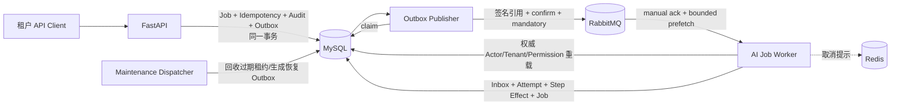

# 租户级持久 AI Job 与可靠执行内核设计

- 日期：2026-09-03
- 状态：执行基线（用户已授权自主推进；未逐项书面确认）
- 所属阶段：阶段 0——工程与安全底座
- 适用法域：中国大陆
- 前置规格：`2026-08-31-lawyer-agent-enterprise-architecture-design.md`、`2026-09-01-multitenant-identity-authorization-design.md`

## 1. 背景与目标

本增量在已经完成的身份、租户、会话和 RBAC + ABAC 底座上，建立可供后续 LangChain、法律检索、合同审查和文档处理复用的持久异步执行内核。它交付：

1. 租户级持久 `AIJob`、执行尝试、访问授权、Transactional Outbox、Consumer Inbox 和幂等 Step Effect；
2. 只传任务引用的签名 RabbitMQ 消息，以及消息防篡改、重放识别和密钥轮换；
3. 基于 `aio-pika` 的 Publisher、Worker 与 Maintenance Dispatcher；
4. 至少一次投递下的去重、租约、Fencing、取消竞争、有界重试、DLQ 和受审计重放边界；
5. Development/Test/Staging 激活环境的 `202 Accepted` 受理、状态查询和取消 API；Production 本增量保持 Catalog-only；
6. 仅在 Development/Test/Staging 显式启用、固定 `non_publishable` 的受控 Synthetic Handler，完成真实 MySQL、RabbitMQ、Redis 集成验收；Production 永禁。

本增量的成功标准不是生成任何法律答案，而是证明：任务一经 MySQL 提交便不会因 API 或 Broker 短暂故障静默丢失；重复消息不会重复提交逻辑效果；过期 Worker 不能覆盖新 Worker；撤销权限和取消请求会在执行边界被重新检查；任意跨租户路径均失败。

## 2. 范围和非目标

### 2.1 本增量范围

- 新增 `ai_job.create`、`ai_job.read`、`ai_job.cancel` 三个稳定租户 Permission Code；
- 新增 AI Job 领域类型、应用服务、Repository、Unit of Work 和 Alembic 前向 Migration；
- API 事务内原子写入 Job、幂等记录、审计事件和 Outbox；
- Publisher 通过 Publisher Confirm 与 `mandatory` 路由保证确认投递；
- Worker 使用手动 ACK、每 Consumer 有界 Prefetch、MySQL 权威授权重载和持久执行租约；
- Retry Queue、DLQ、Maintenance Dispatcher、故障恢复和最小运行指标接口；
- Development/Test/Staging 下显式启用的确定性 Synthetic Handler 与故障注入测试点；
- Docker Compose 增加独立 Publisher、Worker 和 Maintenance Dispatcher 进程；
- 为 Kubernetes 多副本、滚动发布和后续业务 Handler 保留清晰端口。

### 2.2 明确非目标

本增量不实现或假装实现以下能力：

- LangChain、LangGraph、模型供应商、Embedding、RAG、Evidence Bundle 或 Citation Gate；
- 法律法规问答、合同审查、文书起草、知识库、合规、Matter 或法律报告成果；
- SSE、WebSocket、进度正文流式传输或通知中心；
- MinIO/S3 对象上传、下载、预签名地址或结果文件；
- 任意 Prompt 正文、客户文档、法律原文或对象地址进入消息体；
- 外部副作用、Webhook、邮件、短信、支付、电子签章或 MCP Tool；
- 生产 RabbitMQ 多节点部署、Kubernetes Operator、真实 10,000 RPS 容量或法律质量验收；
- 对终态 Job 原地重跑，或对已经产生的外部副作用承诺“恰好一次”。

Synthetic Handler 只允许在 Development/Test/Staging 显式启用并固定 `non_publishable`；它只返回固定的非法律结果码，不输出事实、建议、法律结论或可供客户交付的文本。Production 必须拒绝加载或启用 Synthetic Handler。

## 3. 本增量设计决定

下列决定在既有规格中没有完整参数。为使增量可实现且 Fail Closed，本规格采用保守默认；它们是“本增量设计决定”，不是对后续业务产品的永久授权：

1. MySQL 是 Job、状态、授权关联、重试计划和效果的唯一事实源；RabbitMQ 是可重复投递的唤醒通道，不是业务事实源。
2. API 不直接发布 RabbitMQ；Job 与 Outbox 在同一事务提交，独立 Publisher 负责发送。
3. 默认每 Job 最多执行 4 次（首次执行 + 最多 3 次重试）；三个重试桶依次为 5 秒、30 秒、120 秒，不使用无界重试。
4. Job 执行租约默认 60 秒，Synthetic Handler 每 10 秒以内检查一次取消并每 20 秒以内续租；所有值通过强类型配置给出，必须满足续租间隔小于租约的一半。
5. 首次看到的消息允许最多 15 分钟旧、最多 60 秒未来时钟偏差；已经在 Inbox 留下相同 Digest 的合法重投不再受首次时钟窗限制。
6. 本增量仅给租户所有者、租户管理员、部门管理员、律师/法务、助理和教师授予 AI Job 权限；学生与外部客户默认无新权限。后续教育或客户业务规格可显式扩展。
7. 创建 API 固定生成 `owner_only` Job，不接受 Visibility 输入。租户所有者和租户管理员的 Job 专用 Scope 为 Tenant-wide；其余获权角色为 Owner/Shared，只可读取自己或显式共享的 Job，并只可取消自己的 Job。
8. 本增量不提供共享管理 API。`ai_job_access_grants` 作为后续受控业务服务的端口存在，集成测试以直接 Fixture 验证 Shared 读取；普通创建者不能借创建 API 给他人授权。
9. Redis 取消通知仅为低延迟提示，MySQL `cancel_requested_at/status` 始终为权威状态；Redis 故障不得导致已提交取消丢失。
10. 所有 Queue 使用 Durable Quorum Queue 和 Persistent Message；Compose 单节点只验证协议和持久化路径，不声称具备 Quorum 高可用。
11. 每个 Job 最长寿命 24 小时，`ai_jobs.expires_at` 是 Job 和持久执行授权共同使用的唯一权威到期值。原浏览器 Session 自然到期或普通 Logout 不撤销已经受理的执行授权，显式安全版本变化、Membership/Tenant/User 失效或授权撤销会立即阻止后续执行边界。
12. 消息使用独立用途的 Ed25519 签名。Publisher 独占 Private Seed Ring；Worker 只获得 Public Verify Ring；API 与 Maintenance 都不得持有消息签名私钥。
13. Production 在本增量始终保持 Permission `catalog_only` 且禁止 Synthetic；只有 Development/Test/Staging 可以完成 Synthetic Activation 和 202 验收。首个真实 Handler 必须通过后续规格才可激活 Production 权限和受理。

这些默认值以后只能通过新规格、测试和向前兼容的配置/Migration 调整，不能通过放宽校验或运行时隐式默认改变。

## 4. 架构与模块边界



### 4.1 模块

- `domain.ai_jobs`：状态、失败分类、消息 Envelope、ExecutionContext、租约和状态迁移规则；不依赖 FastAPI、SQLAlchemy、RabbitMQ、Redis 或供应商 SDK。
- `application.ai_jobs`：创建、读取、取消、权威授权重建、Worker Claim、Finalize、Retry 和 Recovery 编排。
- `infrastructure.persistence.ai_jobs`：所有租户谓词、复合外键、行锁、乐观锁和 Fencing 条件写。
- `infrastructure.messaging`：消息签名、拓扑声明、`aio-pika` Publisher/Consumer Adapter。
- `workers.ai_jobs`：只调用应用端口，不直接修改 ORM Model。
- `workers.maintenance`：回收过期 Claim/Lease、重建新鲜 Dispatch，不执行 Handler，不直接发布 RabbitMQ。
- `synthetic_handler`：只在 Development/Test/Staging 显式开启，固定 `non_publishable`，提供确定性成功、一次重试、永久失败和等待取消场景；Production 永远拒绝加载或启用。

现有 `authz_cache_invalidation_outbox` 不得复用作 AI Job 消息 Dispatch；它继续服务包括 Permission Rollout 在内的身份授权缓存补偿，载荷、重试和完成语义与 AI Job 不同。本增量建立独立 `ai_job_outbox`。

## 5. 权限、角色与 ABAC

### 5.1 Permission Catalog

| Permission Code | Resource | Action | 风险级别 | 含义 |
|---|---|---|---|---|
| `ai_job.create` | `ai_job` | `create` | medium | 在显式租户上下文受理允许的 Handler |
| `ai_job.read` | `ai_job` | `read` | medium | 读取获授权 Job 的状态与安全结果投影 |
| `ai_job.cancel` | `ai_job` | `cancel` | high | 请求取消获授权 Job |

Seed 继续执行语义漂移检查。同 Code 的资源、动作或风险级别变化必须失败，不能静默覆盖。

### 5.2 本增量角色矩阵

| 租户角色 | create | read | cancel | ABAC Scope |
|---|---:|---:|---:|---|
| 租户所有者 | 是 | 是 | 是 | tenant-wide、owner、shared |
| 租户管理员 | 是 | 是 | 是 | tenant-wide、owner、shared |
| 部门管理员 | 是 | 是 | 是 | owner、shared；本增量不因部门身份自动读取全部部门 Job |
| 律师/法务 | 是 | 是 | 是 | owner、shared |
| 助理 | 是 | 是 | 是 | owner、shared |
| 教师 | 是 | 是 | 是 | owner、shared |
| 学生 | 否 | 否 | 否 | 默认拒绝 |
| 外部客户 | 否 | 否 | 否 | 默认拒绝 |

平台角色不获得这些租户 Permission。超级管理员、运维支持或 Worker 身份都不能仅凭平台角色读取 Job 内容。

### 5.3 ABAC 固定规则

- Create：必须是 Active Tenant 中的 Active、有效期内 Membership，并具有 `ai_job.create`。创建结果固定 `owner_only`；本增量 API 不接受 Visibility 或共享成员列表。
- Read：先满足 `ai_job.read`，再满足以下任一条件：`created_by_user_id == principal.user_id`；存在未撤销的同租户 `read` Access Grant 指向当前 Membership；Job 专用 Principal Scope 为 Tenant-wide。
- Cancel：先满足 `ai_job.cancel`，再要求 Principal 是 Job Owner 或 Job 专用 Scope 为 Tenant-wide。Shared 只读授权永远不能取消。
- 任意未知 Visibility、Grant Level、Handler、资源字段、租户状态、角色、Permission 或 Scope 均默认拒绝。
- 路径 Tenant、Token Tenant、ExecutionContext Tenant、Job Tenant 和所有子表 Tenant 必须完全相同。
- 猜测其他租户 Job ID 一律返回 404；同租户已定位 Job 但 ABAC 不允许返回 403；认证或 Session 失效返回 401。
- Pending-verification、Suspended、Closed Tenant 均不能新建或启动 Job。已经运行的 Job 在下一个取消/续租/提交边界重新检查，非 Active 时 Fail Closed。

`AIJob` 的 Resource Attributes 使用 `OWNER`、`SHARED` 和 `TENANT_WIDE` 明确表达访问路径；不能用“拥有 read Permission”替代资源范围校验。

### 5.4 `JobAuthorizationResolver`

当前身份增量的 `tenant_actor.scope` 在 HTTP 组合层被硬编码为 `allow_tenant_wide=True`，不能用于 Job ABAC，也不能复制进 ExecutionContext。本增量必须新增 `JobAuthorizationResolver`：

1. 每次 API Create/Read/Cancel 和每次 Worker 执行边界都从 MySQL 权威加载 User、Tenant、Membership、当前 Role Code、Permission Code 和 Role 状态；
2. Resolver 只承认本规格的稳定内置角色 Manifest；`tenant_owner`、`tenant_admin` 推导 `tenant_wide=True`，`department_admin`、`lawyer_or_legal`、`assistant`、`teacher` 推导 `owner=True, shared=True`；
3. 学生、外部客户、未知角色、自定义角色、混合了未知 Scope Code 的角色，若没有后续已批准的显式 Job Scope Mapping，一律默认拒绝；
4. Permission 与 Scope 分开计算：拥有 `ai_job.read` 不会自动获得 Tenant-wide；Tenant-wide 也不能弥补缺失 Permission；
5. Resolver 输出强类型 `JobAuthorizationScope`、所用 Role/Permission Manifest Version 和 `AuthorizationDecision`，不得接受调用方传入 `allow_tenant_wide`；
6. 现有通用 `PolicyEngine + Session` 只用于 HTTP Create/Read/Cancel 的身份、Session、Tenant/Membership 和 Permission 基础校验，Job Resolver 在其后执行资源级 Owner/Shared/Tenant-wide 判断；Worker 路径不得调用这套 HTTP Policy Engine，也不得构造或伪造 Session。

直至现有 HTTP Scope 被重构为权威推导，所有 Job 路径都必须显式绕开该硬编码值并只接受 Resolver 的结果。

## 6. ExecutionContext、Actor 快照和内部 Principal

### 6.1 Actor 快照

创建 Job 时在 MySQL 保存不可变 `ActorSnapshot`：

- `user_id`、`membership_id`、`session_id`；
- `auth_version_at_submit`、`authz_version_at_submit`；
- `role_codes_at_submit`、`permission_codes_at_submit`；
- `policy_version_at_submit`、`authenticated_at`、`submitted_at`。

快照只用于审计、故障解释和版本追踪。它不包含 Access Token、Refresh Token、个人信息、Tenant Name、Prompt 或请求正文。尤其是 `role_codes_at_submit` 和 `permission_codes_at_submit` 只是历史提示，Worker 不得据此授权。

### 6.2 Worker 权威重载

每次首次 Claim、Lease 续期前、每个 Step Effect 提交前和 Job 终态提交前，Worker 必须从 MySQL 重新加载并校验：

1. User 状态与当前 `auth_version`；
2. Job-scoped Durable Execution Grant 存在、未撤销且绑定同一 Tenant/Job/User/Membership，并且联结的 Job 权威 `expires_at` 尚未到期；
3. Tenant 状态；
4. Membership 状态、有效期、User/Tenant 绑定与当前 `authz_version`；
5. Grant 保存的 `auth_version_at_submit/authz_version_at_submit` 与当前权威版本一致；
6. 当前 Tenant Role、Permission Catalog，以及 Worker 专用 `DurableGrantPolicy` 重新推导的 Job Scope；
7. 当前 `ai_job.create` Permission 和 Grant 绑定的 Permission/Policy Version 仍成立；
8. 当前 Job、Access Grant、状态、Version、Lease Token 和 Fence。

Worker 不要求创建 Job 时的浏览器 Auth Session 继续自然存活。Access Token 到期、Refresh Token 轮换、普通 Logout 或浏览器关闭不会自动终止已经受理的 Job；显式密码/身份安全变化导致 `auth_version` 递增、Membership/角色变化导致 `authz_version` 递增、User/Tenant/Membership 失效、Execution Grant 撤销、Job 权威到期或当前 Permission/Scope 不再成立，都会阻止尚未提交的后续效果。Redis 授权缓存只能提示失效，不得取代本路径的 MySQL 权威读取。

### 6.3 Job-scoped Durable Execution Grant

API 只在 Create 鉴权成功时，于 Job/Idempotency/Audit/Outbox 同一事务创建一份不可转让的 `JobExecutionGrant`。它不是 Bearer Token，不返回客户端，不进入 RabbitMQ，也不能用于调用其他 Job 或业务资源。

Grant 固定绑定：`tenant_id + job_id + user_id + membership_id`、提交时 `auth_version/authz_version`、`permission_code='ai_job.create'`、Job Scope/Policy/Manifest Version、`issued_at` 和撤销状态。`ai_jobs.expires_at` 是唯一权威到期时间，Grant 不重复保存 `expires_at`；Handler/Retry/Recovery 联结 Job 后校验该值，均不得跨过 Job 最长 24 小时的不可变寿命。

Grant 只解决浏览器 Session 自然寿命短于异步任务的问题，不冻结业务权限。任何显式安全版本变化或当前权限/Scope 变化都使其失效。撤销写 MySQL 权威状态并审计；不依赖 Redis Token。

### 6.4 ExecutionContext

`ExecutionContext` 是应用层只读强类型对象，至少包含：

- `job_id`、`tenant_id`、`handler_code`、`handler_version`；
- `actor_principal`：由本次 MySQL 重载构造，而不是 ActorSnapshot；
- `tenant_context`、当前 `JobExecutionGrant`、Job 专用 Scope 和本次 `AuthorizationDecision`；
- `attempt_id`、`attempt_no`、`lease_token`、`lease_fence`、`lease_expires_at`；
- `correlation_id`、`trigger_message_id`；
- 经过 Handler Schema 验证的 Synthetic Input；
- `cancellation_probe`、`effect_store`、`lease_heartbeat` 三个受控 Port。

Context 不暴露 ORM Session、RabbitMQ Message、任意数据库 Client、文件系统或网络 Client。

### 6.5 Worker Internal Principal

Worker 的 Workload Identity 使用独立 `WorkerInternalPrincipal`，只用于连接 MySQL、RabbitMQ、Redis 和写入受限的执行表。它：

- 不是 `User`、Membership、Tenant Token 或 Platform Token；
- 不能由 HTTP Header 构造，不能签发或交换成用户/平台 Token；
- 不能冒充提交人、超级管理员或租户管理员；
- 只能在已经构造并验证的 ExecutionContext 内代表系统执行；
- 审计中记录 `actor_kind=system_worker`，同时记录 `on_behalf_of_user_id/membership_id`；
- 不得调用 HTTP `PolicyEngine + Session`，也不得绕过其自身的 Durable Grant 边界调用其他租户业务 Repository。

Worker 使用独立、强类型的 `JobExecutionPrincipal`，其字段只来自已验签 Envelope 定位后的 MySQL 权威 Job、Grant、User、Tenant、Membership 与 Role。`DurableGrantPolicy` 每个执行/提交边界校验 Grant 绑定与撤销状态、Job 到期、提交时和当前 `auth_version/authz_version`、当前 `ai_job.create` Permission，以及当前 Job Scope；它不接受 HTTP Session、Bearer Token、ActorSnapshot 或调用方自称的角色。`WorkerInternalPrincipal` 只代表工作负载，`JobExecutionPrincipal` 只代表该 Job 的受限持续授权，二者均不能冒充用户发起任意业务请求。

## 7. 数据模型与数据库约束

所有新表使用 InnoDB、`utf8mb4`、UUIDv7 `BINARY(16)` 和 UTC `DATETIME(6)`。租户子表均有 `tenant_id`；所有可被租户内引用的父表有 `UNIQUE(tenant_id, id)`。Repository 方法必须显式接收 `TenantContext` 或内部的已验证 `ExecutionContext`，不得提供私有资源裸 `get_by_id(id)`。

### 7.1 `permission_feature_rollouts`

该平台级表持久化 Permission 功能发布状态，避免依赖进程配置猜测。字段包括：`feature_code='ai_job_runtime_v1'`、`phase`、`manifest_version`、`manifest_digest`、`rollout_generation BIGINT UNSIGNED`、`old_instances_drained_at`、`old_instances_drained_by`、`drain_evidence_ref`、`activated_at`、`version` 和时间戳。

`phase` 只允许：`catalog_only -> activating -> activated -> deactivating -> catalog_only`。每次 `catalog_only -> activating` 和 `activated -> deactivating` 都必须在同一全局行锁事务把 `rollout_generation` 精确加一；另外两个完成迁移不递增。所有 CAS 同时匹配旧 `phase + rollout_generation + version`。Generation 从 0 单调递增、永不回绕或复用；达到实现支持的最大值前必须 Fail Closed、告警并要求新 Schema 扩容，不得溢出后归零。跳步、未知 Manifest、缺少显式旧实例清退证据、Production 试图进入 `activating` 均 Fail Closed。`drain_evidence_ref` 只保存受控发布证据编号，不保存任意 Metadata JSON。

### 7.2 `permission_feature_tenant_states`

逐租户状态字段包括：`id`、`feature_code`、`tenant_id`、`phase`、`target_manifest_version`、`applied_manifest_version`、`target_rollout_generation`、`applied_rollout_generation`、`claim_owner`、`claim_token`、`claim_fence`、`claim_expires_at`、`last_error_code`、`activated_at`、`version` 和时间戳。Tenant `phase` 只允许 `catalog_only`、`activating`、`activated`、`deactivating`、`failed`。

约束：`UNIQUE(feature_code, tenant_id)`；`feature_code` 显式外键指向全局 `permission_feature_rollouts.feature_code`，`tenant_id` 显式外键指向 Tenant；Claim 所有权四字段状态一致，Target Manifest/Generation 成组有效，且 `target_rollout_generation >= applied_rollout_generation`。该行既是现有租户分批收敛检查点，也是租户创建事务与 Activation 并发时的数据库互斥点。

`applied_manifest_version + applied_rollout_generation` 是该租户当前已经提交的精确 AI Job Permission 集合及其所属发布周期的唯一事实：Base Manifest 表示无三项 Job Permission，Feature Manifest 表示精确三项。Claim 事务只写 `claim_owner/claim_token/claim_fence/claim_expires_at/target_rollout_generation/target_manifest_version`；Target 字段只是本次 Claim 意图，不改变访问事实，不得提前修改 Applied 或 `phase`。Claim 中间态仍按旧 Applied 对解释期望集合。只有权限变更、受影响 Membership 的安全版本与 Session 处理、带 Generation 的幂等记录和 Audit、引用该记录的现有 Cache Outbox、Applied 二元组和最终 Tenant Phase 在同一个租户事务全部提交后，新周期集合才生效。失败回滚并保留旧 Applied 事实；同一 Generation 的 Claim 过期可由新 Claim Fence 恢复，旧 Generation/Fence 的事务 CAS 必须更新 0 行并停止。

### 7.3 `ai_jobs`

主要字段：

- `id`、`tenant_id`；
- `handler_code`、`handler_version`、`input_schema_version`；
- `input_json`、`input_fingerprint`；本增量只允许有限 Synthetic Schema；
- `created_by_user_id`、`created_by_membership_id`、`created_by_session_id`；
- `actor_snapshot_json`、`policy_version_at_submit`；
- `visibility`：本增量固定 `owner_only`，不得由请求 Body 或角色选择；
- `status`：`queued`、`running`、`retry_scheduled`、`cancel_requested`、`succeeded`、`failed`、`cancelled`；
- `current_attempt_no`、`max_attempts`、`next_attempt_at`；
- `lease_owner`、`lease_token`、`lease_fence`、`lease_expires_at`；
- `cancel_requested_at`、`cancel_requested_by_user_id`、`cancel_reason_code`；
- `risk_class`：本增量固定 `synthetic`；
- `release_state`：本增量固定 `non_publishable`；
- `result_json`：只保存 Synthetic 结果码和计数，不保存自然语言法律内容；
- `failure_class`、`failure_code`；
- `idempotency_record_id`、`correlation_id`；
- `expires_at`；
- `submitted_at`、`started_at`、`completed_at`、`version`、`created_at`、`updated_at`。

约束至少包括：

- `UNIQUE(tenant_id, id)`；
- 新 Migration 先为 Membership 增加 `UNIQUE(tenant_id, id, user_id)`，Job 使用 `(tenant_id, created_by_membership_id, created_by_user_id)` 三列复合外键；
- 新 Migration 为 Tenant Auth Session 增加 `UNIQUE(tenant_id, id, user_id, membership_id)`，Job 使用 `(tenant_id, created_by_session_id, created_by_user_id, created_by_membership_id)` 四列复合外键；Tenant Job 的三元 Actor 不能只靠应用验证；
- `(tenant_id, idempotency_record_id)` 到幂等记录的复合外键；
- `current_attempt_no BETWEEN 0 AND max_attempts`、`max_attempts BETWEEN 1 AND 10`；
- Lease 四字段状态一致：只有 `running` 和 `cancel_requested` 可以持有 Lease，其他状态不得残留 Lease；
- 终态必须有 `completed_at` 且不得有 `next_attempt_at`；
- `submitted_at < expires_at AND expires_at <= DATE_ADD(submitted_at, INTERVAL 24 HOUR)`；`submitted_at/expires_at` 创建后不可修改。该 CHECK 只涉及 `ai_jobs` 本行；过期 Job 不得 Claim/Retry/Recover；
- `risk_class='synthetic' AND release_state='non_publishable'`。后续风险值必须通过新 Migration 扩展。

### 7.4 `ai_job_execution_grants`

字段：`id`、`tenant_id`、`job_id`、`user_id`、`membership_id`、`permission_code`、`auth_version_at_submit`、`authz_version_at_submit`、`policy_version`、`job_scope_manifest_version`、`job_scope_code`、`issued_at`、`revoked_at`、`revocation_reason_code`、`version` 和时间戳。

约束：`UNIQUE(tenant_id, job_id)`；`(tenant_id, job_id)` 复合外键；`(tenant_id, membership_id, user_id)` 三列复合外键；`permission_code='ai_job.create'`；绑定、版本和 `issued_at` 不可变，撤销后不可恢复或换绑。Grant 单向引用 Job，Job 不反向保存 Grant ID；Worker 以 `(tenant_id, job_id)` 唯一键加载并联结 Job 取得唯一权威 `expires_at`，因此不存在跨表 CHECK 或 MySQL 不可延迟外键循环。创建事务先插 Job，再插 Grant，Flush 后再写 Outbox。

### 7.5 `ai_job_access_grants`

字段：`id`、`tenant_id`、`job_id`、`membership_id`、`access_level='read'`、`generation`、可空 `supersedes_generation/supersedes_grant_id`、`granted_by_user_id`、`granted_by_membership_id`、`granted_at`、`revoked_at`、Generated Column `active_marker`、`version` 和时间戳。

约束：

- Job 与 Membership 的外键都包含 `tenant_id`；
- 授权目标与授权者分别使用 `(tenant_id, membership_id)`、`(tenant_id, granted_by_membership_id, granted_by_user_id)` 复合外键；
- `UNIQUE(tenant_id, job_id, membership_id, generation)` 和 `UNIQUE(tenant_id, job_id, membership_id, generation, id)`；`supersedes_generation/supersedes_grant_id` 必须同时为空或同时非空。非空时，`(tenant_id, job_id, membership_id, supersedes_generation, supersedes_grant_id)` 五列复合外键指向前述五列候选键，确保历史链不能跨 Tenant、Job 或 Membership；Service 在同一行锁事务要求 `supersedes_generation = generation - 1`，因此只能指向明确的前一 Generation；`active_marker = CASE WHEN revoked_at IS NULL THEN 1 ELSE NULL END`，再以 `UNIQUE(tenant_id, job_id, membership_id, active_marker)` 利用 MySQL 多 NULL 语义保证每个 Membership 最多一条 Active Grant；
- 本增量拒绝除 `read` 以外的 Access Level；
- 撤销 Grant 后立即不再满足 Shared ABAC；历史行不可变且不物理删除。重授必须插入新 Generation、指向 `supersedes_grant_id`，不得清空旧行 `revoked_at`。

### 7.6 `ai_job_attempts`

字段：

- `id`、`tenant_id`、`job_id`、`attempt_no`；
- `status`：`claimed`、`running`、`succeeded`、`retryable_failed`、`permanent_failed`、`cancelled`、`lease_expired`；
- `trigger_message_id`、`worker_instance_ref`；
- `lease_token`、`lease_fence`；
- `handler_code`、`handler_version`；
- `started_at`、`last_heartbeat_at`、`finished_at`；
- `failure_class`、`failure_code`、`retry_delay_seconds`；
- `cancellation_seen_at`、`version`、时间戳。

约束：`UNIQUE(tenant_id, job_id, id)`、`UNIQUE(tenant_id, job_id, id, lease_fence)`、`UNIQUE(tenant_id, job_id, attempt_no)`、`UNIQUE(tenant_id, trigger_message_id)`，并以 `(tenant_id, job_id)` 复合外键绑定 Job。`lease_fence` 创建后不可变且等于该 Attempt 实际取得的 Job Fence；重复 Delivery 不增加 Attempt，只有成功取得新 Fence 的执行 Claim 才增加。

### 7.7 `ai_job_outbox`

字段：

- `id`、`tenant_id`、`job_id`、`dispatch_generation`、`envelope_generation`、`max_envelope_generations`；
- `event_type='ai_job.execute_requested'`、`routing_key`、`schema_version`；
- `message_id`、`correlation_id`、`issued_at`、`nonce`、`signature`；
- `envelope_digest`；
- 可空 `recovery_source_fence`、`source_attempt_id`；普通 Create/Retry Dispatch 均为 NULL，Lease Recovery 必须同时非 NULL；
- `status`：`pending`、`publishing`、`published`、`blocked`、`superseded`；
- `available_at`、`publish_attempt_count`、`max_publish_attempts`；
- `claim_owner`、`claim_token`、`claim_fence`、`claim_expires_at`；
- `published_at`、`confirmed_at`、`last_error_code`、`version`、时间戳。

Outbox 不保存 Prompt、对象地址、权限列表、ActorSnapshot 或任意业务正文。`dispatch_generation` 是 Job 级逻辑 Dispatch 代次：Create、每次 Handler Retry、每次 Lease Recovery 各自取得递增的新值；`envelope_generation` 是该逻辑 Dispatch 内的消息代次，从 1 开始，只在 Envelope 超窗刷新时递增。Envelope 字段在每个 Outbox 行第一次发布 Claim 时生成并提交；同一行重新发布必须使用完全相同的 `message_id/issued_at/nonce/signature`，不能原地改签。刷新必须新建同一 `dispatch_generation`、`envelope_generation + 1` 的 Outbox 行。

约束：`UNIQUE(tenant_id, id)`、`UNIQUE(tenant_id, job_id, dispatch_generation, envelope_generation)`、`UNIQUE(tenant_id, message_id)`、供 Audit Message 引用的候选键 `UNIQUE(tenant_id, job_id, message_id)`、`UNIQUE(tenant_id, job_id, recovery_source_fence, envelope_generation)`；`1 <= envelope_generation <= max_envelope_generations <= 4`，刷新时复制不可变的上限。`message_id` 在第一次 Publisher Claim 生成前为 NULL，MySQL 的 NULL 唯一键语义允许多条尚未生成 Envelope 的 Outbox；生成后两个 Message 唯一键同时约束租户内 Message 不重复并固定其所属 Job。Recovery 行以 `(tenant_id, job_id, source_attempt_id, recovery_source_fence)` 四列复合外键绑定 Attempt 的实际 Fence。普通 Create/Retry Outbox 的 `source_attempt_id/recovery_source_fence` 必须同时为 NULL；Lease Recovery 的首代及刷新行必须同时非 NULL并保留相同 Source Fence。MySQL 对普通 Outbox 的 NULL Recovery Fence 保持多行语义；同一 Source Fence 的每个 Envelope Generation 最多一行，既保证首代唯一，也允许在同一逻辑 Recovery Dispatch 内换 Envelope。Claim 完成和发布完成更新必须同时匹配 `claim_token + claim_fence + version`。

### 7.8 `ai_job_inbox`

字段：

- `id`、`tenant_id`、`message_id`、`job_id`；
- `schema_version`、`envelope_digest`、`nonce_digest`；
- `status`：`accepted`、`processing`、`completed`、`rejected`；
- `first_received_at`、`last_received_at`、`delivery_count`；
- `handling_attempt_id`、`handling_fence`；
- `completed_at`、`rejection_code`、`version`、时间戳。

`handling_attempt_id`、`handling_fence` 初始均可空且必须同时为空或同时非空。约束：`UNIQUE(tenant_id, message_id)`、`UNIQUE(tenant_id, nonce_digest)`，Job 外键为 `(tenant_id, job_id)`；非空处理关系以 `(tenant_id, job_id, handling_attempt_id, handling_fence)` 四列复合外键绑定 Attempt 的实际 Fence。同一 Message ID 携带不同 Digest 是安全异常，不能当作普通重复；合法重复只增加 Delivery Count，并复用已有处理结论。

MySQL 不支持可延迟外键，因此插入顺序固定为：先插 `Inbox(handling_attempt_id=NULL)` 并 Flush → Claim Job并插 Attempt → 以当前 Fence 条件更新 Inbox 的 `handling_attempt_id/handling_fence` → Commit。不得让 Attempt 反向强制引用尚未存在的 Inbox，从而形成循环。

未通过签名、Schema 和基本格式校验的消息不能凭其自称的 Tenant 写入租户 Inbox。它只进入安全指标和 Broker DLQ，日志使用脱敏引用。

### 7.9 `ai_job_step_effects`

字段：

- `id`、`tenant_id`、`job_id`、`attempt_id`；
- `step_code`、`effect_key`、`input_digest`；
- `status`：`started`、`applied`、`failed`；
- `lease_fence`；
- `result_json`：本增量只允许有限 Synthetic Schema；
- `failure_code`、`started_at`、`applied_at`、`version`、时间戳。

约束：`UNIQUE(tenant_id, job_id, step_code, effect_key)`；Job 外键为 `(tenant_id, job_id)`；Attempt 关系以 `(tenant_id, job_id, attempt_id, lease_fence)` 四列复合外键绑定实际 Fence。写入或完成 Effect 必须匹配 Job 当前 Lease Fence；旧 Worker 的条件更新影响 0 行时必须停止，不能重试覆盖。

本表让数据库内效果可幂等，不代表外部系统恰好一次。未来外部 Adapter 必须接受稳定业务 Idempotency Key、保存远端结果引用，并另行定义不确定结果对账流程。

### 7.10 `message_security_rejections` 与 Audit 强类型扩展

未验签消息可写平台级 `message_security_rejections`，字段只包括：`id`、`observability_ref`、`rejection_code`、可空 `schema_version_hint`、可空 `kid_hint`、`source_channel`、`received_at` 和 `retention_bucket`。`tenant_id/job_id/user_id/membership_id/actor` 必须为 NULL 或不存在；不可信字段仅经独立 Observability Reference Key 做 HMAC 后形成 `observability_ref`，原文不落库。Hint 在入库前强制类型、字符白名单与长度上限：Schema Version 只接受范围受限整数，Kid 只接受 1–64 位 ASCII `[A-Za-z0-9._-]`；任何不合规 Hint 存 NULL，绝不截断后冒充合法值。

表以 `UNIQUE(observability_ref, rejection_code, retention_bucket)` 对同一时间桶攻击去重；默认只保留 7 天，由 Maintenance 按主键/时间有界批量删除。全局行数和每日写入容量使用保守阈值与确定性采样，指标只有 `rejection_code/source_channel/capacity_state` 等低基数标签。达到容量或数据库遥测降级阈值时停止安全拒绝落库、递增 Dropped Telemetry 计数并告警，但消息仍 Fail Closed 且 `nack(requeue=false)` 进入 DLQ；遥测失败不得让恶意流量耗尽 MySQL，也不得使消息通过。

现有 `audit_events.tenant_id/actor_user_id/actor_membership_id` 已由身份授权基线提供，绝不是本增量新增列；旧行和旧 Writer 可以继续按现有约束写这些字段。本增量只做 Expand，新增均可空的 `actor_kind`、`on_behalf_of_user_id/on_behalf_of_membership_id`、`target_job_id/attempt_id/message_id`、`rollout_feature_code/rollout_generation`。结构化 Kind 的闭集为 `tenant_user/global_user/anonymous/system_identity_bootstrap/system_global_maintenance/system_worker/system_publisher/system_job_maintenance/system_feature_rollout/system_global_feature_rollout/platform_operator`，不保留含义重叠的旧通用维护 Kind。

Expand CHECK 使用兼容析取：`actor_kind IS NULL` 时只要求上述真正新增列全部为 NULL，既有 `tenant_id/actor_user_id/actor_membership_id` 及旧 Target 字段仍按基线约束取值；`actor_kind IS NOT NULL` 时才进入以下完整结构化矩阵。所有结构化行先满足公共成组约束：Actor Membership 非空则 Tenant 与 Actor User 都非空；On-behalf-of User/Membership 必须同空同非空，非空时 Tenant 必须非空；Target Job、Attempt 或 Message 任一非空都要求 Tenant 非空，Attempt 或 Message 非空还要求 Target Job 非空；Attempt 必须属于该 Target Job；Rollout Feature/Generation 同空同非空。

- `tenant_user`：Tenant、Actor User、Actor Membership 必填；On-behalf-of 与 Rollout 为空；Job/Attempt/Message Target 可选但必须满足公共关系。
- `system_worker`：Tenant、On-behalf-of User/Membership、Target Job 必填，Actor 二元组与 Rollout 为空；Attempt、Message 可选。
- `system_publisher`：Tenant、Target Job、Message 必填，Actor 二元组、Attempt 与 Rollout 为空；On-behalf-of 二元组可同空或同非空。
- `system_job_maintenance`：Tenant、Target Job 必填，Actor 二元组与 Rollout 为空；On-behalf-of 二元组、Attempt、Message各按公共约束可选。它只表示租户 Job 收敛，不能表示全局维护。
- `system_feature_rollout`：Tenant 和 Rollout Feature/Generation 必填；Actor、On-behalf-of、Job/Attempt/Message 全空。它只表示逐租户 Rollout。
- `system_global_feature_rollout`：Tenant、Actor、On-behalf-of、Job/Attempt/Message 全空，Rollout Feature/Generation 必填。它只表示全局 Feature Phase/Generation 迁移。
- `global_user`：Tenant 为空、Actor User 必填；Actor Membership、On-behalf-of、Job/Attempt/Message 与 Rollout 全空。
- `anonymous`、`system_identity_bootstrap`：Tenant、Actor、On-behalf-of、Job/Attempt/Message 与 Rollout 全空。V1 中 `system_identity_bootstrap` 的精确 Action Allowlist 只有现有 `platform_admin.bootstrap`；`anonymous` 只用于确无已认证 Actor 的请求事件。
- `system_global_maintenance`：Tenant、Actor、On-behalf-of、Job/Attempt/Message 与 Rollout 全空，只表示受控全局维护 Writer。V1 精确 Action Allowlist 包含且当前只有现有 `invitation.blind_index_legacy_reconcile`；新增维护 Action 必须版本化扩展矩阵并迁移，不能靠前缀放行。新 Writer 必须按互不重叠的 Allowlist Fail Closed，禁止用 Anonymous 或 Identity Bootstrap 伪装全局维护。
- `platform_operator`：Actor User 必填，Actor Membership、On-behalf-of 与 Rollout 为空；可以是不绑定租户且无 Job Target 的全局操作，也可以显式绑定 Tenant。若存在 Job/Attempt/Message Target，Tenant 必填并应用相同租户复合外键；不得出现 Tenant 为空却携带租户 Target 的组合。

结构化 Actor Membership 使用 `(tenant_id, actor_user_id, actor_membership_id) -> tenant_memberships(tenant_id, user_id, id)`，On-behalf-of 使用对应三列复合外键；Target Job 使用 `(tenant_id, target_job_id)`，Attempt 使用 `(tenant_id, target_job_id, attempt_id)` 复合外键；Message 使用 `(tenant_id, target_job_id, message_id) -> ai_job_outbox(tenant_id, job_id, message_id)` 复合外键。它们都不能降级为只按全局 ID 引用，错误 Tenant、错误 Job 和跨 Tenant Target 必须由 MySQL 拒绝。Rollout Feature Code 指向全局 Feature Row。结构化行的未知 Kind 或矩阵外组合由 CHECK/FK 拒绝。

新 Binary 的全部 Audit Writer 必须按事件语义写非 NULL 合法 Kind，并通过合约测试；不得借 Legacy Null 逃逸约束。旧 Writer 全部清退后，只能按已批准的事件类型白名单回填能够从既有强类型列唯一确定的历史行；无法确定 Actor 语义的历史行永久保留 `legacy-null`，不能猜测。把 `actor_kind` 改为 NOT NULL、删除 Legacy Null 通道或增加覆盖全部历史事件的穷举 Contract，属于后续独立 Migration 与发布门禁，不与本增量 Current Head 或旧 Writer 同时部署。不得使用任意 `metadata_json` 承载这些安全关系。只有签名通过、Tenant/Job 关系已由 MySQL 验证后，才能写租户 Audit。


## 8. Job、Attempt、Lease 与取消状态机

### 8.1 Job 状态迁移

```text
queued -> running
queued -> cancelled
queued -> failed             （发布耗尽、Job 到期或首次 Claim 前授权失效）
running -> succeeded
running -> retry_scheduled
running -> failed
running -> cancel_requested -> cancelled
retry_scheduled -> running
retry_scheduled -> cancelled
retry_scheduled -> failed    （发布耗尽、Job 到期或首次 Claim 前授权失效）
```

`cancel_requested` 是仍持有原 Lease 的内部执行态，只允许转为 `cancelled`；它不得转为 `succeeded` 或 `failed`。`succeeded`、`failed`、`cancelled` 为终态。未列出的迁移全部拒绝。状态变化使用 `version` 乐观锁；运行相关变化还必须匹配 Lease Token 和 Fence。

首次 Claim 前若 `queued/retry_scheduled` Job 的 Durable Grant、User/Tenant/Membership、提交安全版本、当前 `ai_job.create` Permission 或 Job Scope 已失效，Worker 必须在现有 Inbox 事务内锁 Job，执行“无 Lease、匹配 Version”的 CAS 到 `failed`，稳定码为 `authorization_revoked` 或 `job_expired`，同时写强类型租户 Audit 并将 Inbox 标为 `completed`，Commit 后 ACK。该路径没有取得 Lease，因此不得创建虚假 Attempt。Running 执行边界失效时则必须持当前 Fence：授权/版本撤销从 `running -> failed(authorization_revoked)`；若已是 `cancel_requested`，只能按取消原因 `-> cancelled`，不能借授权失败绕过其唯一迁移。

### 8.2 内部状态与公开六态

为保持总体架构的公开契约，API 只暴露六态：

| 内部状态 | 公开状态 | 说明 |
|---|---|---|
| `queued` | `QUEUED` | 等待首次 Dispatch |
| `retry_scheduled` | `QUEUED` | 等待有界重试；响应另给 `retry_scheduled=true` 和 `next_attempt_at` |
| `running` | `RUNNING` | 持有有效 Lease |
| `cancel_requested` | `RUNNING` | 正在协作取消；响应另给 `cancellation_requested=true` |
| `succeeded` | `SUCCEEDED` | Synthetic 成功终态 |
| `failed` | `FAILED` | 可解释失败终态 |
| `cancelled` | `CANCELLED` | 取消终态 |

`WAITING_REVIEW` 保留为未来业务 Handler 的第六公开状态；Synthetic 永远不能进入。后续内部审核状态必须由业务成果规格新增，不能复用 `cancel_requested/retry_scheduled` 冒充。

### 8.3 Lease、Fencing 与过期恢复

- Claim 使用 MySQL 行锁或单条条件更新，只允许 Due 的 `queued/retry_scheduled` Job 进入 `running`。
- 每次成功 Claim 都原子递增 `lease_fence`，生成高熵 `lease_token`，创建唯一 Attempt。
- 所有效果、Heartbeat、Retry 和终态写都带 `WHERE tenant_id=? AND id=? AND lease_token=? AND lease_fence=? AND version=?`。
- Lease 时间以 MySQL UTC 时间为准，不信任 Worker 本机时间。
- Heartbeat 只延长同一 Fence，不能改变授权或取消状态；`running` 与 `cancel_requested` 都允许延长，以便当前 Worker 完成安全取消。
- Maintenance 对 Lease 过期使用单个 MySQL 条件事务，条件必须匹配 `tenant_id + job_id + source_attempt_id + lease_token + lease_fence + version`：
  - `running` 且 `current_attempt_no < max_attempts`、Job 未到期且 Grant 仍有效：CAS 为 `retry_scheduled`，将 Attempt 标记 `lease_expired`，清空 Lease，设置下一 Retry 时间，并创建带同一 `recovery_source_fence/source_attempt_id` 的唯一 Outbox；
  - `running` 且预算耗尽、Job 到期或 Grant 已失效：CAS 为 `failed`，Attempt 标记 `lease_expired`，清空 Lease，不创建恢复 Outbox；
  - `cancel_requested`：CAS 为 `cancelled`，Attempt 标记 `cancelled`，清空 Lease，不创建恢复 Outbox；
  - 任一条件已变化：更新 0 行并停止，不覆盖新 Worker 或终态。
- `ai_job_outbox` 的 `UNIQUE(tenant_id, job_id, recovery_source_fence, envelope_generation)`、首代固定 `envelope_generation=1`、Source Fence 状态 CAS共同保证每个过期 Fence 只创建一个逻辑 Recovery Dispatch；后续只允许沿该 Dispatch 递增 Envelope Generation并保留 Source Fence。不存在额外的 Recovery Schedule 表或抽象行。
- 迟到 Worker 因 Fence 不匹配无法提交。
- 多 Worker 同时获得同一 Delivery、不同 Delivery 或同一过期 Job 时，最多一个取得新 Fence。

### 8.4 取消竞争

- Cancel API 必须带 `Idempotency-Key` 和当前 `If-Match`。
- `queued/retry_scheduled`：取消事务直接写 `cancelled`，将尚未发布的 Outbox 标记 `superseded`。已经发布的消息由 Worker 读取终态后 ACK。
- `running`：Cancel CAS 必须匹配 `running + version + lease_token + lease_fence`，保留原 Lease并转 `cancel_requested`，写审计，再 best-effort 发送租户前缀 Redis 提示；Worker 在 Step 前、Heartbeat 和终态前查 MySQL。
- Worker 的 Success/Failed/Retry CAS 只能匹配 `running`。若它先提交，后到 Cancel 看到终态并返回 409 `ai_job_not_cancellable`；若 Cancel 先提交，Worker 的普通终态 CAS 更新 0 行，重载后只可在安全点以相同 Fence 提交 `cancelled`。
- `cancel_requested` 除相同幂等 Cancel 重放外不接受新的状态写；其唯一下一状态是 `cancelled`。
- Synthetic Handler 没有不可中断效果。未来 Handler 如果存在不可中断边界，必须在独立业务规格中定义，并向客户端说明取消只保证停止后续步骤，不保证回滚已提交效果。

## 9. HTTP API 契约

### 9.1 创建

`POST /api/v1/tenants/{tenant_id}/ai-jobs`

- 每次请求要求 Tenant Audience Bearer、有效 Session、`ai_job.create`、Active Tenant/Membership 和 `Idempotency-Key`；只有 Lookup 未见的全新 Create 才要求 Redis 限流可用并执行 Backpressure/Admission，Completed Replay 不依赖这些可用性；
- Body 只允许 Development/Test/Staging Synthetic Schema：`kind='synthetic.v1'`、`scenario` 为受控枚举、`work_units` 为 1–10；`extra='forbid'`；
- `visibility` 不在 Body；服务固定写 `owner_only`；
- Production 如果 Synthetic 开关为 true，Settings 启动即失败；Production 全局 Feature Phase 保持 `catalog_only`，Endpoint 不授予角色权限并返回 503 `ai_job_handler_unavailable`，不能宣称 202 可用；
- 固定幂等顺序遵循第 12.1 节：每次请求都先完成 HTTP 身份、Session、Tenant、Membership、当前 `ai_job.create` 和 `JobAuthorizationResolver` 校验，之后短只读事务按 Actor/Operation/Key 查 Completed；命中且 Fingerprint 相同仍须对关联 Job 通过当前 Owner/Tenant-wide ABAC，才读取当前安全投影、当前强 ETag 和同一 Location并返回 202。无权时按普通请求相同的 401/403/跨租户 404 隐匿语义拒绝，绝不返回 Job 投影；幂等记录不持久化 HTTP Response 或历史 ETag；
- Development/Test/Staging 在 Feature `activated` 且 Synthetic 显式启用时，单事务创建 `owner_only` Job、Durable Execution Grant、幂等记录、审计和 Outbox；不等待 RabbitMQ；
- 只有上述已激活环境返回 `202 Accepted`，Body 只含 `job_id`、公开 `status`、`submitted_at` 和相对 Link；Header 含 `Location` 与强 ETag；不回显 Input 或 ActorSnapshot。

RabbitMQ 暂时不可用不直接阻止 Job 受理。若 Outbox 积压超过强类型全局或租户阈值，API 返回 503 和 `Retry-After`，避免无界压垮 MySQL。

### 9.2 状态

`GET /api/v1/tenants/{tenant_id}/ai-jobs/{job_id}`

- 要求 `ai_job.read` 与 Owner/Shared/Tenant-wide ABAC；
- 返回 200、强 ETag、状态、Attempt 计数、时间戳、安全失败码，以及终态时的 Synthetic 结果投影；
- 不返回消息签名、Nonce、Lease、Fence、ActorSnapshot、权限列表、Worker ID、内部异常或 SQL；
- 支持 `If-None-Match`，未变化返回 304；
- 跨租户或猜测 Job ID 返回 404。

### 9.3 取消

`POST /api/v1/tenants/{tenant_id}/ai-jobs/{job_id}/cancel`

- 要求 `ai_job.cancel`、Owner/Tenant-wide ABAC、`Idempotency-Key` 和 `If-Match`；
- 固定幂等顺序遵循第 12.1 节：每次请求都先完成 HTTP 身份、Session、Tenant、Membership、当前 `ai_job.cancel` 和 `JobAuthorizationResolver` 的 Owner/Tenant-wide ABAC；Completed 命中只是不重执行、不重新校验旧 `If-Match`，不绕过当前授权。授权通过后才读取当前 Job 安全投影与当前强 ETag；无权时按统一 401/403/跨租户 404 隐匿语义拒绝且不暴露投影。当前为 `cancel_requested` 返回 202，当前为 `cancelled` 返回 200；其他状态表示持久幂等结果与 Job 状态不一致，Fail Closed 返回 409 并告警；
- Queued/Retry-scheduled 原子取消返回 200；Running 首次写入 `cancel_requested` 返回 202；已经处于 `cancel_requested` 返回 202；
- 相同幂等请求按当前取消状态重放上述固定契约；同 Key 不同 Fingerprint 返回 409；只有首次未见的新 Cancel 才校验其 `If-Match`，不匹配返回 409 `version_conflict`；Replay 仅绕过限流、Backpressure、Handler/Feature Admission、旧 `If-Match` 和写入，绝不绕过当前身份授权；
- 已终态且不是相同幂等重放返回 409 `ai_job_not_cancellable`；
- 跨租户返回 404。

所有错误保持现有 Problem Details、`trace_id` 和稳定 Code。429/503 带整数 `Retry-After`；不得泄露 Broker、Queue、Constraint、签名或配置内部详情。

## 10. RabbitMQ 消息 Envelope 与安全

### 10.1 唯一允许的 Schema

```json
{
  "schema_version": 1,
  "message_id": "019...uuid-v7",
  "job_id": "019...uuid-v7",
  "tenant_id": "019...uuid-v7",
  "correlation_id": "019...uuid-v7",
  "issued_at": "2026-09-03T01:02:03.123456Z",
  "nonce": "base64url-random-128-bit",
  "signature": "ed25519.k2026-09.base64url-signature"
}
```

Pydantic Model 使用 `extra='forbid'`。消息不得包含 Prompt、法律/合同正文、对象存储地址、预签名 URL、ActorSnapshot、User/Membership/Session ID、角色、权限列表、Token、Secret、结果或任意可执行指令。RabbitMQ Property 只使用 Persistent Delivery Mode、Content Type、Message ID、Correlation ID 和 Timestamp；Header 同样不得绕过 Body 白名单携带业务数据。

### 10.2 Canonicalization 与 Ed25519 签名

- `signature` 格式携带算法版本与 `kid`，签名输入不含 `signature` 自身；
- Ed25519 Key 用途独立于 JWT、CSRF、Refresh、Blind Index、日志引用和数据加密。Publisher 独占严格 Base64 解码的 32-byte Private Seed Ring；Worker 只挂载对应的 Public Verify Ring；API、Maintenance、Topology Init 和测试 Client 均不持有 Production Private Seed；
- 签名输入按固定字段顺序、UTF-8、长度前缀编码，不依赖任意 JSON Key 顺序或空白；UUID 必须是小写标准形式，时间必须是规范 UTC 微秒，Nonce 必须是无 Padding Base64URL；
- Worker 使用所选 `kid` 的 Ed25519 Public Key 验证；未知算法、未知 `kid`、非规范编码、字段缺失/多余和签名失败都拒绝且不重投主队列；
- Signature 绑定 Tenant、Job、Message、Correlation、Issued At、Nonce 和 Schema Version，不能跨租户或换 Job 搬运。

### 10.3 重放和时钟窗

- 校验顺序固定且不得重排：限制消息大小/Content Type → 严格 JSON 结构与字段规范化 → Ed25519 验签 → 使用已验签的 `tenant_id + message_id` 查询 Inbox → 若 Existing Digest 完全相同则作为合法 Duplicate处理并可越过 Clock Window → 只有 Inbox 不存在时才校验首次时钟窗并插入 Inbox；
- 首次接收要求 `issued_at` 不早于当前 MySQL UTC 15 分钟、不晚于 60 秒；
- Existing Inbox 的 Digest 不同、同 Tenant Nonce 对应不同 Message、消息 Tenant 与 MySQL Job Tenant 不符均为安全异常；
- 首次看到且过期的消息进入 DLQ；Maintenance 按第 12.4 节只创建新的无签名 Pending Outbox，仍由 Publisher 使用独占私钥生成新 Envelope。旧 Envelope 不改签：首次迟到者进 DLQ；若已有 Exact Digest Inbox，则仍按合法 Duplicate 路径对账并 ACK，不能触发第二次效果；
- `redelivered` 标志只是提示，不能代替 Inbox 去重。

### 10.4 Key Rotation

- Publisher 使用显式 Active `kid`；Worker Public Verify Ring 同时保留 Active 和允许验证的旧 Public Key；多 Key 配置不得猜测 Active；
- Staging/Production 的 Publisher 必须显式挂载 Private Seed Ring 与 Active `kid`，Worker 必须显式挂载 Public Verify Ring；Private/Public 不匹配、格式、长度、重复材料、未知 Active 均在连接 RabbitMQ 前 Fail Closed；
- 发布新 Key 顺序为：先向所有 Worker 发布 Public Verify Key → 验证全部实例就绪 → 只在 Publisher 切换 Active Private Seed → 等待旧 Outbox、Main/Retry/DLQ 和恢复窗清空 → 以数据库查询与 Queue 指标证明无旧 `kid` 引用 → 才允许退役；
- 系统不能仅凭时间推断旧 Key 可删除。回滚期间必须继续保留旧、新两套 Verify Key。

## 11. RabbitMQ 拓扑与 `aio-pika` Adapter

### 11.1 拓扑

本增量使用 Durable Direct Exchange，固定版本后缀：

- `lawyer.ai.jobs.v1`：主执行 Exchange；Routing Key `ai.job.execute`；
- `lawyer.ai.jobs.retry.v1`：重试 Exchange；Routing Key `ai.job.retry.5s/.30s/.120s`；
- `lawyer.ai.jobs.dlx.v1`：死信 Exchange；Routing Key `ai.job.dead`；
- `lawyer.ai.jobs.main.v1`：Main Quorum Queue；
- `lawyer.ai.jobs.retry.5s.v1`、`.30s.v1`、`.120s.v1`：带 Queue-level TTL 的 Retry Quorum Queue，TTL 到期经 DLX 返回 Main Exchange；
- `lawyer.ai.jobs.dlq.v1`：最终 Quorum DLQ，不自动消费、不自动回主队列。

Main 和 Retry Queue 设置 Durable、`x-queue-type=quorum`、Dead Letter Exchange、`dead-letter-strategy=at-least-once`、`overflow=reject-publish` 和有界 Max Length/Bytes。所有消息为 Persistent。DLQ 设置容量告警和 `reject-publish`，不使用 `drop-head` 静默丢弃。

每个 Retry Queue 只配置一个固定 Queue-level TTL，因此同一 Queue 内消息具有相同到期时间，不使用混合 Per-message TTL。RabbitMQ 只在消息到达 Queue Head 时执行过期/Dead-letter；三个固定桶避免较长 TTL 消息在队头阻塞较短 TTL 消息。Retry 延迟是下限而非精确实时定时器，测试使用允许调度抖动的有界区间。

Production 拓扑优先用 Operator Policy 管理可变 DLX/容量参数。独立的一次性 `ai-job-topology-init`/Deployment Preflight 使用最小权限 RabbitMQ Management API 凭据验证/应用 Policy、Binding、`stream_queue` Feature Flag，以及 At-least-once DLX 的 `dead-letter-strategy=at-least-once + overflow=reject-publish + valid DLX` 全部前提。Publisher/Worker Runtime 不持有 Management API 凭据。

Runtime Readiness 只使用 AMQP 凭据连接，并对预期 Exchange/Queue 做 Passive Declare；Binding、Policy 和 Feature Flag 只由 Deployment Preflight 验证。Runtime 不声称通过 AMQP 读取了 Operator Policy 或 Feature Flag。Passive Declare 不存在或类型不等价时 Readiness 失败并告警，Runtime 不能自动删除重建 Queue。

### 11.2 官方可靠性语义形成的不变量

1. Publisher Confirms 与 Consumer Acknowledgements 正交：Confirm 只证明 Broker/目标 Queue 接管发布，不能证明 Consumer 已处理；Consumer ACK 只证明本次 Delivery 的应用处理完成，不能追溯 Publisher。
2. Publisher 必须启用 Confirm，并对每次 Publish 设置 `mandatory=true`。Unroutable 即使随后收到 Confirm，也因 `basic.return` 视为失败；Outbox 不得标记 Published。
3. 对 Persistent Message + Durable Quorum Queue，只有收到正向 Confirm 且没有 Return 才将 Outbox 标记 Published。连接在确认前中断属于结果不确定，使用同一 Envelope 重发，因此必须预期重复。
4. Worker 必须使用 Manual ACK；Auto ACK 禁止用于 Job。
5. Prefetch 必须是非零、有限、按 Consumer 应用的强类型配置。初始默认 8；每个 Consumer 最多同时持有 8 个未 ACK Delivery。`prefetch=0` 因代表无限而启动失败。
6. 业务瞬时失败不使用 `nack(requeue=true)`，避免热 Requeue Loop；先在 MySQL 原子写 Retry 状态和新 Outbox，提交后 ACK 当前 Delivery。
7. Poison/Schema/签名错误使用 `reject/nack(requeue=false)` 进入 DLQ；应用层永久业务失败在 MySQL 写终态后 ACK，不依赖 DLQ 表示业务事实。
8. Quorum Queue 的 At-least-once Dead Lettering 要求 `stream_queue` Feature Flag、`dead-letter-strategy=at-least-once`、`overflow=reject-publish` 和有效 DLX；缺一项时 Deployment Preflight 失败，Runtime 只做 AMQP Passive 验证。

### 11.3 Adapter 约束

- 使用 `aio-pika` Robust Connection；Publisher Channel 显式 `publisher_confirms=True`、`on_return_raises=True`；Publish 显式 `mandatory=True`；
- 每个进程使用独立 Connection/Channel Pool，Consumer ACK 必须在收到 Delivery 的同一 Channel；
- 网络、Channel Close、Confirm Nack、Confirm Timeout、Returned Message 分别映射稳定错误码，不记录 Broker 原始正文；
- Confirm 等待有界；Outbox Claim 也有过期时间，Publisher 崩溃后可被其他实例回收；
- Publisher 不在持有 MySQL 事务/行锁时等待网络 Confirm：先提交 Claim/Envelope，发布，随后用 Fence 条件事务标记结果；
- Consumer 回调不执行无界并发；并发上限不高于 Prefetch，并有 Handler 总超时和优雅停机期限。

## 12. 核心事务与 ACK 时序

### 12.1 受理与发布

1. 每次 API 请求都按固定顺序执行 HTTP 身份 → 有效 Session → 路径/Token Tenant → Active Membership → 当前操作 Permission → `JobAuthorizationResolver`。Cancel/Status 等已有 Job 路径立即执行资源 ABAC；Create 先验证 Create Scope，Completed Create 在 Lookup 定位关联 Job 后、返回投影前再执行 Owner/Tenant-wide ABAC。计算规范 Fingerprint 后，才用短只读 MySQL 事务按 `(actor, operation, idempotency_key_hash)` Lookup；不得 Reserve，不得持行锁跨 Redis 或任何网络调用；
2. Completed + 相同 Fingerprint 仍必须通过第 1 步的当前授权，才读取同一 Job 的当前安全投影、当前 ETag 和稳定 Location；Create Replay 保持 202，Cancel Replay 按当前 `cancel_requested=202/cancelled=200` 返回。不同 Fingerprint 返回 409。无权请求按普通端点一致的 401/403/跨租户 404 返回，不能通过 Idempotency Key 探测 Job；
3. 只有 Lookup 未见的新请求才执行 Redis 配额、Outbox Backpressure、Feature Phase 和 Handler Admission。事务外 Feature/Handler 检查只用于快速拒绝和减载，不是权威 Admission；失败不插入 Idempotency Record。Completed Replay 只绕过这些 Admission、旧 `If-Match` 和所有写入，不绕过第 1 步；
4. 全新 Create 的最终单个 MySQL 事务严格按锁序先对 Global Feature Row `SELECT ... FOR SHARE`，再对当前 Tenant Feature State `SELECT ... FOR SHARE`；随后重验 Global `phase=activated`、`rollout_generation` 与 Tenant `applied_rollout_generation` 相等、Tenant Applied Manifest 为 Feature 且 Tenant Phase `activated`，再重验 Membership/Authz Version、当前 Permission 与 Resolver Decision。全部成立后才以现有 `IdempotencyService` 原子模式按唯一 `(actor, operation, key)` Acquire，并写内部 `reserved`、`owner_only` Job、Durable Execution Grant、强类型 Audit、Pending Outbox后标记 `completed`；提交前 `reserved` 不对其他事务可见。Deactivation 必须对同一 Global Feature Row `FOR UPDATE`，因此与 Create Share Lock 串行：Create 先锁则可原子提交后再关闭，Deactivation 先锁则后到 Create 看到非 Activated 并拒绝，不存在半关闭窗口；
5. 全新 Cancel 不以 Feature Phase 为前提；其最终事务重验 Membership/Authz Version、当前 `ai_job.cancel`、Job ABAC、`If-Match` 和可取消状态，再原子 Acquire Idempotency，并以 Job CAS 写 Cancel/Audit/Completed。Create 或 Cancel 都不存在可见的孤立 Reservation；
6. 并发 Loser 遇唯一键冲突后结束失败事务并在新短事务重读：再次执行第 1 步当前授权后，相同 Fingerprint 按 Completed Replay 返回，不同 Fingerprint 返回 409。不得等待并持有应用级锁，不得重复业务写；
7. Development/Test/Staging 的 Synthetic Feature Activated 且显式启用时，Create Commit 成功后返回 202；Commit 失败不返回 Job ID。Production 本增量不进入此分支。Replay 不因当前背压或旧 `If-Match` 失败；
8. Publisher 以 `SKIP LOCKED` 或等价有界批次 Claim Due Outbox，使用其独占 Private Seed Ring 签名，持久化唯一 Envelope 与 Claim Fence 并 Commit；
9. 事务外 Publish，等待 Confirm，同时处理 Mandatory Return；
10. 正向 Confirm 且未 Return 后，以 Claim Fence 事务标记 Published；不确定/失败则释放为 Pending 或在达到 Publisher 上限后 Blocked 并告警。

Publisher 在第 8 步后、第 9 步前崩溃会重发同一 Message；这正是 Inbox 必须存在的原因。

Permission Feature Phase 只控制全新 Create。GET、Cancel 和 Create/Cancel Completed Replay 都是已有资源操作，不要求 Global/Tenant Feature 仍为 Activated；它们每次仍必须通过当前 Session、Active Membership、对应 `ai_job.read/ai_job.create/ai_job.cancel` Permission 和 Job ABAC。Deactivation 批次删除该 Tenant 权限后，请求会因当前 Permission 自然拒绝，而不是因全局 Phase 捷径拒绝。Maintenance 使用系统 Principal 继续对已受理 Job 做授权失败、到期、取消和 Lease 等必要终态收敛，不冒充用户调用 HTTP Endpoint。

### 12.2 Worker 首次处理

1. 严格限制大小/Content Type，解析结构与规范编码，使用 Public Verify Ring 验签；未验签拒绝按第 7.10 节有界、去重、容量保护规则尝试写平台 `message_security_rejections`，遥测被丢弃仍 Fail Closed 并进 DLQ；
2. 用已验签 Tenant/Message 查询 Inbox；Exact Digest Duplicate 可越过 Clock Window，Inbox 不存在时才校验首次时钟窗；
3. MySQL 事务插入 `Inbox(handling_attempt_id=NULL)`，核对 Job Tenant、Message/Digest/Nonce；若 Inbox 已 Completed 或 Job 已终态，Commit 后 ACK；
4. 用 `JobExecutionPrincipal + DurableGrantPolicy` 重载 Durable Execution Grant、User、Tenant、Membership、Role、Permission 和 Job 专用 Scope；不调用 HTTP PolicyEngine、不构造 Session，也不要求原浏览器 Session 自然存活。若首次 Claim 前授权失效或 Job 到期，按第 8.1 节无 Lease、无 Attempt 地原子 Failed + Audit + Inbox Completed，Commit 后 ACK；
5. 授权有效时，对 Due Job 获取新 Lease Fence，先创建具有 `UNIQUE(tenant_id, job_id, id, lease_fence)` 的 Attempt，再以 `(tenant_id, job_id, handling_attempt_id, handling_fence)` 四列关系更新 Inbox 为 Processing 并 Commit；
6. 事务外调用受控 Handler；每个 Step 通过 Effect Store 小事务和 `DurableGrantPolicy` 检查 Grant、Job 到期、权威安全版本、当前权限/Scope、取消和 Fence；
7. 最终事务写 Attempt、Step Effect、Job 终态或 Retry 状态、新 Outbox、Inbox Completed 和强类型 Audit；
8. 只有第 7 步 Commit 成功后才 ACK 当前 Delivery。

RabbitMQ ACK 不能与 MySQL Commit 原子化。采用“先 MySQL Commit，后 ACK”：

- Commit 前崩溃：Delivery 重投，Inbox/Lease/Effect 让新 Worker恢复；
- Commit 后 ACK 前崩溃：Delivery 重投，Completed Inbox/终态 Job 使其只 ACK，不重复效果；
- ACK 后进程崩溃：MySQL 已有完整结果，不丢失。

### 12.3 活跃 Lease 重投

若重复 Delivery 到达而 Inbox 显示另一 Worker 持有尚未过期 Lease，接收者不得热 Requeue。它只在 MySQL 增加合法 Duplicate Delivery 计数并 Commit，然后 ACK 该重复 Delivery。原 Worker继续完成；若其死亡，Maintenance 在 Lease 到期后按第 8.3 节状态 CAS，并通过 Source Fence 状态 CAS 创建至多一个逻辑 Recovery Dispatch；该 Dispatch 的 Envelope 可按第 12.4 节有界换代。不存在 Recovery Schedule 表。

### 12.4 Maintenance Dispatcher

Maintenance 以有界批次和 Claim Fence：

- 将“未终结 Envelope”定义为：当前 Outbox 行处于 `pending`、Claim 已过期的 `publishing`、其当前 `message_id` 尚无 Inbox 的 `published` 或 `blocked`，且 Job 当前没有有效 Running Lease。`superseded` 是该 Envelope 行终态，不再恢复；不得因为同一 Job 存在任何历史 Inbox、Attempt 或已结束 Lease 就排除当前 Retry/Lease-Recovery Dispatch。具有未过期 Publishing Claim 的行不得抢占，必须等 Claim Expiry；
- 对 Pending、过期 Publishing、Published、Blocked 全部做有界扫描。Maintenance 先用条件更新取得当前 Outbox Claim Token/Fence，再锁同租户 Job；所有 Supersede/新建更新都匹配 Outbox Claim Fence、Job Version、逻辑 `dispatch_generation`、当前 `envelope_generation`，并再次确认当前 `message_id` 没有 Inbox。Publisher 的迟到 Confirm 因 Status/Claim Fence 不匹配只能更新 0 行；
- 严格执行第 8.3 节：Running 有预算则转 Retry-scheduled 并创建唯一 Recovery Outbox，预算耗尽则 Failed，Cancel-requested 则 Cancelled；三条路径都以 Source Fence CAS并清理 Lease；
- 对任何已生成且超过首次时钟窗的未终结 Envelope，若 Job 仍为 `queued/retry_scheduled`、未到期、授权有效、当前 `message_id` 无 Inbox且无有效 Running Lease，则在同一事务将旧行 `superseded`，并新建保持同一逻辑 `dispatch_generation`、相同 `recovery_source_fence/source_attempt_id`、`envelope_generation + 1` 的 Pending Outbox；Maintenance 不签名，Publisher 后续生成新 Message ID/Nonce/Issued At/Signature。达到该逻辑 Dispatch 的 `max_envelope_generations` 后 Job 才 `failed/dispatch_exhausted`；
- 对已到期或 Durable Grant 当前授权失效且无 Lease 的 `queued/retry_scheduled` Job，以 Job Version CAS 为 `failed/job_expired` 或 `failed/authorization_revoked`、写强类型 Tenant Audit，并将 Pending、Claim 已过期的 Publishing、Published、Blocked 等所有未完成 Outbox 标记 `superseded`。具有活跃 Publishing Claim 的行暂不抢占，但 Job 已先 Fail Closed；Claim 到期后再由 Maintenance Fence Supersede。若迟到消息已入 Broker，首次超窗按 Clock Gate 进 DLQ；仍在窗内或已有 Inbox 时，Worker 看到终态后只对账并 ACK；
- Pending Outbox 尚未生成 Envelope 时不存在 Clock Refresh；Job 有效则留给 Publisher，Job 过期则走上一条。Published/Blocked 只按“当前 Message 无 Inbox + 当前无有效 Running Lease + Envelope 超窗”刷新；历史 Attempt/Inbox 不参与该判断，因此 Handler Retry 和由过期 Lease 创建的 Recovery Outbox 都可刷新第二代 Envelope；
- 投递到期的 Retry（通过 Outbox，不直接 Publish）；
- 将过期 Inbox Processing 与 Job/Attempt 权威状态对账；
- 标记已取消 Job 的 Pending Outbox 为 Superseded；
- 输出积压、最老年龄和恢复计数，不修改终态效果。

Maintenance 多副本使用数据库 Claim/Fence、Job Version、逻辑 Dispatch/Envelope Generation 唯一约束，不依赖单例锁。原行 Supersede 与新行插入在同一事务完成；并发败者因旧行 Status/Fence CAS 或新四列唯一键冲突退出，不产生两条当前 Envelope。Lease 过期生成逻辑 Recovery Dispatch 仍只由第 8.3 节的 Source Fence 路径完成；此后若该 Recovery Envelope 超窗，刷新仅增加其 `envelope_generation` 并保留 Source Fence，绝不再创建第二个逻辑 Lease Recovery。一次扫描失败只回滚本批次并有界退避。

## 13. 失败分类、重试、DLQ 与重放边界

### 13.1 失败分类

| Failure Class | 示例 | Job 行为 | Broker 行为 |
|---|---|---|---|
| `validation` | 未知 Handler/Input Schema | 不创建或永久失败 | ACK；恶意 Envelope 则 DLQ |
| `authorization` | Membership 撤销、Permission 被移除、Tenant 停用 | 永久失败或取消，记录稳定码 | Commit 后 ACK |
| `security` | 签名失败、跨租户 Envelope、Nonce 冲突 | 不执行 | Nack no-requeue 到 DLQ |
| `transient_infrastructure` | MySQL Deadlock、短暂网络/依赖超时 | 有界 Retry | 写新 Outbox后 ACK |
| `permanent_handler` | Synthetic 指定永久失败 | Failed | Commit 后 ACK |
| `cancelled` | 观察到权威取消 | Cancelled | Commit 后 ACK |
| `unknown` | 未分类异常 | 按永久失败 Fail Closed，告警 | Commit 后 ACK；不得无限重试 |

错误详情只保存稳定 `failure_code`。堆栈、DSN、Queue 地址、Payload、签名、Secret 和供应商原始响应不进入 API、Audit 或 Result。

### 13.2 有界重试

- Handler Attempt 最大 4 次（首次 + 三次重试），三次重试延迟依次映射 5/30/120 秒；配置只能进一步收紧，放宽需新评审；
- MySQL Deadlock/Serialization 类仅在应用确认事务未提交时做少量带 Jitter 的本地重试；结果不确定时靠幂等记录/Inbox 对账；
- Publisher 网络重试与 Handler Attempt 分开计数，Publisher 重试不增加 Job Attempt；
- 达到 Handler 上限写 `failed/retry_exhausted`；达到单个 Outbox 的 Publisher 上限时以 Claim Fence 写 `blocked` 并告警，不能伪装为已投递。若 Job 仍为 `queued/retry_scheduled`、当前 Message 无 Inbox且无有效 Running Lease，该 Envelope 随后超过首次时钟窗时，Maintenance 按第 12.4 节保持逻辑 Dispatch、递增 Envelope Generation；只有 Job 已到期、无可恢复 Envelope，或当前逻辑 Dispatch 达到 `max_envelope_generations` 时才以 Job Version CAS `failed/dispatch_exhausted`。已经 Running 或终态的 Job 不刷新 Envelope；
- Retry 使用新 Message ID/Nonce/Outbox Generation，但仍指向同一 Job；每次执行资格均重新授权。

### 13.3 DLQ 与人工重放

- DLQ 不自动消费、不自动回 Main；任何自动循环都禁止；
- 运维重放不是公共 API。受控命令必须提供工单、原因、目标 Message/Job 和操作人 Workload Identity，并写不可变 Audit；
- 只允许在 Job 为 `queued/retry_scheduled`、无有效 Lease、无终态效果、Tenant/Actor 权限仍有效时创建新的签名 Dispatch Generation；
- `succeeded/failed/cancelled` Job 不允许原地重放。业务上确需重做必须创建新 Job 并记录 Parent Job 关系，该能力不属于本增量；
- 签名失败、跨租户冲突或未知 Schema 的消息不能一键重放，必须先修复来源/拓扑并由安全人员判断；
- 重放绝不复用原始 ActorSnapshot 作为授权。

## 14. 风险与发布边界

Job “执行成功”与成果“可发布”是两个独立状态。本增量唯一允许组合是：

```text
risk_class = synthetic
release_state = non_publishable
```

Synthetic Result 必须在 API 中标识为测试结果，不得被导出为法律结论、意见书、合同建议或教学评分。

未来业务 Handler 启用前必须另行设计并实现：

- 低风险：Evidence Bundle、Claim-Citation 绑定与 Citation Gate 通过后才可直接展示；
- 中风险：只产生 Draft，明确待确认事项，不可作为正式成果；
- 高风险：进入租户律师/法务 `PENDING_REVIEW`，只有 `APPROVED` 版本可发布；
- 证据缺失、时效/地域冲突或授权变化时拒答、降级或转人工。

不得因为底层 Job 为 `succeeded` 就跳过法律证据和人工复核门禁。

## 15. 审计、日志与最小指标

### 15.1 审计事件

至少记录：

- `ai_job.created`、`ai_job.cancel_requested`、`ai_job.cancelled`；
- `ai_job.execution_started`、`ai_job.retry_scheduled`、`ai_job.succeeded`、`ai_job.failed`；
- `ai_job.authorization_revoked`、`ai_job.lease_expired`、`ai_job.recovered`；
- `ai_job.message_replay_detected`、`ai_job.verified_message_rejected`；
- `ai_job.outbox_blocked`、`ai_job.dlq_redrive_requested/completed/rejected`。

租户 Audit 只接受已经验签并经 MySQL 证明 Tenant/Job 关系的事件。新 Binary 字段使用第 7.10 节非 NULL 结构化 `actor_kind`、Actor User/Membership、On-behalf-of User/Membership、Target Job/Attempt/Message、可空 Rollout Feature/Generation、Action、Result、Reason Code、Policy Version、Correlation/Trace ID 和时间；关联字段使用可空复合外键，不使用任意 Metadata JSON。Worker 审计必须同时区分系统 Actor 与原提交 Actor。Legacy Null 仅用于兼容历史/旧 Writer，不是新事件的合法降级路径。

结构、规范化或验签失败不能信任 Tenant、Job 或 Actor，不写租户 Audit；它只按第 7.10 节容量保护尝试写平台级 `message_security_rejections`，这些身份字段为空，不可信输入只形成独立用途 HMAC 的 `observability_ref`。该遥测被去重、采样、限容或丢弃均不改变 Fail Closed 与 DLQ 行为。

### 15.2 安全日志

- 使用独立 `Observability Reference Key` 的 HMAC 脱敏 `tenant_ref/job_ref/message_ref/worker_ref`，不记录原始 User、Membership、Session、Tenant Name 或客户数据。该 Key 不得复用 JWT、消息 Ed25519、Blind Index、Refresh、CSRF 或数据加密 Key；
- Correlation/Trace ID 可以记录，但不得把签名、Nonce 或 Envelope 全文作为结构化字段；
- 安全拒绝只记录稳定原因和 Schema/Kid Hint，不记录签名字节或不可信字段原文；
- 日志注入字符、换行和超长字段在边界清洗。

### 15.3 最小指标接口

预留 Prometheus/OpenTelemetry Port，指标 Label 仅使用低基数值：`handler_code`、`outcome`、`failure_class`、`queue_role`、`schema_version`。禁止 Tenant ID、Job ID、User ID、Message ID、Tenant Name 和 Error Message 作为 Label。

指标至少包括：

- Job created/transition/terminal/cancel/retry 总数与执行时长；
- Outbox pending 数、最老年龄、Confirm/Nack/Return/Timeout；
- Consumer delivery、deduplicated、invalid signature、replay conflict、ACK/Nack；
- Security rejection persisted/deduplicated/sampled/dropped、容量状态和 7 天清理滞后；相关 Label 仅限稳定拒绝码、来源通道和容量状态；
- Active Lease、Lease expired、Fence conflict、Recovery；
- Main/Retry/DLQ 深度、Unacked、Consumer Capacity 和每 Consumer Prefetch；
- Redis cancellation hint success/fallback；
- Maintenance scan duration、claimed/recovered/failed。

## 16. Docker Compose、进程与健康

### 16.1 新进程

- `api`：只依赖 MySQL 与安全 Redis 才 Ready；不直接连接 RabbitMQ。RabbitMQ 故障通过 Outbox 解耦，积压阈值触发背压。
- `ai-job-topology-init`：一次性 Deployment Preflight，依赖 RabbitMQ AMQP + Management API，使用独立最小拓扑凭据验证/应用 Exchange、Queue、Binding、Operator Policy、`stream_queue` Feature Flag 和 At-least-once DLX 前提；成功后退出，不与 Runtime 共享 Management Credential。
- `ai-job-publisher`：依赖 MySQL 与 RabbitMQ；Ready 只要求 MySQL、AMQP 连接、Private Seed Ring 合法和预期 Exchange/Queue Passive Declare 成功。
- `ai-job-worker`：依赖 MySQL 与 RabbitMQ；Ready 只要求 MySQL、AMQP 连接、Public Verify Ring 合法和预期 Exchange/Queue Passive Declare 成功。Redis 用于取消提示，故障时 Ready 仍可保持但报告 Degraded，并以 MySQL Poll 保证正确性。
- `ai-job-maintenance`：依赖 MySQL；只写 Outbox，不直接依赖 RabbitMQ；Ready 要求 MySQL 和配置有效。
- `rabbitmq`：保留命名 Volume，声明 Quorum 拓扑和管理/Prometheus能力；不得在测试清理时删除开发 Volume。

三个后台进程使用同一 Backend Image、不同 Command、非 Root、只读根文件系统和 `/tmp` Tmpfs。各自提供仅容器网络可访问的 `/health/live` 与 `/health/ready`，或等价无 Secret 进程探针：Live 只检查事件循环；Ready 检查上述必需依赖。优雅停机时 Publisher 停止 Claim 并等待有界 Confirm；Worker 停止拉取、在期限内完成/释放 Lease，未 ACK Delivery 由 Broker 重投。

### 16.2 配置

强类型配置至少包括 Rabbit AMQP URL/Virtual Host、仅 Preflight 使用的 Management URL/Credential、Exchange/Queue 前缀、Confirm Timeout、Publisher Batch、Claim TTL、Consumer Prefetch、Handler Timeout、Lease/Heartbeat、Retry Buckets、Outbox Backpressure、Message Clock Window、Publisher Private Seed Ring/Active Kid、Worker Public Verify Ring、Observability Reference Key、Job 最大寿命（不得超过 24 小时）、安全拒绝遥测容量/采样/7 天清理参数、允许激活的环境集合和 Synthetic 开关。Permission Feature Phase 只读 MySQL 持久行，环境变量不得覆盖。

Staging/Production 不允许 Rabbit URL、Publisher Private Seed Ring、Worker Public Verify Ring、Active Kid、Prefetch、Lease 或拓扑使用 Development 默认；Secret 使用只读 Secret File/Vault/KMS Adapter，不进入环境回显、镜像或 Git。Worker 镜像/Pod 不挂载 Private Seed 或 Management Credential；API/Maintenance 也不挂载它们。Production Permission Feature 必须保持 `catalog_only` 且 Synthetic 为 false。

Compose 只部署单 RabbitMQ 节点，因此不能验证多数派、Leader 切换或网络分区数据安全。Production 仍按总体规格使用至少三节点 RabbitMQ 与三成员 Quorum Queue。

## 17. Migration、发布与回滚

### 17.1 Expand Migration 与 Manifest

- 新建向前 Alembic Revision，绝不修改身份认证已发布 Migration；
- 创建第 7 节全部表；Outbox 建立 `(tenant_id, job_id, message_id)` 候选键。保留既有 `audit_events.tenant_id/actor_user_id/actor_membership_id` 原列与旧 Writer 合约不变，只以 Expand 方式新增第 7.10 节列；增加只对 `actor_kind IS NOT NULL` 结构化行生效的完整 Kind/Action Allowlist 矩阵、成组 CHECK，以及 Tenant/Actor/Membership/Job/Attempt/Outbox Message 可空复合 FK；创建索引和三个 Permission Catalog 行；
- 创建全局 `permission_feature_rollouts(feature_code='ai_job_runtime_v1', phase='catalog_only', rollout_generation=0)`，并以 Migration 当时可见 Tenant 快照幂等插入 Base `permission_feature_tenant_states(applied_rollout_generation=0,target_rollout_generation=0)`；不创建数据库 Trigger。Expand 后仍运行的旧 Tenant Writer 不认识新表，因此在它完全清退前允许新 Tenant 暂时缺 State，但 Acceptance 始终关闭；
- Migration 不给 Role Template 或 Tenant Role 增加 AI Job Permission，避免旧版 Policy Engine 将新 Permission 识别为 Unknown 后拒绝原有请求；
- Binary 内置版本化 `JobPermissionManifest`，精确列出三个 Permission 的语义、目标内置 Role Template、Job Scope Mapping 和 Manifest Digest；数据库保存 Version/Digest并拒绝语义漂移；
- 认识新表的 Tenant Writer 即使全局仍为 `catalog_only`，也必须在创建 Tenant/Role 的同一事务写 Base `permission_feature_tenant_states`；不得留下新的缺 State Tenant；
- Current Head 允许旧 Audit Writer 与新 Binary 并发：旧 Writer 可继续写既有 Tenant/Actor User/Actor Membership 组合，同时让真正新增列全 NULL；新 Writer 必须写非 NULL 结构化 Kind。旧 Writer Drain 后仅按事件类型白名单回填可唯一确定行，其余保持 Legacy Null；本增量不执行 Audit Contract NOT NULL；
- 真实 MySQL 验证全新 `upgrade head`、一次性数据库 `downgrade`、再次 `upgrade`，以及从当前生产 Revision 前向升级。

### 17.2 Seed 与租户创建的 Phase-aware 精确集合

新 Binary 的 Seed/租户创建不能再用单一常量假定所有环境已激活：

- `catalog_only`：Permission Catalog 必须存在且语义精确；Role Template 和新/旧 Tenant Role 的期望集合为 Base Manifest，不含 AI Job Permission；新 Writer 创建 Tenant 时原子写 Base `applied_manifest_version/applied_rollout_generation=<global generation>/phase=catalog_only`；
- `activating/activated`：目标 Role Template 的期望集合包含 Feature Manifest 权限；每个 Tenant Role 的精确期望集合只由其 State 的 Applied Manifest/Generation 二元组决定，Claim Target 和中间 Phase 不改变该事实；
- `deactivating`：全局 Acceptance 立即关闭，但 Role Template 仍保持 Feature Manifest，直至所有 Tenant 已收敛当前 Generation 的 Base。已有 Tenant 按 Applied 二元组计算精确集合；新 Tenant 显式从 Base Manifest 克隆并过滤仍存在于 Template 的三项 Feature Permission，原子写 Base State 和当前 Applied Generation；
- 新 Tenant 创建事务先 `SELECT ... FOR SHARE` 锁全局 Feature Row，再按上述 Phase/Generation 克隆 Role。Activating/Activated 时，目标非 Custom、`role_template_id` 明确关联的内置 Role 原子获得 Feature Grant并写 Feature Applied Manifest/Generation 与 `phase=activated`；Catalog-only/Deactivating 时按 Base 和当前 Generation 创建；
- 未知 Phase、Manifest/Digest 不匹配、目标 Role 失去 Template Link或 Custom Role 试图继承均 Fail Closed。缺少 Tenant State 对新 Binary 的业务 Acceptance、正常 Seed 和 Activation 对账均 Fail Closed；第 17.3 节专门的受控 Anti-join 补齐步骤是唯一例外，它正是为修复 Expand/旧 Writer 窗口而存在，不能因“缺 State”规则自我阻断。

### 17.3 Activation

仅 Development/Test/Staging 可执行以下流程；Production Guard 拒绝离开 `catalog_only`：

1. 部署认识新 Permission/Manifest、但 Acceptance 关闭的新 Binary；
2. 通过实例清单、部署 Revision、连接/流量证据确认旧 Policy Engine/API/租户创建 Writer 全部清退，将证据编号和操作人写入全局 Feature Row；系统不得自动推断；
3. 清退后且进入 Activation 前，新 Binary 在全局 Feature Row 的排他锁事务中执行幂等 Anti-join `INSERT ... SELECT`，只为所有缺失 State 的现存 Tenant 补 Base `applied_manifest_version/applied_rollout_generation=<current global generation>/phase=catalog_only`。同一锁保护下对 `tenants` 与 Tenant States 做精确 Count 和排序主键 Hash 对账，必须证明一一相等、无多余/缺失/重复行；失败则回滚或保持 `catalog_only`，Acceptance 继续关闭；
4. 只有清退证据、Manifest 校验和 Count/Hash 对账全部成功，才在同一排他锁事务验证 Generation 未达上限，将 `rollout_generation` 单调加一为 `G`，以旧 `phase + generation + version` CAS `catalog_only -> activating`，并给目标 Role Template 添加精确 Feature Manifest Permission；此后并发新租户按第 17.2 节以 `G` 原子激活；
5. Activation Worker 以 `SKIP LOCKED`/Claim Fence 分批 Claim 现有 Tenant State。Claim 事务 `SELECT ... FOR UPDATE` 锁 Tenant Feature State，只写 Claim 字段并将 Target Manifest/Generation 固定为 Feature/`G`，绝不修改 Applied/Phase；只处理 `is_custom=false`、`role_template_id` 指向目标内置 Template、Role Code/Manifest 均匹配的 Tenant Role；
6. 同一租户事务再次 `SELECT ... FOR UPDATE` Tenant Feature State并校验 Target=`G`、Claim Fence、State Version和全局仍为 `activating/G`，再添加缺失 Role Permission。对于每个受影响 Membership，以 `operation='feature.activate'` 和由 `feature_code + G + target_manifest_version + membership_id` 稳定派生的 Key 创建 Membership-scoped 确定性 `IdempotencyRecord`，Result 指向该 Tenant State/`G`；随后以稳定 Reason `permission_feature_activation` 撤销该 Membership 的全部 Tenant Sessions，递增 `authz_version`，写强类型 Audit 的 Rollout Generation，并创建引用该 Idempotency Record 与新 `authz_version` 的现有 Authz Cache Outbox，最后原子写 Feature `applied_manifest_version/applied_rollout_generation=G/phase=activated` 并清 Claim。任一步失败整租户回滚，旧 Applied 二元组仍是唯一事实；
7. 同一周期重复批次/崩溃重跑依靠包含 `G` 的 Membership-scoped Idempotency 唯一键、Role Permission 唯一约束、Cache Outbox 唯一键、Audit 幂等引用和 State Version 幂等；不得修改已发布 Idempotency 表。Claim 过期只允许同一 `G` 重新取得更高 Claim Fence；旧 Generation/Fence 的迟到事务更新 0 行。自定义/失联/漂移 Role 记录稳定错误、保留旧 Applied 事实并阻止全局完成；
8. 只有所有 Tenant State 的 Applied Manifest 精确等于 Feature、`applied_rollout_generation=G`、Phase 为 `activated`，且模板/角色/带 `G` 的幂等记录/Session 撤销/授权版本/Cache Outbox/Audit 对账通过后，才以 `phase=activating + rollout_generation=G + version` CAS 全局为 `activated`；
9. 只有全新 Create 要求全局 `activated`、当前 Tenant State Applied 为同一 Generation 的 Feature Manifest、Tenant Phase `activated`、Handler 可用且环境允许；权威判断必须在第 12.1 节 Share Lock 事务内完成。GET、Cancel 与 Completed Replay 不以 Feature Phase 为前提，仍按当前 Permission 和 Job ABAC；Synthetic 202 仅在 Development/Test/Staging 成立。

Permission Activation 是高风险角色权限变化：每个受影响 Membership 必须撤销全部 Tenant Sessions并递增 `authz_version`，而不是只等待旧 Token 自然到期。后续 HTTP 请求必须重新认证并取得正确上下文；Cache Outbox 只做提交后失效补偿，不是安全事实源。Worker 不依赖这些 Session，但 `DurableGrantPolicy` 会因 `authz_version` 变化停止相应 Job。

### 17.4 Deactivation 与应用回滚

1. 在全局 `FOR UPDATE` 排他锁事务验证 Generation 未达上限，将 `rollout_generation` 单调加一为 `G`，以旧 `phase + generation + version` CAS `activated -> deactivating`；它与新 Create 的 Global `FOR SHARE` 锁串行并原子关闭后续 Create Admission，但不关闭 GET、Cancel 或 Completed Replay。已提交 Job 在下一 `DurableGrantPolicy` 边界因权限/安全版本变化完成当前已提交效果后 Failed，或按已存在取消请求受控 Cancelled；
2. 全局为 `deactivating` 的整个分批窗口内，目标 Role Template 仍精确保留 Feature Manifest Permission；不得提前删除，否则 Template 与仍处 Feature Applied 的 Tenant 失配；
3. Deactivation Worker 分租户 Claim，Claim 事务 `SELECT ... FOR UPDATE` Tenant Feature State，只写 Claim 字段并将 Target 固定为 Base/`G`；业务事务再次排他锁 State并校验 Target/Claim Fence/State Version/全局 `deactivating/G`，只删除 Manifest 管理的非 Custom、Template-linked Role Permission。对于每个受影响 Membership，以 `operation='feature.deactivate'` 和由 `feature_code + G + base_manifest_version + membership_id` 稳定派生的 Key 创建 Membership-scoped 确定性 Idempotency Record（Result 指向 Tenant State/`G`），以稳定 Reason `permission_feature_deactivation` 撤销其全部 Tenant Sessions，递增 `authz_version`，写强类型 Audit 的 Rollout Generation，并创建引用该 Idempotency Record 与新 `authz_version` 的现有 Cache Outbox，最后在同一租户事务写 Base `applied_manifest_version/applied_rollout_generation=G/phase=catalog_only` 并清 Claim；失败保留旧 Applied 二元组；
4. Deactivating 期间创建的新 Tenant 按第 17.2 节从 Base Manifest 克隆，显式过滤仍在 Template 上的 Feature Permission，并原子写 Base State 与 `applied_rollout_generation=G`；
5. 同一周期重复批次使用含 `G` 的 Idempotency/Audit、引用新 Idempotency Record和递增 Authz Version 的现有 Cache Outbox、Role Permission 唯一键和 State Version 幂等；过期 Claim 只在相同 `G` 恢复，旧 Generation/Fence 更新 0 行。只有全部 Tenant State Applied 精确为 Base、`applied_rollout_generation=G`，且 Session 撤销与版本/缓存/Audit 对账成功后，才在最终全局排他事务删除 Role Template 的 Feature Permission，并以 `phase=deactivating + rollout_generation=G + version` CAS 为 `catalog_only`；Permission Catalog 行与历史审计保留；
6. 只有回到 `catalog_only` 且确认旧 Binary 可接受的精确 Role 集合后，才能回滚到不认识新 Permission 的旧 API；
7. 已创建表和数据保留，不在生产做破坏性 Downgrade；Publisher/Worker 只能在 Pending Outbox、Main/Retry Unacked、Running/Cancel-requested Lease 均为零或已有明确恢复方案后停止；
8. 删除表、退役 Ed25519 Key、删除 Exchange/Queue 必须是未来独立 Contract 变更，并以无引用、无消息、备份与恢复验证为门禁。

同一 Manifest 可以多次启停，但每次方向迁移都有新的单调 Generation。例如 Activation `G=1`、Deactivation `G=2`、再次 Activation `G=3`，因此 Membership Idempotency 与 Audit 不会与旧周期碰撞。Authz Cache Outbox 不新增 `rollout_generation` 列：Generation 只进入新的确定性 Idempotency Operation/Key；Outbox 引用该 Record ID并使用递增后的 `authz_version`，继续依靠现有 `UNIQUE(tenant_id, membership_id, authz_version)` 与 `UNIQUE(tenant_id, idempotency_record_id)` 跨周期幂等。进程在全局进入 `activating/G` 或 `deactivating/G` 后崩溃，恢复者必须继续同一 `G`，不得再次递增；只有从稳定 Phase 开始新方向迁移才分配下一 Generation。`target_rollout_generation` 不得小于 Applied Generation，`applied_rollout_generation` 不得回退；任何不连续 Global CAS、Generation 溢出、Tenant Applied 超前或跨 Generation Claim 都 Fail Closed。

### 17.5 Rollout 与身份 Writer 的并发锁协议

Activation/Deactivation 每个租户的 Claim 和业务事务都对同一 `permission_feature_tenant_states(feature_code, tenant_id)` 行执行 `SELECT ... FOR UPDATE`；业务事务取得排他锁后必须重载 Applied/Target Manifest 与 Generation、State Version 和全局 Phase/Generation，不能沿用 Claim 前内存快照。

认识本增量的新 Binary 中，以下所有 Writer 必须在同一事务先对该 Tenant Feature State 取得共享/兼容锁，再重载 Applied Manifest/Generation 与相关 Membership `authz_version`，之后才能写入：已有租户的 Membership 创建、邀请接受、角色调整或分配、Tenant Session 签发、Tenant Session 租户切换。缺 State 或未知 Generation 一律 Fail Closed。角色调整本身仍是高风险授权变化，无论是否改变 AI Job Permission 都必须撤销受影响 Membership 的全部 Tenant Sessions、递增 `authz_version` 并写 Cache Outbox/Audit。

统一锁序为：仅全局 Phase 切换/新 Tenant 创建需要的 Global Feature Row → 单个 Tenant Feature State → 按主键排序的 Role/Role Permission → 按主键排序的 Membership → Session → Membership Idempotency/Cache Outbox/Audit。Rollout Batch 一次只处理一个 Tenant，业务事务不持 Global Feature 排他锁；它只重读全局 Generation 做 CAS 条件。普通 Writer 不得先锁 Membership/Session 再回头锁 Feature State。Deadlock 仍按事务未提交的稳定错误做有界抖动重试，不可跳过锁。

因此并发结果是确定的：普通 Writer 若先持共享锁完成，随后 Activation/Deactivation 排他锁必能看到新 Membership/Session 并纳入权限变更、版本递增和撤销；Rollout 若先持排他锁完成，普通 Writer 等待后必须重载新的 Applied Generation，按新精确集合创建/分配并签发新版本 Session。旧 Writer 清退完成前 Acceptance 始终关闭；第 17.3 节 Drain + Anti-join 对账完成后才允许进入 Activation，保证开放前所有会写身份/角色/Session 的实例都遵守本锁协议。

## 18. 四个独立实施里程碑

本规格是一份总设计，实施必须拆成四个可独立提交、验证和复审的里程碑。前一段 Review Ready 后才开始后一段，不能把全部改动压成一个大提交：

### 18.1 A——Schema、状态机、Job 授权与 Permission Rollout

- 交付第 7 节 Schema/Migration、Audit nullable Expand 与结构化行条件约束（不冒充后续 Contract）、Job 单一权威到期、内部/公开状态映射、首次 Claim 前授权失败迁移、`JobAuthorizationResolver`、Durable Execution Grant、Actor/Grant/Fence 复合约束；
- 交付无 Trigger Expand 窗口、旧 Writer Drain、排他锁 Anti-join + Count/Hash 对账、Applied Manifest/单调 Rollout Generation 唯一事实、Phase-aware 新 Tenant 精确克隆、带 Generation 的 Activation/Deactivation Membership 幂等/Audit及引用现有 Idempotency/Authz Version 键的 Cache Outbox、身份 Writer 共享锁协议、全 Tenant Session 撤销及 Deactivating Template 延迟收敛；
- 使用纯领域、真实 MySQL、Migration、角色/Scope、租户创建并发、批次崩溃重入和跨租户反向测试验收；
- 本段不连接 RabbitMQ，不开放 Job HTTP Endpoint。

### 18.2 B——Ed25519、Topology Preflight、Outbox Publisher

- 交付严格 Envelope、Private/Public Key 分离、Rotation、有界去重且 7 天保留的容量保护平台安全拒绝、Topology Init、AMQP Passive Readiness、Transactional Outbox Publisher、Confirm + Mandatory；
- 使用真实 RabbitMQ、Unroutable、Confirm 不确定、Publisher 崩溃和 Key Rotation 测试验收；
- 本段不执行 Handler。

### 18.3 C——Worker、Inbox、Lease/Fencing、Retry/Recovery

- 交付 Worker 独立 `JobExecutionPrincipal + DurableGrantPolicy`、无 HTTP Session 的权威 Grant/Actor 重载、首次 Claim 前无 Attempt 授权失败、Inbox 插入顺序、Attempt/Fence 四列 FK、Step Effect、Manual ACK、Lease 过期三分支，以及覆盖 Pending/过期 Publishing/Published/Blocked 的 Envelope Refresh、Job Expiry、Retry/DLQ 和 Maintenance；
- 使用真实 MySQL/RabbitMQ/Redis、两个 Worker、精确 Crash Failpoint、取消竞争和跨租户消息测试验收；
- 本段可通过内部 Harness 投递 Synthetic Job，不开放公共 API。

### 18.4 D——API、Compose、故障矩阵与全量门禁

- 交付每次 Replay 当前 HTTP 身份/Session/Tenant/Membership/Permission/Job ABAC、仅新 Create 的 Global/Tenant Feature Share Lock 权威 Admission、Idempotency 短只读 Lookup → 新请求 Admission → 最终单事务唯一 Acquire/业务/Completed → Loser 重读顺序、授权后当前安全投影/ETag Replay、202/Status/Cancel、OpenAPI、Compose 四进程、Health、指标和 Production Catalog-only Guard；
- 只在 Development/Test/Staging Activated 环境跑完整 Synthetic E2E、Migration 往返、Ruff、mypy、Secret/Diff/Compose 门禁；
- 本段 Review Ready 后，本增量才可称为基础设施验收完成；仍不得称为法律 Agent 或 Production AI Handler 可用。

## 19. 测试矩阵

### 19.1 单元与契约测试

- Job/Attempt/Cancel 状态机全部允许和拒绝迁移；
- Lease Token、Fence、过期、Heartbeat 和迟到 Worker 条件更新；
- Envelope `extra=forbid`、Canonicalization、签名篡改、未知 Kid/Schema、非规范 UUID/时间/Base64URL；
- 新旧 Key Ring 签发/验证和错误退役门禁；
- ActorSnapshot 不能被用作授权，Worker 必须调用权威 Loader；
- Permission/角色矩阵、Owner/Shared/Tenant-wide、Shared 不可取消；
- `JobAuthorizationResolver` 明确拒绝当前 HTTP 硬编码 `allow_tenant_wide`、未知/自定义 Role 和缺少 Job Scope Mapping；
- Job 唯一 `expires_at` 最大 24 小时且不可变、Grant 无重复到期字段、Grant 撤销和安全版本变化；浏览器 Session 自然到期/普通 Logout 不撤销 Grant；
- Worker 不调用 HTTP PolicyEngine、不伪造 Session，并以 `JobExecutionPrincipal + DurableGrantPolicy` 拒绝失效授权；
- Idempotency 相同 Key/相同 Fingerprint 只有在每次当前身份、Session、Tenant、Membership、Permission 和 Job ABAC 均通过后才返回当前安全投影与 ETag；幂等记录不保存 HTTP Response；不同 Fingerprint 冲突；Replay 只绕过当前限流/Backpressure/Admission、旧 If-Match 和写入；
- OpenAPI 不泄露 Input、Snapshot、权限、Lease、Fence、签名或内部错误；
- Production 拒绝 Synthetic Enabled。

### 19.2 真实 MySQL 测试

- Migration 前向、一次性 Downgrade/Upgrade、无 Trigger Expand 缺 State 窗口、旧 Writer Drain、排他 Anti-join 补齐及 Tenant/State Count+Hash 对账；
- Applied Manifest/Generation 精确集合、Generation 不回绕/不复用/溢出拒绝、同 Manifest 至少两轮启停、旧 Claim/事务跨 Generation CAS 失败；Claim 不改 Applied/Phase、逐租户 Activation/Deactivation 原子事务、每 Membership 带 Generation 的 Idempotency/Audit、无新 Generation 列且引用现有两条唯一键的 Cache Outbox、全 Tenant Session 撤销、新租户并发，以及 Deactivating Template 保留 Feature 到最终 Base 收敛；
- Membership 创建、邀请接受、角色调整/分配和 Tenant Session 签发/切换与 Rollout 的双向并发：普通 Writer 先提交时 Rollout 纳入新记录，Rollout 先提交时 Writer 重载新 Applied Generation；验证统一锁序、无漏撤 Session、Deadlock 有界重试且角色调整自身仍撤销 Session；
- 全新 Create 与 Deactivation 双向并发：Create 先取得 Global/Tenant Share Lock 则整单提交后 Deactivation 再关闭，Deactivation 先取得 Global Update Lock 则 Create 在最终事务拒绝；事务外 Activated 预检即使已陈旧也不能绕过。Global Deactivating 但当前 Tenant Permission 尚在时，GET/Cancel/Completed Replay 仍按当前授权工作；权限删除后自然拒绝；
- Job + Durable Execution Grant + Idempotency + Audit + Outbox 原子提交和故障回滚；
- Audit Expand 在含既有 Global User Audit、Tenant Membership Audit、Anonymous Audit、System Identity Bootstrap Audit 和 `invitation.blind_index_legacy_reconcile` 全局维护 Audit 的真实数据库上前向升级；验证各类旧行保留原 `tenant_id/actor_user_id/actor_membership_id` 并可读，且旧 Writer 在 Migration 并发期间仍可写这些既有组合而让真正新增列全 NULL。对 `actor_kind IS NOT NULL` 的完整矩阵做真实 MySQL 正向与负向测试：任一 Membership 无对应 User、On-behalf-of 半组、Membership/Target Job/Attempt/Message 使用 `tenant_id=NULL`、错误 Tenant、跨 Tenant Target、Attempt 无 Job或属于另一 Job；Message 使用错误 Tenant、错误 Job、不存在 ID 或跨租户 ID；Rollout Feature/Generation 半组及 Kind/Action Allowlist 外组合均由 CHECK/FK 或新 Writer 合约拒绝。新 Binary 所有 Audit Writer 合约测试要求非 NULL 合法 Kind，并覆盖现有全局维护 Writer只能写 `system_global_maintenance`、不得写 `anonymous/system_identity_bootstrap`；白名单回填仅处理可唯一确定行，未知历史行保持 Legacy Null；
- 每个租户复合 FK、Unique、Check 和 Repository Tenant Predicate；Attempt/Outbox/Inbox/Step Effect 的四列 Fence 关系与 Access Grant Supersedes 五列历史链不可跨 Tenant/Job/Membership；
- Tenant A Token 猜 Tenant B Job 得 404；跨租户 Job/Attempt/Grant/Outbox/Inbox/Effect 插入失败；
- 多 Worker 并发 Claim 只有一个 Fence，旧 Fence 永远不能 Finalize；
- Retry/Cancel/Success CAS 竞争符合第 8 节；
- `running` Lease 过期的 Retry/预算耗尽 Failed、`cancel_requested` Lease 过期 Cancelled 三分支，以及每 Source Fence 仅一个逻辑 Recovery Dispatch、每 Envelope Generation 至多一条 Recovery Outbox；
- Pending、Claim 过期 Publishing、Published、Blocked 的 Outbox/Envelope 超窗恢复；活跃 Publishing Claim 不被抢占、迟到 Confirm 被 Fence 拒绝、Job 到期原子 Failed/Audit/Supersede，以及 Running Lease 只走 Source Fence Recovery；
- Commit 后 ACK 前模拟崩溃，重投不重复 Effect；
- 相同 Effect Key 并发只应用一次数据库效果。

### 19.3 真实 RabbitMQ 测试

- Topology Init 以 Management API 验证 Durable Exchange、Quorum Main/Retry/DLQ、Binding、Policy、`stream_queue` 和 Persistent Message；Runtime 只持 AMQP Credential 并做 Passive Declare；
- Publisher Confirm 正向、Nack/Timeout、连接中断和 `mandatory` Unroutable Return；
- Broker 已接收但 Publisher 未标记 Published时重发，Consumer Inbox 去重；
- Manual ACK：Commit 前杀 Worker 后消息重投；Commit 后 ACK 前杀 Worker 后只 ACK；
- 每 Consumer Prefetch 有界且 `0` 启动失败；
- Retry 经过 5/30/120 秒 Queue，而不是 `requeue=true` 热循环；
- Poison/签名错误进 DLQ，业务永久失败记录 Job 后 ACK；
- Ed25519 篡改、旧/新 Public Verify Ring 和 Worker/API/Maintenance 均无 Private Seed；
- 固定单 TTL Retry Queue 的 Head 到期与允许抖动，不在同一 Queue 混用 TTL；
- RabbitMQ 单节点重启后已 Confirm Persistent Message 和 Durable Queue 仍存在。

### 19.4 真实 Redis 与降级测试

- Job Create 租户/Session 限流 Key 使用脱敏且包含租户范围；
- Cancel Commit 后 Redis 提示成功可加快 Worker 观察；
- Redis 在 Cancel 后、提示前故障，Worker 仍由 MySQL 看到取消；
- Redis 故障时 API 安全限流路径按身份规格 Fail Closed，已运行 Worker 不以缓存权限代替 MySQL；
- Tenant A 的取消提示不能影响 Tenant B Job。

### 19.5 故障注入、隔离进程与清理边界

- 测试专用强类型 Failpoint Registry 只在 `environment=test` 启用，未知名称或非 Test 环境配置立即启动失败；Production Artifact 不提供远程切换 Endpoint；
- 固定 Failpoint 至少包括 `api.before_job_commit`、`api.after_job_commit_before_response`、`publisher.after_claim_commit`、`publisher.after_confirm_before_mark`、`worker.after_inbox_commit`、`worker.after_effect_commit`、`worker.after_final_commit_before_ack`、`maintenance.after_recovery_commit`；
- 每个崩溃测试在独立子进程运行。父测试进程等待数据库/Broker 边界探针后强制终止子进程，再启动全新实例验证恢复；不能用同进程抛异常冒充进程崩溃；
- Confirm Nack 用一次性 Quorum Queue 的 `reject-publish` 容量场景稳定制造；Confirm Timeout/Channel Close 用测试网络代理或隔离连接关闭制造；Mandatory Unroutable 用无 Binding Routing Key 制造；
- Maintenance 多实例、暂停、恢复和 Claim 过期；
- MySQL Deadlock、连接超时、Rabbit Channel Close、Confirm Timeout、Redis Timeout；
- Publisher 停摆使 Pending/Publishing/Published/Blocked Envelope 超过首次时钟窗后，旧消息 DLQ、同一逻辑 Dispatch 的新 Envelope Generation 继续；分别验证存在历史 Attempt/Inbox 的 Handler Retry Outbox 与 Lease-Recovery Outbox 都能从 Envelope 1 刷新为 Envelope 2，且相同 Recovery Source Fence 不发生唯一键冲突；已过期 Job 不生成新 Envelope，活跃 Publishing Claim 等到过期再 Supersede；
- Membership/Permission/User 安全版本/Tenant/Execution Grant 在首次 Claim 前、Running 和 Finalize 前分别撤销；首次 Claim 前证明无 Lease、无 Attempt 地 Failed + Inbox Completed + ACK，Running 证明 Fence 终态；另证实原浏览器 Session 自然到期、Refresh 轮换和普通 Logout 不自动终止；
- Platform Security Rejection 的 Hint 类型/字符/长度、HMAC Ref、时间桶去重、7 天批量清理、确定性采样和容量阈值；容量满或遥测数据库失败时仍 Fail Closed + DLQ 且不会无界增长；
- 多次 Cancel、Cancel 与 Success、Cancel 与 Retry 同时发生；
- 优雅停机与强制终止均不产生不可解释 Job。

每个 Rabbit 集成用例组创建严格命名的一次性 Virtual Host：`lawyer_test_<32 lowercase hex>`。清理代码先以正则和本次随机值双重验证完整名称，只删除该 VHost 中由本次测试创建的 Connection/Queue/Exchange/Policy，最后删除该精确 VHost；禁止操作默认 `/`、Development VHost、其他测试 VHost 或 RabbitMQ 命名 Volume。测试数据库采用同等严格随机命名和边界。SQLite、内存 Queue 或 Mock Confirm 不能替代上述真实服务门禁。

## 20. 验收标准

1. Development/Test/Staging 在 Feature Activated + Synthetic 显式 Enabled 时，Create 按“每次当前 HTTP 身份/Session/Tenant/Membership/Permission/ABAC、短只读 Lookup、仅新请求 Admission、最终单事务唯一 Acquire + Job/Grant/Idempotency/Audit/Outbox + Completed、Loser 重读”执行并返回 202；授权通过的 Replay 返回同 Job 当前安全投影/ETag/Location 且仍为 202，不因当前背压失败；当前无权则按普通端点隐匿拒绝且不返回投影。Cancel Replay 同样先做当前授权，之后按 Cancel-requested 202、Cancelled 200，且不重新执行或校验旧 If-Match。RabbitMQ 暂停时任务仍可恢复发布。Production 本增量保持 Catalog-only 且永禁 Synthetic，不声称 202。
2. RabbitMQ 消息严格只有第 10.1 节八个字段，无 Prompt、对象地址、Actor 或权限列表。
3. Ed25519 篡改、过期首次消息、未知 Key、Nonce 冲突和跨租户 Envelope 均 Fail Closed；Exact Digest 合法重投在验签/Inbox 顺序下可越过首次 Clock Window并幂等处理。Pending、过期 Publishing、Published、Blocked 的未终结 Dispatch 都能在 Outbox/Job Fence 下刷新；活跃 Publishing Claim 不被抢占，Job 到期只 Failed/Audit/Supersede 不刷新，Running Lease 只走 Source Fence Recovery。
4. Publisher 同时验证 Positive Confirm 与 Mandatory Route；Unroutable 不得标记 Published。
5. Worker 使用 Manual ACK 和每 Consumer 有界 Prefetch；业务瞬时失败不产生热 Requeue。
6. MySQL Commit 后 ACK 前崩溃不会重复 Step Effect；Lease 过期按 Retry/Failed/Cancelled 三分支恢复，旧 Worker 因 Fence 不能提交。
7. Worker 只使用 `JobExecutionPrincipal + DurableGrantPolicy`，每次执行和提交边界重新加载 Durable Execution Grant、Job 唯一到期、MySQL 权威 User、Tenant、Membership、Role、Permission 和 Job Scope，不信任 ActorSnapshot、不调用 HTTP PolicyEngine、不构造 Session；普通 Session 自然到期/Logout 与显式安全版本变化有不同且已验证的结果。首次 Claim 前失效无 Attempt 地原子 Failed，Running 失效必须持 Fence 收敛。
8. Tenant A 的 Token、消息、外键、Grant、Repository 或 Redis Hint 均不能访问/影响 Tenant B Job；API 返回 404。
9. Owner、Shared、Tenant-wide Read 和 Owner/Tenant-wide Cancel 符合矩阵；Shared 永远不能 Cancel。
10. Queued、Running、Retry 与 Success 的取消竞争具有确定 CAS 结果；`cancel_requested` 持 Lease 且只可转 `cancelled`，并有完整审计。
11. Retry 有界，耗尽后进入可解释终态；DLQ 不自动回放，人工 Redrive 不能触碰终态 Job。
12. Compose 可启动 API、Topology Init、Publisher、Worker、Maintenance、MySQL、Redis 和 RabbitMQ；Runtime Readiness 只验证 AMQP/Passive资源，Management Policy/Feature Flag 由 Preflight 验证且 Runtime 无 Management Credential。
13. Synthetic Result 固定 `non_publishable`，Production 无法离开 Catalog-only 或启用 Synthetic；没有任何测试结果被表述为法律结论。
14. Permission Rollout 实证无 Trigger Expand 窗口可补齐：旧 Writer 清退后在全局排他锁内 Anti-join、Count/Hash 对账成功才进入 Activating；Applied Manifest/Generation 始终是唯一精确集合。每轮启停单调递增且永不复用 Generation；Activation/Deactivation 对每个受影响 Membership 原子写含 Generation 的 Idempotency/Audit、撤销全部 Tenant Sessions、递增安全版本，并通过现有 Membership-Version 与 Tenant-Idempotency 两条唯一键写 Cache Outbox，不新增 Generation 列。Membership/邀请/角色/Session Writer 遵循同一 State 共享锁与统一锁序；全新 Create 用 Global/Tenant Share Lock 做权威 Admission并与 Deactivation Update Lock 串行，GET/Cancel/Completed Replay 不以 Feature Phase 为前提；Deactivating Template 到所有 Tenant 当前 Generation Base 收敛前始终保留 Feature Permission。
15. 安全拒绝遥测严格校验 Hint，使用 HMAC Ref、时间桶去重、7 天有界清理、采样和全局容量保护；容量满时停止落库但消息仍 Fail Closed + DLQ，MySQL 不会被无界攻击行耗尽。
16. Audit Current Head 只新增 nullable Expand 列，既有 Tenant/Actor User/Actor Membership 列及旧 Writer 语义保持兼容；真实 MySQL 已覆盖既有 Global User、Tenant Membership、Anonymous、System Identity Bootstrap、Global Maintenance 行升级和旧 Writer 并发写。结构化 Kind 使用互斥矩阵和稳定 Action Allowlist，现有 `invitation.blind_index_legacy_reconcile` 新 Writer 只能写 `system_global_maintenance`。Outbox 提供 `(tenant_id, job_id, message_id)` 候选键，Audit Message 以同三列复合外键绑定；`tenant_id=NULL`、错误 Tenant、错误 Job、不存在 Message 与跨 Tenant Target 均被拒绝。新 Binary Writer 必须写合法非 NULL Kind并有合约测试；旧 Writer Drain 后仅白名单回填可确定行，其余明确保持 Legacy Null；NOT NULL/穷举 Contract 留给独立后续 Migration。
17. pytest、Ruff、mypy、OpenAPI、真实 MySQL/RabbitMQ/Redis、Migration 和跨租户故障矩阵全部有实际通过证据。
18. Git 不跟踪 `.env`、Rabbit 凭据、Message Key、Token、签名样本、生产数据或运行 Volume；最终 Diff 无无关修改。

## 21. 明确未验证项

即使本增量全部通过，也不能声称以下事项已经验证：

- 三节点 RabbitMQ 的多数派故障、Leader 切换、网络分区和跨可用区延迟；
- Kubernetes Operator、PodDisruptionBudget、NetworkPolicy、HPA/KEDA、滚动发布和灾备恢复；
- Vault/KMS 真实 Message Key 生命周期与生产轮换演练；
- 10,000 RPS 任务受理、真实积压阈值、Worker 容量、长任务成本和正式 SLO；
- LangChain、DeepSeek、模型超时/熔断、RAG、Evidence Bundle、Citation Gate 或法律质量；
- SSE、MinIO、文档处理、MCP、外部副作用和人工法律复核工作流；
- 中国大陆个人信息、数据保留、等保三级制度和测评的最终合规结论。

这些项目分别在后续阶段以真实依赖、故障演练、容量报告和专业法律评测验收，不能用 Synthetic Handler 或单节点 Compose 代替。

## 22. RabbitMQ 语义依据

本规格的消息不变量以 RabbitMQ 官方文档为依据：

- [Consumer Acknowledgements and Publisher Confirms](https://www.rabbitmq.com/docs/confirms)
- [Reliability Guide](https://www.rabbitmq.com/docs/reliability)
- [Quorum Queues](https://www.rabbitmq.com/docs/quorum-queues)
- [Consumer Prefetch](https://www.rabbitmq.com/docs/consumer-prefetch)
- [Dead Letter Exchanges](https://www.rabbitmq.com/docs/dlx)

核心解释是：Publisher Confirm 与 Consumer ACK 彼此正交；Publisher 必须处理 `mandatory` Unroutable Return；Consumer ACK 应在应用持久化处理结果后发送；Quorum Queue 的 At-least-once Dead Lettering 需要显式策略与 `reject-publish`；RabbitMQ 的 Prefetch 是每 Consumer 的未 ACK 上限。应用因此仍必须承担去重、幂等、Fencing、失败分类和恢复责任，RabbitMQ 不提供跨 MySQL 的分布式“恰好一次”事务。
