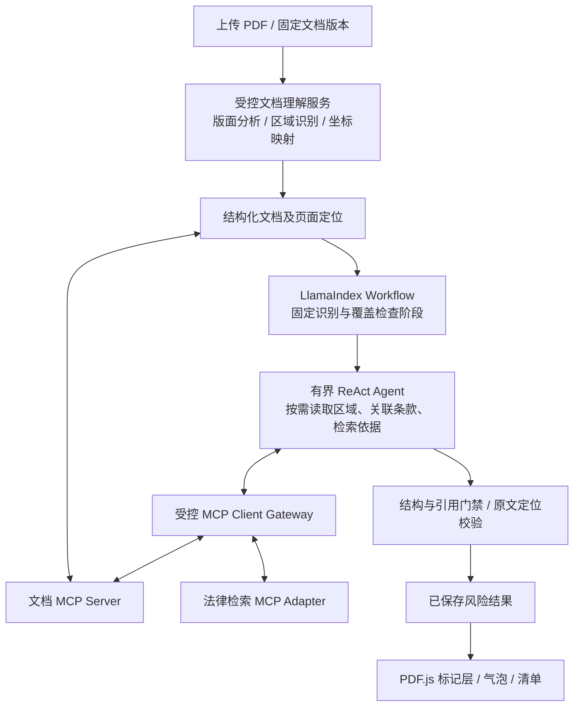
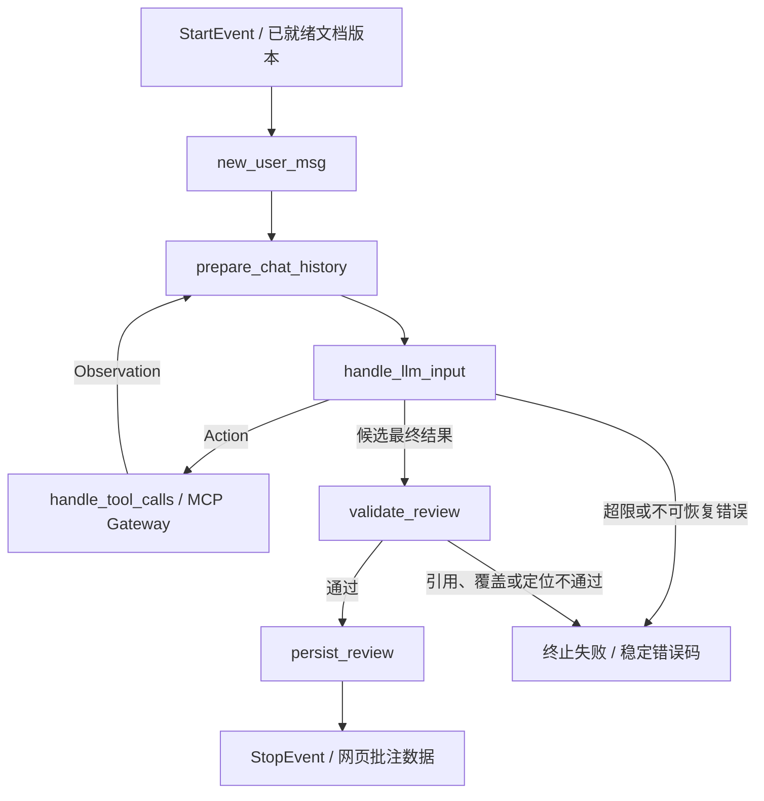

# 合同网页预览与风险批注设计

- 日期：2026-09-16
- 状态：用户已确认 PDF 网页预览、网页标红/气泡、版面分析 + MCP + LlamaIndex + ReAct Agent 技术方向，并指定其提供的四步 `ReActAgent(Workflow)` 为工作流骨架；核心框架已实现并完成合成验证，见[运行说明](../../contract-review-core.md)。真实识别/检索/内容门禁适配器、持久化、公网接口和网页尚未接入，整体功能尚未验收。
- 依据：总体架构规格第 8.3 节及本次用户需求。

## 当前覆盖决策：两次多模态调用（2026-09-21）

用户明确两次都包含看图。当前window_v2本地入口：第一次全部PDF页图＋原生文字总结 → 总结一次RAG/RRF/rerank Top7 → 第二次全部同样页图＋全文＋相关法律片段，一次JSON风险输出。保留四步LlamaIndex事件骨架和受控MCP，取消该路径旧的模型选文、独立视觉读取、两条分页、模型纠正及第三次独立内容核验；legacy实现不删除。后文旧分批要求以此为准。

程序仅核验本次允许的片段编号/原文、身份、覆盖、引用定位与授权，不能代替法律语义/效力核验。新增evidence_passages保存精确来源引用；缺失或未知引用候选进入withheld_issues（序号、页码、固定原因），不发布其正文、不因一条引用失败丢弃其他风险草稿。全部输出明确未经独立语义复核；正式法律意见的人工批准与生产法律质量验收边界保留。

原生文字不能唯一定位时，引用保留为模型来源且quality=needs_review、无精确高亮；不得伪造坐标或称转录已核验。SSE先阶段、后门禁与保存后的完整草稿，不泄露隐藏推理。真实23页流程完成不等于意见准确，最新质量缺口及验证见[现状](../../project-status.md)。

## 1. 交付效果与范围

用户上传包含文字、表格或图片的合同，在网页中保留文档版式阅读；有风险的文字位置出现红色半透明高亮和红色下划线，点击后显示批注气泡。标记覆盖于预览层，原始文件不可变。

首个实现切片交付 PDF 的完整链路，包括文字 PDF、扫描 PDF 和混合页面。原始需求中的 Word 输入保留为后续相邻切片：受控转换为固定 PDF 预览，定位绑定转换产物及其哈希；不得把 PDF 切片完成表述为 Word 已支持。

本轮以网页查看和审查处置为交付范围；带批注文件下载、在线修改合同正文和自动替换条款不属于本轮验收。

## 2. 方案比较与建议

| 方案 | 用户效果 | 取舍 |
| --- | --- | --- |
| PDF 页面预览叠加定位标记 | 保留图片、表格与分页，点击原文查看气泡 | 推荐；需要可靠的文字/OCR 坐标映射 |
| 提取为 HTML 正文并标记 | 文字交互容易 | 不能保证原始版式与图片位置，不满足本次核心效果 |
| 完整在线文档编辑器 | 可进一步编辑正文及管理修订 | 当前查看批注需求不需要完整编辑器，增加集成范围 |

建议使用 PDF.js 作为前端页面渲染候选，自建风险标注层和气泡组件。PDF.js 官方示例提供页面渲染以及缩放、旋转的 viewport 变换；风险定位及审查业务由项目实现。参考：https://mozilla.github.io/pdf.js/examples/ 。具体依赖版本与后端解析/OCR 适配器在实施计划中通过兼容性、中文定位质量、许可证及部署验证后固定；不能默认现有 Loader 已提供这些能力。

## 3. 网页交互

2026-09-17 用户要求修复模型未配置、拖放失败并改为 ChatGPT 风格。此次界面采用浅灰左侧导航、居中对话、底部附件输入框及按需展开的右侧 PDF 批注；在手机上将预览切换为单独面板。保留既有业务入口与 Vue 技术栈。统一 `/chat` 和 `/contract-review` 的对话工作区，PDF 必须走租户合同审查链路，纯文本走账号对话。附件选择和拖放共用校验/审查方法；未登录或未选租户时保留待传文件，登录/选择后继续；切租户、登出、重开、卸载取消请求并清理私有状态。状态摘要流出，最终批注仍在证据门禁和持久化后展示。配置合同 Qwen 时普通对话复用相同供应商配置，未配置合同服务的旧部署仍保持 DeepSeek；配置失效不偷偷切换供应商。

2026-09-21 用户要求合同审阅完成后仍可像统一聊天页面一样继续提问。合同审阅与普通消息可以存在于同一会话视图；首次追问创建租户和创建者范围内、可选绑定一个合同审阅的持久会话，历史入口必须同时恢复两类记录并将已绑定合同去重。追问只携带已保存审阅结果中的风险点、建议和引用片段，不传完整 PDF 文本，不保存或展示隐藏推理。上传新附件仍进入合同审阅工具流；普通文本只有经过单独证据门禁后才可自动调用新一轮法律检索，不能把普通模型回答标成工具或 RAG 结果。

1. 上传后完成文件校验，展示可预览页面；审查独立显示识别中、审查中、校验中、完成或失败状态。
2. 审查立场支持选择合同中的具体当事人或中立检查，默认中立；未选定立场不得自行假设代表甲方或乙方。
3. 桌面端以合同预览为主体，右侧显示风险清单；窄屏清单使用抽屉。清单与原文双向定位。
4. 点击标记打开气泡，支持键盘焦点打开和 Escape 关闭；气泡不越过可视区域。一个位置有多项风险时可以切换查看。
5. 气泡包含：风险级别、所涉原文、问题说明、可能影响、建议改写、判断类型、依据和待确认事项。修改建议是可复制草稿，不自动改动正文。
6. 风险级别使用明确文字标签，不能只靠颜色区分。商业立场、表述歧义、条款矛盾与法律判断明确分类。
7. 有权限的律师/法务可接受、驳回或调整建议，记录理由和版本；接受建议不等于已修改合同或已批准正式发布。
8. 跨条款矛盾关联多个原文位置。缺失条款没有真实文字位置，只在清单显示并提示建议补充位置，不伪造原文标记。

## 4. 识别、定位与完整性

- 文档理解采用版面分析、文字识别和结构恢复的组合：识别标题、段落、表格、图片、页眉页脚及阅读顺序，再按区域选择原生文字提取、OCR 或视觉语言模型（VLM）。版面分析不能替代文字识别；VLM 输出也必须核对缺漏和改写，不能默认为忠实原文。
- 原生文字保留文字片段、阅读顺序和页面几何信息。扫描页与图片文字走 OCR，保留识别来源、坐标变换和置信信息。
- 混合页按区域处理，不能因页面存在部分文字就跳过图片文字；对重复文本层与 OCR 结果去重并保留来源。
- 每项定位绑定租户、不可变文档版本、原件/预览哈希、解析版本、页码、文本片段 ID、原文字符范围及一个或多个四边形。
- 几何坐标统一存于未旋转页面坐标系，并记录裁剪区域和页面旋转；OCR 图像坐标先映射回页面。前端通过同一 viewport 变换显示，适配缩放、旋转和高像素密度。
- AI 返回允许的片段 ID 与引文，不允许模型自行猜页码或坐标。后端核对引文与范围，生成定位；不能只按全文字符串搜索标记重复句子。
- 无法可靠识别或定位时显示“识别待核对”或“位置待核对”，保留原图和对应进度；不得错位标红或计为完整审查。
- 图片、签章、手写信息的存在可被标记，但不据 OCR 推断签名真实性或签章有效性。
- 段落级 bbox 不等于句子/字符坐标。解析产物同时保存版面块及行/词/字符片段；视觉模型只返回块级文本时，需经可核验的细粒度识别/对齐补齐，无法补齐则标为块级待定位，不能宣称精确文字标红已通过。中文字符不能按文本长度均分矩形来伪造位置。

### 4.1 文档理解候选与选型依据

优先评测 PaddleOCR-VL 文档解析产线，其官方说明覆盖版面分析、区域裁剪、阅读顺序、视觉识别及结构结果；Docling 作为对照候选，评测统一文档结构、表格和坐标输出。两者均需检查实际版本的细粒度定位能力，不能据产品名称推断输出粒度。

本次不绑定具体模型版本，也未下载模型或安装依赖。用合成/获授权的中文合同对照文字准确率、金额日期与否定词、阅读顺序、表格关联、句子定位、耗时及内存/显存；候选必须同时满足识别和定位要求。优先按自部署评测，外部解析服务若涉及合同传输与付费则另行明确部署与数据边界。采用 LlamaIndex 不意味着必须采用 LlamaParse 或 LlamaCloud。

官方资料：

- https://github.com/PaddlePaddle/PaddleOCR/blob/main/docs/version3.x/pipeline_usage/PaddleOCR-VL.md
- https://docling.ai/formats/

## 5. 后端链路与现有代码边界

### 第一版已确认顺序（2026-09-16）

2026-09-17用户补充明确：Qwen先阅读并生成合同内容总结，本地MCP拿总结执行RAG，不拿整篇合同作为检索查询。实现将合同类型、最多1200字符的内容总结及单个最多200字符的检索重点组成有界查询；最多7次查询合并Top7。空白或超长摘要必须报错，不能回退到全文检索。摘要输入与随后完整读取候选法律全文是不同阶段。

上传 PDF 未填写文字时自动发起中立合同审阅；解析确认合同后，生成合同类型、关键事实和检索计划。复用现有 Docker RAG 的向量/BM25/RRF，按文档身份去重得到最多7份法律文档候选；明确 RRF 是排序融合，未装配语义重排模型。LLM 判断相关性并选择最多3份不同法律文档，通过受控 MCP 全文工具完整读取，再逐条审阅、校验证据与定位、保存草稿并展示网页批注。未找到相关文档时固定回复“我没有找到相关的法律文档，暂时无法提供相关服务”；服务故障与无结果分别处理。

全文工具从已验证的派生段落与文档元数据恢复正文，不能简单拼接父子chunk造成重复，也不能将未识别图片和截断内容称为完整原件。只读挂载 F 盘派生产物，不重导 Milvus，不改变原始法律文件。阅读上限按文档数计，长文按有界页读取并核对版本及覆盖完成；上下文超限明确终止，不假装已经读完。

对外仅流式发送实际阶段、工具状态、简短合同摘要和门禁后的批注，不输出原始 Thought、Prompt 或供应商响应。合同上传、版本和租户授权必须由业务接口确定；网页不直接访问 MCP 或 RAG 密钥。现有核心框架/合成示例不等于本流程已装配，实施进度以现状文档为准。

上传受理 → 不可变原件及版本登记 → 安全校验/预览准备 → 文本与图像识别 → 合同结构和全文关联 → 规则与 AI 审查/法规检索 → 引文与定位校验 → 风险项持久化 → 网页展示及人工处置。

现有 `DocumentsView.vue` 使用 DOCX base64 登记；现有 `RiskIssue` 为强制 `rule_based` 的规则命中模型，包含命中文本和条款号，缺少页面几何定位。不能把此模型改称 AI 法律结论，也不能把现有草稿报告导出视为原文批注。

复用 Matter、文档版本、权限及审计边界；新增独立审查运行、页面/片段定位及 AI 风险结果模型，保留旧规则风险项契约。关系数据存 MySQL，原件和预览放租户隔离对象存储；异步任务只传引用并重新校验权威权限状态。现有对象存储上传与异步装配须在实施前核对实际可用性，缺失项纳入该链路实现。

本合同审查 Agent 按用户最新选择采用其提供的自定义 `ReActAgent(Workflow)` 四步事件循环，保留 `ReActChatFormatter`、`ReActOutputParser` 与 Action/Observation 循环；由项目适配器接入既有 Model Gateway，引用证据来自受控检索接口。用户指定的自定义 Workflow 是实现基线，不能用仅构造内置 ReActAgent 的方式代替本骨架。此选择替代本场景原 LangChain Chain 方向，不自动扩大为全部既有模块迁移。现有内网 RAG 服务不能直接当作公网租户接口，不能将其未知效力元数据当作已核验现行法律依据。

### 5.1 LlamaIndex、ReAct 与 MCP 分工

LlamaIndex 负责工作流和工具编排，ReAct 负责在有限工具集合内选择需要补查的内容，MCP 负责服务工具协议。固定的上传校验、基础解析、覆盖核对、结果门禁和持久化由应用流程强制执行，不由 Agent 自行决定是否执行。全文审查遍历与覆盖清单由流程保证，不能只检索几段就宣布全文已审查。

工具契约建议为：

| 工具 | 输入要点 | 输出要点 |
| --- | --- | --- |
| `document.get_structure` | 不可变文档版本、游标 | 结构块、条款关联、阅读顺序及识别覆盖 |
| `document.read_blocks` | 版本、受限数量的 block_id | 原文、表格结构、定位引用及质量标记 |
| `document.inspect_region` | 版本、既有区域 ID | 有界视觉复核结果和来源；耗时任务返回 job_id |
| `document.get_job_status` | 授权任务 ID | 状态、进度、结果引用；不暴露 Worker 内部地址 |
| `legal.search` / `legal.read` | 查询、地域/日期或证据 ID | 证据与完整性/效力状态 |

上述名字为计划契约，尚未实现。租户、Actor、有效授权上下文由网关可信注入，不能接受模型自报身份。Server 独立核验资源范围，工具只接已登记 ID，不允许 Agent 传任意 URL 或本地路径。MCP 工具发现不等于授权；未知工具、Schema 漂移和超范围资源拒绝调用，结果有分页/字节预算和严格 Schema。

网页通过业务 API/SSE 获取进度和风险结果，不直接连接 MCP Server。Agent 仅产生结构化候选风险；页面坐标由文档服务和后端定位校验确定，不由 Agent 写 CSS 或修改 PDF。

按用户2026-09-20要求，合同Provider到Qwen的请求使用流式SSE（stream=true、include_usage=true），增量接收JSON正文，检查结束原因、用量和[DONE]后交给原工作流校验。断流、截断、取消不作为成功候选。此处传输增量不等于向网页提前发布未经证据门禁的法律意见；流式不保证模型停止重复生成。

为 ReAct 设置最大步数、总时间、模型/工具调用与费用预算、重复调用去重及取消策略；耗时识别通过异步任务恢复，避免模型循环轮询。解析按租户、原件哈希和解析版本缓存；同一合同不因每次审查反复全量解析。固定解析阶段和可独立页面任务允许受控并发，不对每个文字块启动一轮 ReAct。

ReAct 内部 reasoning/Thought 仅供必要的瞬时推理上下文，不进入业务存储、调试输出、追踪导出或 SSE。持久审计只保存允许的工具名称、资源引用、状态、耗时和调用计量等元数据。LlamaIndex 回调、Workflow 状态和错误采集须单独验证，不能依赖关闭 verbose 就宣称没有推理泄露。

现有 `application/mcp_gateway.py` 是受控工具登记/白名单/参数分发基础，不能据此宣称已具备 MCP 协议传输、真实 Server 或 LlamaIndex 集成；这些属于新增接入验收。当前项目依赖清单也未声明 LlamaIndex。

官方资料：

- https://github.com/run-llama/llama_index/blob/main/llama-index-core/llama_index/core/agent/workflow/react_agent.py
- https://developers.llamaindex.ai/python/examples/tools/mcp/

### 5.2 输出门禁与状态

法律结论经 Evidence Bundle 与 Citation Gate 校验后才允许展示；缺证据时缩小结论或转人工。普通进度可先展示，未通过门禁的正文不能流出；首版默认完整校验后发布风险清单。后续若做分批展示，须每批独立通过门禁，并清楚标识全文未完成。

上传、解析、审查运行分别记录状态、处理覆盖和失败原因，避免把“可以预览”或“零命中”展示为“合同安全”。取消、刷新重进和重复请求遵守持久任务/幂等契约。

### 5.3 用户指定 Workflow 的逐步接入

来源为本次用户附件 `pasted-text.txt`，SHA-256 `f9973fbadf97cbe40a47fafc934bdfabfc71d0ecab357b2c48b07c5e7e77f910`。附件是参考实现，不是可直接投产的完整模块；本文保存接入约定，运行不依赖用户机器上的附件路径。其结构与 LlamaIndex 官方 [Workflow for a ReAct Agent](https://developers.llamaindex.ai/python/examples/workflow/react_agent/) 示例一致。

保留四个已有步骤的职责和循环结构，类在项目中命名为 `ContractReviewWorkflow(Workflow)`，避免与框架内置 Agent 混淆；名称调整不改变用户指定骨架。

| 步骤 | 在合同审查中的职责 | 后续事件 |
| --- | --- | --- |
| `new_user_msg` | 校验可信租户/Actor/文档版本；绑定审查立场、运行预算与隔离会话；加载已就绪的文档结构和强制覆盖任务 | `PrepEvent` |
| `prepare_chat_history` | 组装 ReAct 指令、当前允许工具、受限原文/证据与本轮临时推理；按预算裁剪上下文而不丢失待检查清单 | `InputEvent` |
| `handle_llm_input` | 经 Model Gateway 调用模型，完整解析 Action 或最终候选结果；调用前检查预算，内部消费原始流 | `ToolCallEvent`、受限修复的 `PrepEvent` 或 `ValidateReviewEvent` |
| `handle_tool_calls` | 经网关异步执行本次授权 MCP 工具，校验并限制返回大小；记录允许的来源引用，构造 Observation 后回到循环 | `PrepEvent` |
| 新增 `validate_review` | 检查结构化风险、全文覆盖、法律引用、原文范围及定位身份；未通过不得作为答案返回 | `PersistReviewEvent` 或终止失败 |
| 新增 `persist_review` | 幂等保存通过校验的结果和处置初始状态，然后返回白名单响应 | `StopEvent` |

固定的文件检查、版面分析和基础识别在审查循环前完成；未就绪时创建/等待受控解析任务，不能让模型把未解析合同当作已读。Agent 可在 `handle_tool_calls` 中通过 MCP 读取结构、条款、关联表格、疑难区域复核及法规依据。

附件接入前必须修正的具体问题：

1. 补全附件未定义/导入的 `PrepEvent`、`InputEvent`、`ToolCallEvent`、`StreamEvent`、`ChatMessage` 和 `ToolSelection`；事件与步骤返回类型必须匹配，尤其 `handle_llm_input` 的重试分支也返回 `PrepEvent`。`StreamEvent` 改为明确的业务进度事件，不承载模型文本 delta。
2. 删除 `llm or OpenAI()` 隐式默认 Provider。模型必须显式注入项目 Gateway 适配器；缺配置返回稳定错误，不能偷偷切供应商或绕过费用/超时记录。
3. 原 `ctx.write_event_to_stream(StreamEvent(delta=...))` 会在解析和门禁前发出模型文本；改为内部汇总，外部只发阶段/覆盖进度。移除最终 `reasoning` 字段；原始响应、格式化 Prompt 和 `current_reasoning` 均不能进入日志、追踪或持久 Checkpoint。
4. 工具分支在返回 `ToolCallEvent` 前显式保存本轮 Action 到临时状态，不依赖 `ctx.store.get` 返回列表是否共享引用。为调用分配真实唯一 ID，替代 `tool_id="fake"`。
5. 同步 `tool(**kwargs)` 改为受控异步调用。现有 `MCPClientGateway.call_async` 仍会先直接调用同步 handler，因此 MCP handler 应使用真正异步传输；解析计算交由有界 Worker，不能仅因方法名带 async 就认定不会阻塞。
6. 处理空模型流、空内容、部分流后异常和非预期解析结果。不能在空流后访问未赋值 `response`；不能靠无限 `PrepEvent` 重试吞掉失败。输出解析最多受控修复一次，工具超限/越权/取消直接终止，不回传原始异常字符串。
7. 原 `sources: [sources]` 会多包一层列表；改为经过校验、去重且有大小上限的扁平来源引用。不能直接序列化 `ToolOutput`，也不能把全部 Observation 当成已核验法律证据。
8. Memory 与 Context 必须绑定租户、用户、文档版本和运行，禁止共享跨租户/跨文档 memory。`ChatMemoryBuffer` 或锁定版本兼容的 memory 实现置于独立适配器，不能把上下文裁剪误认为完成全文审查。
9. 原 `is_done` 直接返回 `StopEvent`；改为候选风险进入强制校验和幂等持久化。只有成功保存后才发完成事件；输出按风险项返回 `issue_id`、`block_id`、原文范围、`anchor_id`、问题说明、风险级别、建议及证据引用。`anchor_id` 对应的页码/坐标由后端解析产物提供。

依赖与验证按锁定版本验证实际 API，不能盲目复制示例版本的导入路径。第一项运行验收应使用真实 LlamaIndex Workflow 调度器与合成 LLM/MCP 结果，走通 Action → Observation → 最终候选 → 校验 → 保存，同时测试空流、解析修复超限、越权工具、异步取消与输出无 reasoning；之后才接真实 MCP 文档服务和解析模型。上述测试入口仍待实施，不代表本轮已执行。

## 6. 文件与访问边界

- 文件类型依据内容校验，文件大小、页数、解压大小、OCR 图像像素、处理时长及任务并发均设置服务器端上限；继承现有上传大小基线，实施时统一前后端配置和稳定错误码。
- 损坏、加密且不可读取、超限或转换失败文件明确返回失败原因，不绕过安全校验。解析器/转换器采用受控运行环境；PDF 脚本和嵌入附件不执行。
- 预览、定位、风险清单、进度和处置 API 均显式验证租户与资源权限；短时单对象访问不能变成任意文件代理。
- 切租户、登出和失效会话清除页面、气泡和临时对象 URL，终止请求并忽略旧响应；后台任务按既定授权策略处理。
- 客户合同不进入公共法规索引；文件内容不能覆盖 Prompt、工具授权或输出 Schema；不记录正文、模型 Payload 或凭据。

## 7. 验收与实施顺序

1. PDF 上传、隔离存储、安全预览和页面定位纵向切片。
2. 版面分析/区域识别候选对照、扫描/混合页细粒度坐标核验及低质量/部分失败状态。
3. 文档 MCP Server、受控 Gateway 和 LlamaIndex ReAct 合同审查接入；真实模型、证据校验与持久风险结果。
4. 原文红色标记、气泡、风险清单联动及人工处置。
5. Word 受控转换后复用网页链路，另行验收格式保真和转换版本绑定。

使用合成合同覆盖重复句子、跨行/跨页句子、表格、多栏、扫描与混合页、旋转裁剪、缺失条款、矛盾条款和低质量图片。浏览器验证缩放与旋转后标注仍对应原文，翻页/清单导航/气泡/键盘操作正确；版本不匹配的定位拒绝使用。

验证同租户允许及跨租户拒绝、旧会话响应隔离、证据缺失/非法引用拒绝、部分识别不能冒充完整结果、任务失败/取消/重进。后端聚焦 TDD 后执行匹配范围 pytest/Ruff/mypy，前端类型/测试/构建及浏览器端到端，真实基础设施和实际模型调用独立记录。

新增验证 MCP 发现/调用的协议链路、服务端权限复核、工具漂移/恶意输出拒绝、ReAct 步数/重复调用/成本预算、强制全文覆盖、VLM 改写原文的对齐拒绝，以及回调/追踪/持久化/SSE 无内部 Thought。工具 Mock 通过不替代真实 MCP 传输或解析模型验证。

性能分别测量上传后首屏预览时间、识别耗时、首批可信结果时间与全文完成时间；记录页数、图像比例、文件大小、并发、硬件和 Provider。小规模基准通过后再确定服务延迟目标；当前不承诺未经实测的秒数或生产容量。

## 8. 本轮设计核验

已检查当前前端登记流程、规则风险项、文档版本和草稿报告边界，并核对 PDF.js 官方渲染示例。本次只形成设计草案，未修改应用代码、运行服务或调用审查模型；文档检查不代表上述能力已经实现。

用户随后明确选择 ReAct Agent（并非 React 前端框架）、LlamaIndex、版面分析和 MCP 接入。已据此修订本草案，并在总体规格及长期规则明确本场景的架构覆盖关系；未安装新框架、运行 OCR/VLM 或验证真实 MCP 服务，候选能力仅据官方资料评估。

用户进一步指定附件中的 `ReActAgent(Workflow)` 为框架；已逐步映射四个方法、保留 Formatter/Parser/Action/Observation 循环，并记录事件定义缺失、原始流/推理暴露、同步工具调用、嵌套 sources、空流和终止门禁等接入修正。此轮为框架设计细化，未修改或执行附件，未生成可运行 Agent，也未更改依赖。
# 2026-09-17 用户确认：Qwen 多模态读取

用户明确取消独立版面分析/OCR前置工具，改为当前 qwen3.8-max 原生视觉阅读；确认保留 PDF 自带文字坐标，仅用于校对引用和精确标红。此段覆盖此前此场景的规则表格/OCR解析选型，不改变租户、原件、证据与人工复核边界。

页面仍在本机按页渲染，保留原始页尺寸；通过现有模型网关发送图片与最小文字指令，使用现有阿里云配置。文档 MCP 接口保留，内部用视觉读取器替代规则表格检测，不再因合并单元格空占位报错。原生字形位置只能辅助定位，不承担合同语义理解。

视觉返回逐页正文、观察及可读性/原生覆盖判断，检查返回页号、数量和Schema，不要求模型输出坐标。转录传给合同理解、ReAct及独立内容校验，不能替代原生引用。批注必须使用已有原生块、完整锚点范围和原文；扫描页、识别不清或内容覆盖不足时标为待复核，不将模型自报置信度作为准确率证明。此阶段不凭视觉猜测生成已核验精确批注。合同理解、RAG Top7、最多3份全文、后端法律与引用门禁、MySQL/S3保存流程继续适用。

内容核对修正：辅助原生文字按pdfplumber原生字形读取顺序提供给视觉模型，必须与规范引用块保留完全相同的非空白字符及其出现次数；不一致则保留原规范文字。该辅助排序不替换引用块或坐标，不调用OCR或表格检测。视觉判断须列全差异类型和原文线索；顺序/空格类差异须经后端确认全文除空白或完整行顺序外一致，保留数字、否定词、标点和重复行的检查。对于“缺字”指控，仅在至少4个非空白字符的线索同时、唯一出现在同页原生文字与视觉转录中时判定该项指控不成立；短片段、重复出现、转录不含该线索、实际不匹配、乱码、不可读及无具体差异的否定判断仍阻断。这是核对已报告疑点，不能证明模型未遗漏其它内容，不能作为真实识别准确率验收。失败报告仅保存最多30页的页码和固定原因码，经过原租户/所有者授权后读取；网页用固定中文解释显示疑点，不发布模型观察、推理或未经门禁的批注。

空白字段复核：真实合同第18页的填写横线被视觉模型转录为连续下划线，再被错误地当成缺失文字。Prompt明确区分绘图横线与可见实字；仍有带连续下划线的疑点时，每份合同最多额外调用一次，重新查看最多4个疑似页面及同页原生文字。前次疑点作为不可信数据提供，复核不预设通过；新返回仍检查页序、Schema、实字覆盖和原文边界，真实填写数字缺失、不可读或不确定仍阻断。剩余页面不能因本次复核被忽略。额外调用纳入既有总调用数及超时预算，保持单次图像大小限制，计量包含重读图片的实际成本；不直接删除下划线后放行。

图片与正文均作为不可信输入，不影响权限、工具或指令。图片大小、页数、响应长度、调用数与总期限有界，取消请求不提前释放仍在运行的渲染资源。图片不进入日志或调用审计正文；调用用量纳入现有计量。界面只展示阶段进度及门禁后的结果。此次模型图片接口合成验证200、167 tokens，字符大小写未严格保持，不能作为真实合同准确率验收。

模型输入范围补充（2026-09-17）：用户指定切换为qwen3.6-flash，沿用已配置Token Plan地址。摘要模型输入保留每块全文、页码、类型、表格位置及视觉辅助信息，省去批注ID与几何坐标。ReAct初始材料及document_read_blocks观察保留原块全文、锚点ID/start/end/page，省去quad；MCP线协议、内部缓存、规范解析产物和后端门禁仍使用完整权威数据。全部条款覆盖检查不变，不截断全文、不以摘要替代审阅原文。

摘要结构恢复（2026-09-17）：ContractBrief的is_contract、contract_type、fact_summary、queries均显式必填，消除Schema可省略与业务必填之间的冲突；保留非空、长度、唯一性和合同/非合同一致性校验。摘要校验失败后最多增加一次模型调用，使用相同完整原文和仅含固定错误码的提示重新生成，第二次失败仍停止且不得进入RAG。额外调用纳入原全局次数、上下文和期限预算，不对Provider错误、选文或法律门禁增加重试。日志仅记录固定阶段、受控字段名、原因类型及是否代码围栏，不包含输入、错误上下文、任意模型字段名或合同正文。

## 2026-09-17 用户决定：内容核对警告后继续

2026-09-20用户批准的读取恢复补充：有原生文字的页面保留原生正文，视觉仅返回缺漏文字、表格关系及差异，不再全文复抄；空补充不与原生全文作相等比较。无原生文字页单独转录，失败时至多拆成上下两个不重叠区域；保留区域观察、差异与未核验边界，合并超长文字按连续块完整保存，不虚构坐标。多页可恢复失败拆单页；供应商明确JSON生成异常每页最多一次非流式请求，该额度在分区及复核间共享。其它可恢复视觉响应错误、截断或超时最终形成visual_read_failed警告并继续，已有原文和补充不丢弃。授权、取消、配置不可用和运行总预算仍停止；两种传输共享模型网关和用量审计，未返回usage的调用记录未知。法律证据与引用门禁不因此放宽。

本节覆盖此前合同网页流程中“缺字/乱码/不可读/原生覆盖不足/缺少坐标必须全局停止”的要求。此类问题不再以document_incomplete提前退出：保留真实recognition_complete和页级报告，运行装配显式允许不完整文档，继续摘要、MCP研究、ReAct、校验和保存。模型调用不可用、文件损坏、身份/来源/引用及法律门禁仍按原错误处理，不能伪造成功。

保留原生字形块与精确锚点；疑点页另提供needs_review的视觉转录块，anchors为空，不能将整页框当成文字坐标。原生引用仍逐字、逐锚点校验；仅无锚点且needs_review块允许anchor_id=null，quote/start/end必须对应提供的转录。此类意见必须为待核对的条件性措辞/交易协商建议，仍经独立内容与法律限制检查。网页显示“位置待核对”，保留意见但不画虚假标红；原生块不得以null逃避锚点检查。

警告通过content_warning进度通知，并在draft/no_evidence结果和原授权读取接口返回有界verification_report，MySQL完成清单保存同一报告。旧失败记录保留原状态；不将缺字报告伪装为核对通过。完结状态代表已审阅当前可用材料，不代表原件全部识别准确。

## 长合同结构化审阅（2026-09-20）

2026-09-20接入第二版、2026-09-21按用户要求修正法律输入范围：本机window_v2经受控MCP访问独立鉴权服务，复用第二版Milvus窗口、LlamaIndex RRF和qwen3-rerank。摘要携带实际履行地省级region（未知或跨省为空），两路同范围过滤。每次查询Top7窗口按文档汇总，多查询形成Top7文档候选，最多选择3份法律。取消上文旧方案的默认“阅读全文”：每份按窗口跨查询名次累计保留最多7个，读取接口只接收已召回ID；核验同release冻结chunks.jsonl/fulltext.txt，只取命中段落及每侧1000字符内可恢复的条文/段落边界。无法补齐保留告警，重叠合并，非连续处标记省略，不自动扩大为全文。原件、旧索引不变。

输入必须显式标记retrieved_excerpts，保留原文字符范围与窗口ID，区分来源全文content_hash和实际段落context_hash；complete表示片段响应结束，不代表读完法律。模型只能使用提供段落，不能凭未输入章节作已核验结论。合同原文覆盖要求不变；效力未知、质量警告、租户/运行授权、引用门禁和真实计量继续适用。上下文核验通过不等于审阅生成质量通过。

合同模型调用使用官方JSON Object模式与后端Pydantic校验；自定义ReAct四步循环保留，工具动作使用action/action_input JSON。长合同按最多96块分批生成意见，每批仍提供完整合同与法律上下文。后端固定本轮运行、文档版本及有序批次，模型读完指定批次后返回对应reviewed_batch_id和issues；匹配后由后端恢复该批完整ID集合。错误或缺失确认不能计为覆盖，意见只能引用本批条款；旧覆盖ID输出仅在精确覆盖且无重复时兼容。全部批次完成后统一执行原文、覆盖、引用及独立内容门禁，一次保存最终草稿。批次确认仅证明流程完成，不证明模型在语义上没有遗漏；不得伪装为法律质量验收。

按用户2026-09-20最新要求，合同调用不显式发送max_tokens或max_completion_tokens，采用供应商默认输出容量；Qwen3.6-Flash官方最大输出仍为65,536 tokens，取消本地参数不能突破服务限制。单次等待300秒，全流程600秒和100次调用；不裁剪合同正文来节省成本。供应商length终止单独识别为model_output_truncated，最多一次完整重生成，失败不保存局部结果。修正诊断仅含已知字段、固定错误码和范围计数，日志不包含模型正文、任意字段或隐藏推理。

摘要中的完全重复检索重点按首次出现顺序去重，再调用MCP；不因重复请求重新生成整份摘要。去重只在各字段类型和长度验证后进行，保留全部不同重点和原摘要，不放行空摘要、空重点、缺少必填字段或合同分类矛盾。

用户进一步明确“每次两条、缓存后继续”：本条覆盖一次返回全部批次意见的方式。无论合同长短，模型每轮最多返回两条新意见，同时返回轮次绑定的reviewed_batch_id和必填布尔batch_complete。批次未完继续同批，只有明确审完才计覆盖；少于两条和无问题均可正常结束，不能凑数。后端只缓存结构化候选意见，在下一轮作为不可信previous_issues传回，不缓存隐藏推理；同位置同问题去重，错误轮次、跨批输出、持续无新增或超过两条必须修正或明确失败，不能伪装完成。缓存仅存当前运行的私有内存，结束时清除，不作为已核验答案流出。完整合同及法律上下文保留，全部批次合并后执行原完整门禁和一次保存；结构修正也按两条执行，仅可改引用定位字段，不得删风险或改建议。模型次数预算从40调整到100以容纳多轮输出，原100条最终候选和600秒期限保留，耗尽时不保存部分草稿。
